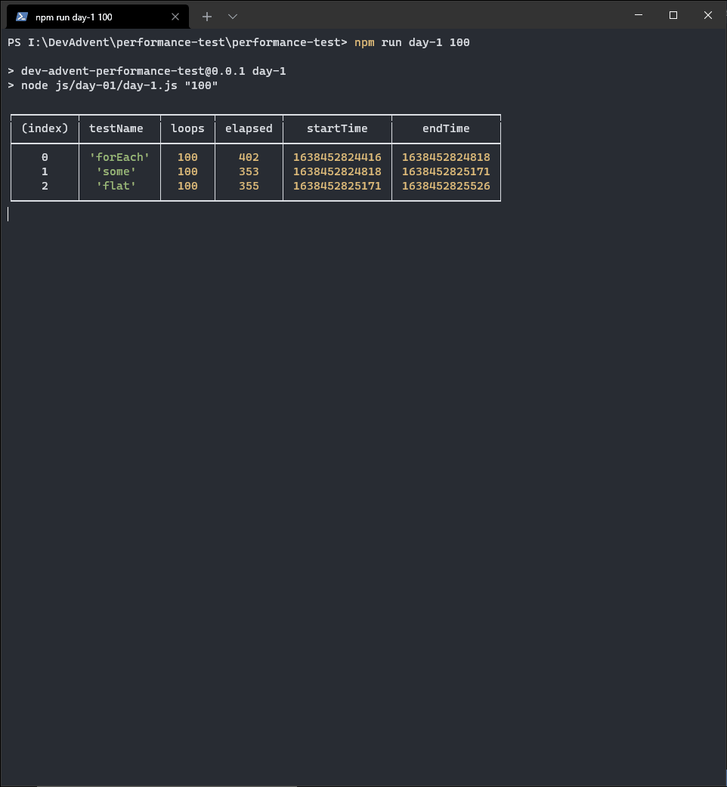
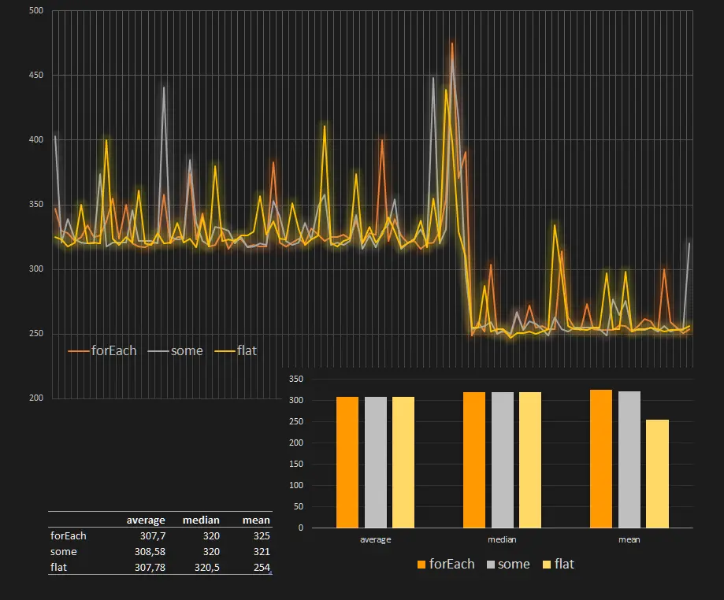

Ogni volta che si avvicina il Natale mia moglie comincia il suo _Avvento Perlinoso_. È una cosa che le ho sempre invidiato, la sua costanza e perseveranza. Dietro suo consiglio, e spinto dalla sua insistenza, ho deciso di provare a fare anche io qualcosa di simile. Ovviamente non legata al mondo dei gioielli artigianali (sarebbe un disastro) ma collegata al coding. Fortuna ha voluto che incappassi in un video in cui [Marc Backes](https://www.youtube.com/c/MarcBackesCodes) presenta il suo **Dev Advent Calendar 2021**:

<iframe width="560" height="315" src="https://www.youtube.com/embed/AmtkdsTcHTo" title="YouTube video player" frameborder="0" allow="accelerometer; autoplay; clipboard-write; encrypted-media; gyroscope; picture-in-picture" allowfullscreen></iframe>

Ovviamente non so ancora se riuscirò a fare i compiti ogni giorno. E men che meno se riuscirò a scrivere un post con la mia soluzione. Non conosco in anticipo i puzzle, e non so se avrò sempre qualcosa di interessante da dire. Per il primo problema sì, ci sono un paio di spunti interessanti.

### Il problema: trova Rudolf


```text
Weeks before Christmas, Santa's reindeers start practicing their flying in order to be fit for the big night. Unfortunately, one of them (Rudolf) crashed and landed in the forest 🌲

Now, Santa 🎅 needs YOUR help to find him.
```

In pratica si tratta di risolvere un problema di ricerca in un array di array, ovvero trovare le coordinate di un elemento in una matrice bidimensionale. Per capirci, se ho una matrice di questo tipo:

```js
const forest = [
  ["  ", "🌲", "🌲", "🌲"],
  ["🌲", "🌲", "🌲", "🌲"],
  ["🌲", "🌲", "🌲", "🦌"],
  ["🌲", "🌲", "🌲", "🌲"],
];
```

mi aspetto di trovare la renna Rudolf alle coordinate `(3, 2)`.

Invece in una "foresta" di questo tipo:

```js
const forest = [
  ["🌲", "🌲", "🌲", "🌲"],
  ["🌲", "🌲", "🌲", "🌲"],
  ["🌲", "🌲", "🌲", "🌲"],
  ["🌲", "🌲", "🌲", "🌲"],
];
```

otterrò delle coordinate negative, `(-1, -1)`.

### Come trovare un elemento in una matrice: forEach

Il problema in sè è abbastanza semplice. Lo possiamo risolvere in più modi. Il primo, forse quello più intuitivo, è di scorrere ogni riga della foresta alla ricerca di Rudolf:

```ts
import type { Forest } from "./typeForest";

const findRudolf = (forest: Forest) => {
  const result = {
    col: -1,
    row: -1,
  };

  forest.forEach((row, index) => {
    const rudolfPosition = row.indexOf("🦌");
    if (rudolfPosition > -1) {
      result.row = index;
      result.col = rudolfPosition;
    }
  });

  return result;
};
```

Il metodo [Array.prototype.forEach()](https://developer.mozilla.org/en-US/docs/Web/JavaScript/Reference/Global_Objects/Array/forEach) esegue lo stesso codice per ogni elemento di un array. Il codice è semplicemente una ricerca dell'indice in cui si trova Rudolf (🦌) usando [indexOf](https://developer.mozilla.org/en-US/docs/Web/JavaScript/Reference/Global_Objects/Array/indexOf). Se l'indice è negativo Rudolf non è in quella riga. Se invece otteniamo un indice positivo allora abbiamo trovato sia la riga che la colonna dove andarlo a recuperare.

### Come trovare un elemento in una matrice: some

Dopo aver risolto il problema mi sono chiesto se esistesse un metodo più veloce per trovare un elemento in una matrice. Una criticità di **forEach()** è che non c'è modo di interromperlo. Per esempio, se Rudolf è alle coordinate `(0, 0)` non serve andarlo a cercare per tutta la foresta. Ma questo codice fa esattamente questo, continua a cercare anche se è già stata trovata una risposta.

Per risolvere questo problema ho deciso di usare un altro metodo, [Array.prototype.some()](https://developer.mozilla.org/en-US/docs/Web/JavaScript/Reference/Global_Objects/Array/some). `some()` fa esattamente la stessa cosa di `forEach` ma con una piccola ma sostanziale differenza: ferma il ciclo quando trova l'elemento. O, meglio, quando la condizione definita risulta essere vera.

Riscrivo quindi il codice:

```ts
import type { Forest } from "./typeForest";

const findRudolf = (forest: Forest) => {
  let col = -1;
  let row = -1;

  const found = forest.some((r, index) => {
    row = index;
    col = r.indexOf("🦌");
    return col > -1;
  });

  row = found ? row : -1;
  return {
    col,
    row,
  };
};
```

In questo caso salvo ogni volta il valore delle coordinate controllate in due variabili, `col` e `row`. Però mi salvo anche una variabile aggiuntiva, `found`, da usare come riferimento per sapere se sono riuscito o meno a trovare Rudolf. Esegui quindi il ciclo per ogni elemento della foresta e lo interrompo quando `r.indexOf("🦌") > -1`, ovvero quando ho trovato il valore "🦌" nell'array.

### Come trovare un elemento in una matrice: flat

Tutto questo è molto bello ma non sono ancora soddisfatto. Mi piacerebbe riuscire a evitare sia `forEach()` che `some()`. Ho deciso quindi di provare un'altra strada. Il presupposto base è che la foresta sia composta da righe tutte della stessa dimensione. Se così è allora posso trasformare la matrice bidimensionale in un array monodimensionale. Poi uso `indexOf("🦌")` per ricavare la posizione di Rudolf. Infine converto quell'indice in una coppia di coordinate bidimensionali. Alla basa di tutto questo ragionamento c'è il metodo [Array.prototype.flat()](https://developer.mozilla.org/en-US/docs/Web/JavaScript/Reference/Global_Objects/Array/flat). `flat()` permette di ottenere un nuovo array dalla concatenazione di tutti i subarray dell'originale.

Traducendo in codice:

```ts
import type { Forest } from "./typeForest";

const findRudolf = (forest: Forest) => {
  const forestCols = forest[0].length;
  const rudolfPosition = forest.flat().indexOf("🦌");
  const row =
    rudolfPosition > -1 ? Math.floor(rudolfPosition / forestCols) : -1;
  const col = rudolfPosition > -1 ? rudolfPosition - row * forestCols : -1;

  return {
    col,
    row,
  };
};
```

### Ok, ma qual è il metodo migliore?

Giunto a questo punto mi sono chiesto: bene, ho tre metodi per trovare un elemento in un array bidimensionale, ma qual è il metodo più efficiente?

Per rispondere a questa domanda sono andato a cercare un qualche metodo furbo per misurare la performance di una funzione. Alla fine però il metodo migliore è usare il metodo più comune: registrare il tempo impiegato dalle varie funzioni per eseguire molte volte la stessa operazione e confrontarli. Nella mia ricerca ho trovato alcune letture molto istruttive. Consiglio di leggere questo post di Zell Liew, [Testing JavaScript Performance](https://zellwk.com/blog/performance-now/). Ovviamente non riporto le sue considerazioni.

Creo una funzione da usare per calcolare il tempo di esecuzione di una singola funzione:

```ts
function perfDate(message: string, callback: Function, loops: number) {
  const startTime = Date.now();

  let i = loops;
  while (i) {
    callback();
    i = i - 1;
  }

  const endTime = Date.now();
  const elapsed = endTime - startTime;

  return {
    testName: message,
    loops,
    elapsed,
    startTime,
    endTime,
  };
}
```

Poi creo un set di foreste casuali in cui cercare la renna. Penso che un campione di 1.000.000 di foreste sia sufficiente per i miei test

```ts
const tree = "🌲";
const rudolf = "🦌";
const forests: Array<Forest> = createMultipleForests(1000000);

function createMultipleForests(n: number): Array<Forest> {
  const forests = new Array<Forest>(n);
  forests.forEach((f) =>
    createForest(getRandomInt(10, 1000000), getRandomInt(10, 1000000))
  );
  return forests;
}

function createForest(col: number, row: number): Forest {
  const arrayTrees = new Array(col).fill(tree);
  const forest: Forest = new Array(row).fill(arrayTrees);
  const r = getRandomInt(0, row);
  const c = getRandomInt(0, col);
  if (Math.random() > 0.1) {
    forest[r][c] = rudolf;
  }
  return forest;
}

function getRandomInt(min: number, max: number): number {
  min = Math.ceil(min);
  max = Math.floor(max);
  return Math.floor(Math.random() * (max - min) + min);
}
```

E creo delle funzioni per cercare Rudolf in sequenza in ognuna delle foreste:

```ts
import findRudolf_forEach from "./solution-1";
import findRudolf_some from "./solution-2";
import findRudolf_flat from "./solution-3";

const a = () => forests.forEach((f) => findRudolf_forEach(f));
const b = () => forests.forEach((f) => findRudolf_some(f));
const c = () => forests.forEach((f) => findRudolf_flat(f));
```

Infine eseguo un po' di test

```ts
const args = process.argv.slice(2);
const l: number = parseInt(args[0]);

const resultGeneral = [];

resultGeneral.push(perfDate("forEach", a, l));
resultGeneral.push(perfDate("some", b, l));
resultGeneral.push(perfDate("flat", c, l));

console.table(resultGeneral);
```

Eseguendo i test ottengo qualcosa di simile a questo:



A occhio non pare esserci una predominanza netta di un metodo su un altro. Però per curiosità decido di salvare i valori dei test in un file e provare a vedere se i crudi numeri possono essere d'aiuto. Installo un pacchetto aggiuntivo, [jsonexport](https://www.npmjs.com/package/jsonexport) per aiutarmi con la conversione della variabile `resultGeneral` e creo un file csv:

```ts
import fs from "fs";
import jsonexport from "jsonexport";

jsonexport(resultGeneral, function (err: Error, csv: string) {
  if (err) return console.error(err);
  fs.writeFileSync("day-1.csv", csv);
});
```

Dopo aver importato i risultati in Excel ottengo questo grafico:



Beh, che dire? Tanta fatica per nulla: nei miei test la performance di tre metodi è pressoché equivalente. Adesso però è il momento di poggiare la tastiera del pc, di prendere la lanterna e aiutare gli elfi nella foresta a trovare Rudolf.
