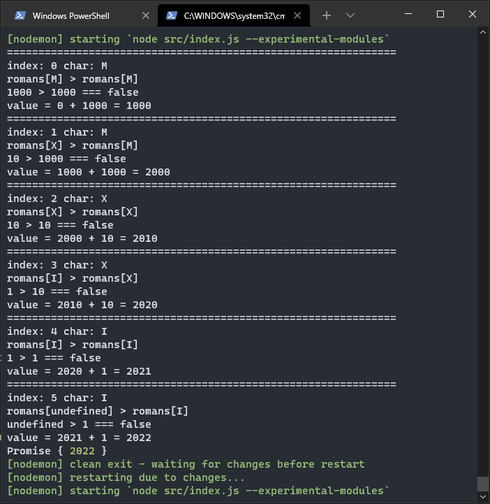

Oramai gli elfi sono lanciatissimi. Hanno convinto Babbo Natale ad ammodernare tutto e stanno convertendo millenni di scartoffie in documenti digitali. Si sono accorti, però, che più vanno indietro nel tempo più è difficile. Anche perché per molto, molto, molto tempo gli elfi hanno usato il sistema numerico romano. Quello con le lettere al poso dei numeri. Adesso, per fortuna, è tutto in numerazione araba, quella con le cifre da 0 a 9. Si tratta solamente di capire qual è il modo più rapido per convertire un numero romano in un numero arabo.

### Il problema: Number Conversion 🏛️


La conversione di numeri romani in decimali non è un problema facile. Non è possibile usare dei metodi nativi di JavaScript: dobbiamo creare noi una funzione ad hoc. Inoltre la numerazione latina è una numerazione basata su raggruppamenti di lettere. Ma il significato della lettera varia in base alle lettere che la seguono o precedono.

Per esempio, la lettera `I` indica la cifra `1`. La lettera `V` indica il numero `5`. Possiamo combinare questi due simboli in due diverse maniere: `IV` e `VI`. Nel nostro sistema numerico diventerebbero `15` e `51`. Ma non è così. Perché `I` davanti a `V` significa `meno 1 a 5`, ovvero `4`. Invece `I` dopo `V` significa `5 più 1`, ovvero `6`.

### Convertire da numeri romani a numeri decimali

La conversione da numeri romani a numeri arabi richiede quindi due tipi di operazioni. Va prima analizzata la posizione delle singole lettere di una string. Poi si estraggono i singoli valori e quindi si procede a sommarli.

Per risolvere questo puzzle ho usato tantissimo una discussione di qualche anno fa pubblicata su [stackoverflow](https://stackoverflow.com/questions/48946083/convert-roman-number-to-arabic-using-javascript). Leggendo i vari commenti ci sono diversi modi per affrontare la questione. Unendo un po' di pezzi ho scritto la mia soluzione:

```js
export const romanToArabic = (input) => {
  const romans = {
    I: 1,
    V: 5,
    X: 10,
    L: 50,
    C: 100,
    D: 500,
    M: 1000,
  };
  return [...input.toUpperCase()].reduce(
    (previousValue, currentValue, currentIndex, array) =>
      romans[array[currentIndex + 1]] > romans[currentValue]
        ? previousValue - romans[currentValue]
        : previousValue + romans[currentValue],
    0
  );
};
```

Come funziona?

Per prima cosa definisco un oggetto avente come proprietà le lettere dei numeri romani. Il valore di ogni proprietà è il valore (in cifre decimali) della lettera:

```js
const romans = {
  I: 1,
  V: 5,
  X: 10,
  L: 50,
  C: 100,
  D: 500,
  M: 1000,
};
```

Poi prendo il numero da convertire, che sarà una string, e la trasformo in un array contenente di caratteri:

```js
const inputUppercase = input.toUpperCase();
const arrayRomans = [...inputUppercase];
```

Prima trasformo tutto il contenuto in lettere maiuscole, in questo modo posso semplificare l'analisi successiva.

Per scorrere tutte le lettere utilizzo il metodo [Array.prototype.reduce()](https://developer.mozilla.org/en-US/docs/Web/JavaScript/Reference/Global_Objects/Array/Reduce). A differenza delle altre volte uso la sua forma estesa:

```js
reduce((previousValue, currentValue, currentIndex, array) => {
  /* ... */
}, initialValue);
```

Quello che voglio fare è confrontare il valore che sto analizzando con quello che lo segue:

```js
arrayRomans.reduce((previousValue, currentValue, currentIndex, array) => {
  if (romans[array[currentIndex + 1]] > romans[currentValue]) {
    //
  } else {
    //
  }, 0
});
```

Prendo questo numero come esempio: `["M","X","X","I","V"]`.

Con `index = 0` la condizione diventa:

```js
romans[arrayRomans[0 + 1]] > romans["M"];
romans["X"] > romans["M"];
10 > 1000;
```

Invece quella successiva è:

```js
romans[arrayRomans[1 + 1]] > romans["X"];
romans["X"] > romans["X"];
10 > 10;
```

Cosa devo fare adesso?

Adesso devo calcolare il valore che quella lettera indica.

Quindi se il valore che segue è maggiore di quello che precede dobbiamo sottrarre il valore corrente al numero complessivo:

```js
previousValue - romans[currentValue];
```

Al contrario, se il valore che segue è minore o uguale posso sommarlo al totale:

```js
previousValue + romans[currentValue];
```

Se eseguo tutti i passaggi in sequenza ottengo:



Una piccola nota sulla gif. Per ritardare l'esecuzione del codice in JavaScript ho usato una funzione `sleep()`:

```js
function sleep(milliseconds) {
  var start = new Date().getTime();
  for (var i = 0; i < 1e7; i++) {
    if (new Date().getTime() - start > milliseconds) {
      break;
    }
  }
}
```

### Trasformare numeri arabi in numeri romani

Giunto a questo punto mi sono chiesto come fare l'operazione contraria. Ho quindi cercato in rete come convertire un numero decimale in numeri romani. Ho trovato un articolo interessante di [Carlos da Costa](https://calolocosta.medium.com/create-a-roman-numerals-converter-in-javascript-a82fda6b7a60) che spiega come fare. Ho modificato un po' il suo codice, cercando di semplificarlo. Questo è la mia risposta:

```js
export const arabicToRoman = (input) => {
  const rules = {
    M: 1000,
    CM: 900,
    D: 500,
    CD: 400,
    C: 100,
    XC: 90,
    L: 50,
    XL: 40,
    XXX: 30,
    XX: 20,
    X: 10,
    IX: 9,
    V: 5,
    IV: 4,
    I: 1,
  };
  let res = "";
  let num = parseInt(input);
  const romans = Object.keys(rules);

  for (let value of romans) {
    const val = rules[value];
    while (num >= val) {
      num -= val;
      res += value;
    }
  }
  return res;
};
```

Anche se spero che gli elfi non si mettano in testa di riconvertire tutto da numeri arabi a numeri decimali.

Per finire, questo articolo fa parte di una serie di puzzle natalizi. Ho pubblicato su Medium una lista che contiene tutte le mie soluzioni:

- [Dev Advent Calendar](https://el3um4s.medium.com/list/dev-advent-calendar-89d163132d6e)
