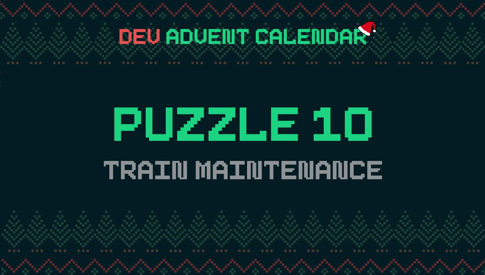
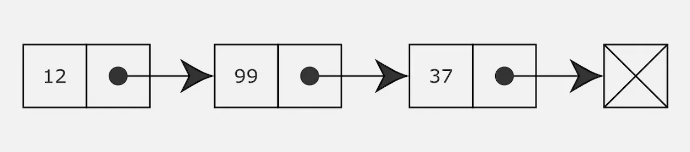

Al Polo Nord fa freddo, si sa. Non capisco come mai Babbo Natale si ostini a passare laggiù gran parte dell'anno. Ma cosi è, e dobbiamo farci i conti. Anche perché i problemi non mancano. Dopo i cartellini con i nomi rovinati dalla neve oggi c'è stato un altro incidente. Qualcuno si è dimenticato di controllare la data di revisione dei vagoni del treno dei regali e il convoglio è partito in ritardo.

### Il problema: Train maintenance 🚂



Giorno 10 del [Dev Advent Calendar 🎅](https://github.com/devadvent/puzzle-10): oggi sono decisamente fuori dalla mia comfort zone. Il problema di oggi riguarda le [liste concatenate](https://it.wikipedia.org/wiki/Lista_concatenata), in inglese **linked list**. Secondo Wikipedia sono delle strutture dati dinamiche **fondamentali**. Mi tocca ammettere di non averle mai usate prima.

### Cosa sono le Linked List

La prima cosa è stato tentare di capire cosa fossero. In rete ci sono molti articoli, alcuni più tecnici di altri. Wikipedia è un'ottima partenza. Ma ho trovato utili anche tre post specifici. Il primo è un excursus abbastanza approfondito dei vari tipi di liste concatenate. C'è anche del codice di esempio in C++ e in Python.

- [Data Structures Explained with Examples - Linked List](https://www.freecodecamp.org/news/data-structures-explained-with-examples-linked-list/)

Gli altri due riguardano direttamente l'implementazione di liste concatenate in JavaScript. Sono stati utili per farmi capire in linea generale come affrontare il problema di oggi.

- [How to Implement a Linked List in JavaScript](https://www.freecodecamp.org/news/implementing-a-linked-list-in-javascript/)
- [Singly Linked List in JavaScript](https://medium.com/swlh/singly-linked-list-in-javascript-a0e58d045561)

Su YouTube, invece, non ci sono molti video rapidi che spiegano cosa sono. Ci sono alcuni video, fatti bene, ma molto lunghi. Per fortuna [Anthony Sistilli](https://www.youtube.com/channel/UCoYzQqZNCRqqAomJwJ6yEdg) ha riassunto in 3 minuti i concetti fondamentali:

<iframe width="560" height="315" src="https://www.youtube.com/embed/W-9hyTm1syc" title="YouTube video player" frameborder="0" allow="accelerometer; autoplay; clipboard-write; encrypted-media; gyroscope; picture-in-picture" allowfullscreen></iframe>

Riassumendo, le linked list sono una collezione di oggetti, ognuno proprietà dell'altro.



In pratica sono oggetti fatti così:

```js
const mario = {
  name: "Mario",
  next: john,
};

const john = {
  name: "John",
  next: luigi,
};

const luigi = {
  name: "Luigi",
  next: null,
};
```

La proprietà fondamentale è `next`. In realtà la possiamo chiamare come vogliamo ma `next` è un termine abbastanza chiaro. L'oggetto `mario` è la testa, `head`, della lista. Tutti gli elementi sono i nodi, `node` della struttura.

Posso riscrivere il codice precedente in questo modo:

```js
mario = {
  name: "Mario",
  next: {
    name: "John",
    next: {
      name: "Luigi",
    },
  },
};
```

Posso anche creare strutture più lunghe e complesse di questa. Ma per capire il concetto base credo possa bastare così.

### Scorrere gli elementi di una lista

Il problema richiede sostanzialmente di scorrere una lista di elementi e di eseguire un'azione per ognuno. Forzando il confronto si tratta di creare una specie di metodo `map()`.

Il primo passo è capire come iterare tra tutti i vari elementi. In questo caso, con questa struttura, conviene usare un ciclo [while](https://developer.mozilla.org/en-US/docs/Web/JavaScript/Reference/Statements/while): scorro la proprietà `next` di ogni elemento fino a che la proprietà stessa esiste:

```js
export const iterateList = (start) => {
  let next = start;
  while (next) {
    next = next.next;
  }
};
```

Questo codice è la base su cui posso costruire la mia soluzione al problema del giorno. E sospetto anche di tutti gli altri metodi legati alle linked list.

### Filtrare elementi in una lista lista concatenata

Per rendere utile la lista, e per risolvere il puzzle, devo aggiungere un altro paio di argomenti alla funzione `iterateList`. Per cominciare scorrere la lista senza fare nulla è inutile. Aggiungo quindi l'argomento `actionFn`

```js
export const iterateList = (start, actionFn) => {
  let item = start;
  while (item) {
    actionFn(item);
    item = item.next;
  }
};
```

Mi serve inoltre un modo per eseguire le azioni solo su alcuni elementi della lista. Una specie di filtro, `filterFn`:

```js
export const iterateList = (start, actionFn, filterFn) => {
  let item = start;
  while (item) {
    if (filterFn(item)) {
      actionFn(item);
    }
    item = item.next;
  }
};
```

Questo è tutto quello che mi serve sapere per risolvere il problema. Il code completo della mia soluzione, dopo aver rinominato le variabili per semplificare, è questo:

```js
const DAY_IN_MILLISECONDS = 1000 * 60 * 60 * 24;

const defaultFilterFn = () => true;
const defaultActionFn = (wagon) => console.log(`${wagon.emoji} ${wagon.name}`);

export const iterateWagons = (
  start,
  actionFn = defaultActionFn,
  filterFn = defaultFilterFn
) => {
  let wagon = start;
  while (wagon) {
    if (filterFn(wagon)) {
      actionFn(wagon);
    }
    wagon = wagon.next;
  }
};

export const filterOldBreaks = (wagon) =>
  daysAfterDate(wagon.lastBreakRevision) > 365;

const daysAfterDate = (d) => {
  const origDate = new Date(d);
  const today = new Date();
  const difference = today - origDate;
  return difference / DAY_IN_MILLISECONDS;
};
```

### Metodi utili per Linked List in JavaScript

Dopo aver risolto il quesito ho dedicato un po' di tempo a sperimentare con le liste concatenate. Un po' leggendo di qua e di là, ho stilato una lista di alcuni metodi che potranno servirmi in futuro. Li riporto qui, a futura memoria mia.

### Calcolare la dimensione di una lista concatenata

Il primo metodo permette di calcolare il numero di nodi presenti in una lista.

```js
const size = (start) => {
  let count = 0;
  let item = start;
  while (item) {
    count++;
    item = item.next;
  }
  return count;
};
```

Posso però anche ottenere lo stesso risultato partendo da `iterateList()`:

```js
export const size = (start) => {
  let count = 0;
  iterateList(start, () => count++);
  return count;
};
```

### Contare quanti nodi di una lista concatenata soddisfano una condizione

Preferisco il secondo metodo perché si può modificare facilmente per contare quanti nodi di una lista soddisfano una data condizione:

```js
export const countNode = (start, filterFn = () => true) => {
  let count = 0;
  iterateList(start, () => count++, filterFn);
  return count;
};
```

### Trovare l'ultimo nodo di una lista concatenata

Negli array è tutto sommato semplice trovare l'ultimo elemento. Con le liste concatenate occorre scorrere tutti i nodi fino ad arrivare all'ultimo:

```js
export const last = (start) => {
  let node = start;
  while (node.next) {
    node = node.next;
  }
  return node;
};
```

Posso anche aggiungere un filtro per ottenere l'ultimo dei nodi che soddisfa una data condizione:

```js
export const last = (start, filterFn = () => true) => {
  let node = start;
  let lastNode = null;
  while (node.next) {
    node = node.next;
    if (filterFn(node)) {
      lastNode = node;
    }
  }
  return lastNode;
};
```

### Trovare il primo elemento di una lista in base a una condizione

Posso modificare l'ultima funzione per creare un metodo per ottenere il primo nodo che soddisfa una certa condizione:

```js
export const first = (start, filterFn = () => true) => {
  let node = start;
  let firstNode = null;
  while (node.next) {
    if (filterFn(node)) {
      firstNode = node;
      break;
    }
    node = node.next;
  }
  return firstNode;
};
```

### Trovare un nodo in una linked list in base alla sua posizione

Nonostante non esista un indice, come per gli array, è possibile ottenere un nodo di una lista concatenata in base alla sua posizione.

```js
export const getByIndex = (start, index) => {
  let counter = 0;
  let node = start;
  while (counter < index) {
    node = node.next;
    counter++;
  }
  return node;
};
```

Posso anche decidere di contare gli elementi partendo da `1` invece che da `0`: basta cambiare il valore originario di `counter`.

### Aggiungere un nodo all'inizio di una lista concatenata

Finora ho solamente cercato tra i vari nodi. Ma può essere utile anche aggiungere un nuovo nodo. La situazione più facile è quando vogliamo aggiungere qualcosa all'inizio, emulando il metodo `unshift()` degli array:

```js
export const addHead = (start, node) => (node.next = start);
```

Qui le cose però si complicano un pochetto. Giunti a questo punto conviene creare una classe specifica per gestire i vari casi limite. Consiglio, di nuovo, la lettura dell'articolo di [Gulgina Arkin](https://medium.com/swlh/singly-linked-list-in-javascript-a0e58d045561) che ho linkato all'inizio.

### Eliminare un nodo all'inizio della lista

È altrettanto rapido eliminare la testa di una lista:

```js
export const removeHead = (start) => {
  let next = start.next;
  start.next = null;
  return next;
};
```

### Aggiungere un nodo alla fine della lista

Aggiungere un nodo alla fine della lista richiede un passaggio in più. Devo prima trovare l'ultimo nodo, e poi a questo aggiungere quello nuovo:

```js
export const push = (start, node) => {
  const lastNode = last(start);
  lastNode.next = node;
};
```

In una sola riga sarebbe:

```js
export const push = (start, node) => (lastWagon(start).next = node);
```

### Eliminare un nodo alla fine della lista

In maniera simmetrica posso eliminare l'ultimo elemento di una linked list:

```js
export const pop = (start) => {
  const n = countWagon(start);
  const node = getByIndex(start, n - 2);
  node.next = null;
};
```

Oppure in maniera più sintetica

```js
export const pop = (start) =>
  (getByIndex(start, countWagon(start) - 2).next = null);
```

### Aggiungere un elemento in una linked list

Un'altra operazione che può essere utile è l'inserimento di un elemento in una posizione specifica della lista. Per farlo devo cambiare l'elemento che precede la posizione desiderata.

```js
export const insert = (start, index, node) => {
  const prev = getByIndex(start, index - 1);
  const next = getByIndex(start, index);

  prev.next = node;
  node.next = next;
};
```

### Eliminare un nodo da una lista

Anche l'eliminazione di un nodo prevede la modifica del nodo che lo precede.

```js
export const remove = (start, index) => {
  const prev = getByIndex(start, index - 1);
  const next = getByIndex(start, index + 1);
  prev.next = next;
};
```

### Modificare un nodo

L'ultima operazione di uso comune che resta è la modifica di un nodo. Questo caso è abbastanza semplice, basta recuperare il nodo da modificare con `getByIndex()`

```js
export const change = (start, index, value) => {
  let node = getByIndex(start, index);
  node = {
    ...node,
    ...value,
  };
  remove(start, index);
  insert(start, index, node);
};
```
