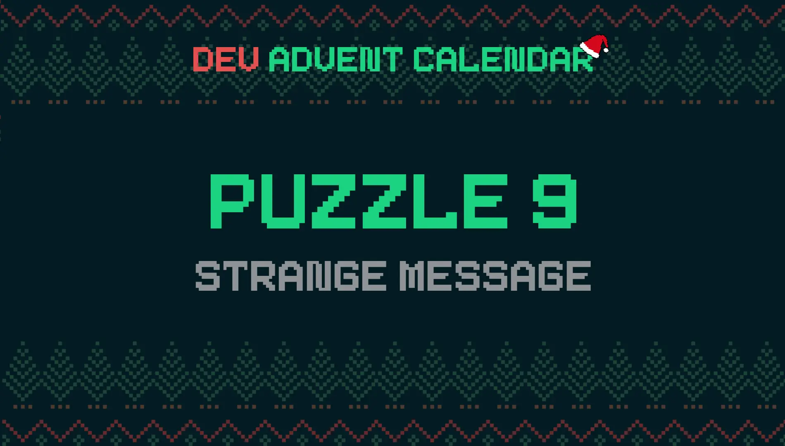

Oggi sono un po' in ritardo. Ieri Babbo Natale ha fatto bisboccia e il puzzle di oggi è arrivato tardi. E non solo era in ritardo: ha anche pasticciato con il codice segreto che usa con gli elfi e non riesce più a decifrare i vari messaggi. Per fortuna, o per sfortuna, il codice di cifratura è piuttosto debole. Talmente debole che basta una riga di codice per decifrarlo.

### Il problema: Strange Message 📜



Il problema di oggi, il numero 9 del [Dev Advent Calendar 🎅](https://github.com/devadvent/puzzle-9) è un problema di conversione di numeri binari. Cos'è un numero binario? [Wikipedia](https://it.wikipedia.org/wiki/Sistema_numerico_binario) lo spiega piuttosto bene:

`Il sistema numerico binario è un sistema numerico posizionale in base 2. Esso utilizza solo due simboli, di solito indicati con 0 e 1, invece delle dieci cifre utilizzate dal sistema numerico decimale. Ciascuno dei numeri espressi nel sistema numerico binario è definito "numero binario".`

### Convertire numeri in basi diverse

In pratica le cifre vanno da `0` a `1` e nulla più. Sono solo due ma sono tutto. A partire da una sequenza di zeri e di uno possiamo far funzionare i computer, internet, ogni cosa. Ovviamente anche scrivere. Ovviamente noi, umani, non siamo abituati a leggere i numeri binari e questo complica un po' le cose. Dobbiamo convertire le varie sequenze in un sistema numerico che maneggiamo meglio, in genere quello decimale.

Ci sono delle regole per convertire un numero da una base all'altra. JavaScript mette a disposizione il metodo [parseInt()](https://developer.mozilla.org/en-US/docs/Web/JavaScript/Reference/Global_Objects/parseInt). Questo metodo accetta due argomenti:

- un valore in formato string che rappresenta un numero
- un numero che rappresenta la base numerica utilizzata

`parseInt()` restituisce il valore rappresentato dalla string come numero in base 10.

Forse un esempio è un po' più chiaro:

```js
parseInt("101010", 2); // 42
parseInt("101010", 3); // 273
parseInt("101010", 4); // 1092
parseInt("101010", 5); // 3255

parseInt(101010, 2); // 42
parseInt(1120, 3); // 42
parseInt(222, 4); // 42
parseInt(132, 5); // 1092
```

Se invece volessi fare il processo inverso, convertire un numero decimale in uno di una base diversa posso usare il metodo [Object.prototype.toString()](https://developer.mozilla.org/en-US/docs/Web/JavaScript/Reference/Global_Objects/Object/toString). Mi sono accorto di averlo usato sempre per convertire un stringa in un numero sottintendendo che il numero dovesse essere a base 10. Ma in realtà questo metodo accetta un argomento, di tipo numerico. L'argomento indica la base di conversione. In pratica, per scrivere l'esempio sopra ho usato questo codice:

```js
let x = 42;

for (let b = 2; b <= 10; b++) {
  console.table(b, x.toString(b));
}
```

Ottenendo una lista di questo tipo:

```js
3  '1120'
4  '222'
5  '132'
6  '110'
7  '60'
8  '52'
9  '46'
10 '42'
```

### Convertire un numero in testo

Risolto il problema della conversione dei numeri da una base all'altra resta la domanda: come convertire un numero in carattere? Per farlo posso usare [String.fromCharCode()](https://developer.mozilla.org/en-US/docs/Web/JavaScript/Reference/Global_Objects/String/fromCharCode). Questo metodo accetta come argomento una sequenza di numeri compresi tra `0` e `65535` (`0xFFFF`) rappresentanti la codifica [UTF-16](https://en.wikipedia.org/wiki/UTF-16) dei caratteri unicode.

Senza farla troppo per le lunghe, sostanzialmente ogni numero tra `0` e `65535` rappresenta un carattere distinto. Il metodo `fromCharCode()` permette di convertire un numero nel carattere corrispondente. Il metodo contrario, quello che converte un carattere in un codice numero è [String.prototype.charCodeAt()](https://developer.mozilla.org/en-US/docs/Web/JavaScript/Reference/Global_Objects/String/charCodeAt). Quindi giusto per giocare posso scrivere questo:

```js
let a = "a".charCodeAt(); // 97

for (let n = 0; n < 5; n++, a++) {
  console.log(String.fromCharCode(a));
}

// a
// b
// c
// d
// e

console.log(String.fromCharCode(a + 11, a + 12, a + 13, a + 14));
// qrst
```

### Decodificare un testo in binario

Con questo ho tutti gli strumenti necessari per risolvere il quiz. L'unica difficoltà aggiuntiva è data dal formato che hanno i dati: sono conservati in un file `message.data` che viene letto come una stringa su più righe.

Creo un array usando [String.prototype.split()](https://developer.mozilla.org/en-US/docs/Web/JavaScript/Reference/Global_Objects/String/split) e mettendo come argomento i caratteri che indicano una nuova linea come regular expressions (`/\r?\n/`). Devo usare una regular expression perché i caratteri sono diversi su Windows (che uso io) e su Linux (usato da GitHub per verificare la correttezza della soluzione).

Mettendo tutto assieme ottengo una funzione come questa:

```js
export const decode = (input) => {
  return input
    .split(/\r?\n/)
    .map((line) => String.fromCharCode(parseInt(line, 2)))
    .join("");
};
```

In alternativa posso ottenere lo stesso risultato con una funzione simile:

```js
export const decode = (input) => {
  return String.fromCharCode(
    ...input.split(/\r?\n/).map((n) => parseInt(n, 2))
  );
};
```

### Un po' di link

Con questo è tutto. Però prima di chiudere questo post voglio riportare due link interessanti. Il primo è un articolo simile, scritto però qualche mese fa da [Mehdi Aoussiad](https://mehdiouss.medium.com/). Si intitola ["How to Convert from Binary to Text in JavaScript"](https://javascript.plainenglish.io/how-to-convert-from-binary-to-text-in-javascript-3e881c7fd8c7) e affronta lo stesso problema. Mi è stato molto utile.

Il secondo articolo riguarda invece come convertire un numero da decimale a binario ([Convert Decimal to Binary](https://masteringjs.io/tutorials/fundamentals/decimal-to-binary)): non è strettamente legato alla risoluzione del problema ma è comunque interessante.

Infine, l'articolo precedente di questa serie su [Dev Advent Calendar 🎅](https://github.com/devadvent/readme): [How to Generate an Array of Pairs From an Array in JavaScript](https://javascript.plainenglish.io/how-to-generate-an-array-of-pairs-from-an-array-in-javascript-edbbb5cdd8da).
