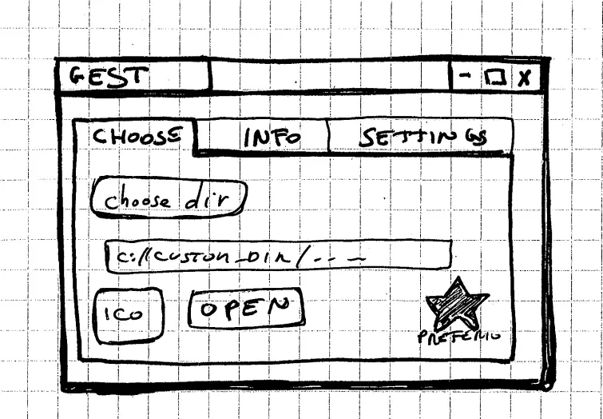
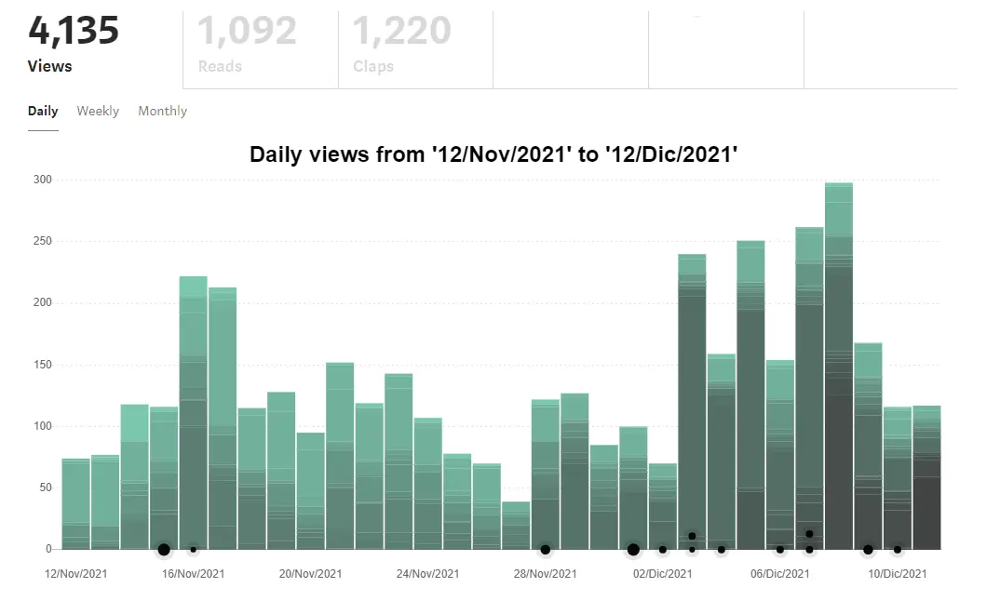

Sono passati 3 mesi da quando ho scritto [Some notes about the future](https://blog.stranianelli.com/some-notes-about-the-future-and-how-to-use-svelte-with-construct-3-english/). Penso sia quindi giunta l'ora di fare un punto su come sta procedendo. Anche perché nell'ultimo mese non ho pubblicato nulla su Patreon, e mi dispiace.

### Patreon and me

Comincio da questo aspetto. Per quanto Patreon possa essere un'ottima piattaforma ha un grosso limite: non è per niente facile condividere snippets di codice. Mi sono reso conto che questo è un aspetto fondamentale, per me. Praticamente tutti i miei post contengono esempi di codice, più o meno complesso. E non ho intenzione, per il momento, di cambiare tipologia.

Perché?

Perché i miei articoli non sono altro che il mio diario di viaggio. Sono i miei appunti e le mie considerazioni. Le mie scoperte e i miei errori. Servono per tenere traccia di quello che imparo, per poterlo ritrovare in futuro e per condividerlo con chi si ritrova ad affrontare gli stessi problemi.

Quindi devo decidere cosa fare. Riflettendo credo che la cosa migliore sia pubblicare regolarmente degli aggiornamenti sui miei vari progetti. E inserire i link agli articoli sul mio blog (e su Medium - ma su questo ci torno sopra tra un attimo). In questo modo credo di poter evitare di riempire Patreon di post illeggibili. Posso inoltre evitare di trasformarlo in una pagina contenti solo link verso il mio blog: non mi piacerebbe per nulla l'idea. Posso inoltre, ed è la cosa che mi piace di più, usare questo spazio come scusa per fare un punto su come procede il mio progetto, magari mettendo bene a fuoco le criticità che ho incontrato.

La domanda successiva è: ogni quanto? Questo non lo so. Sicuramente almeno una volta al mese. Forse due.

### GEST-DASHBOARD: Tornare indietro per andare avanti

Questi tre mesi, e credo anche i prossimi, sono stati caratterizzati dal tornare indietro. Ho cominciato a lavorare sul progetto `gest-dashboard` e mi sono scontrato con molti dei miei limiti.

L'idea del progetto è creare un'applicazione Electron in grado di aprire delle cartelle su PC e leggerle come se fossero su un server.

Perché? Perché voglio creare alcune applicazioni in grado di vivere offline. Non voglio però qualcosa che richieda conoscenze di sviluppo software avanzato.

Ok, sto facendo confusione. Provo a spiegarmi meglio. Mi interessa avere un metodo semplice per eseguire in locale una applicazione salvata come cartella html. L'utente lancia il programma principale, poi sceglie la cartella da aprire ed può cominciare a usare l'app senza dover impostare alcun server locale.

Il vantaggio, per me, è che in questo modo non devo creare un programma con Electron per ogni singola app.

So bene che si tratta di un'esigenza assolutamente particolare, e probabilmente si rivelerà un mero esercizio di stile. Ma non è un problema semplice, non per me.

Nell'affrontare tutto questo mi sono accorto delle mie lacune. Lacune date dalla mancanza di una formazione accademica. In altre parole, mi mancano le basi. Di conseguenza ho dovuto ingegnarmi per costruirmele.

### Capire come funziona Electron

Una parte grossa del mio tempo libero è stata impegnata a capire come creare applicazioni con Electron e sopratutto come mantenerle aggiornate e testarle. Ho tenuto traccia di tutto questo in alcuni articoli.

Questi sono i link per la versione (in inglese) sul mio blog:

- [Electron and TypeScript: how to use ipcMain and ipcRenderer](https://blog.stranianelli.com/electron-ipcmain-ipcrenderer-typescript-english/)
- [How to Test Electron Apps](https://blog.stranianelli.com/how-to-test-electronjs-app-english/)
- [Electron seamless titlebar with Svelte and Tailwind](https://blog.stranianelli.com/electron-seamless-titlebar-with-svelte-and-tailwind-english/)

Mentre questi sono i link su medium:

- [How to Use ipcMain and ipcRenderer](https://el3um4s.medium.com/electron-and-typescript-how-to-use-ipcmain-and-ipcrenderer-english-4ebd4addf8e5)
- [How to Test Electron Apps](https://betterprogramming.pub/how-to-test-electron-apps-1e8eb0078d7b)
- [Electron seamless titlebar with Svelte and Tailwind](https://el3um4s.medium.com/electron-seamless-titlebar-with-svelte-and-tailwind-bd4d53d81c67)

Lo so, questi articoli non sono sufficienti per capire come creare un'app con Electron. Ma presentano alcuni dei problemi che ho dovuto affrontare. Ne ho scritti degli altri, e conto di scrivere ancora su questo argomento in futuro.

### Come creare dei Web Components

Ma giunto a questo punto mi sono scontrato con altre due mie mancanze: la conoscenza, frammentaria, dei fogli di stile (aka CSS) e dei metodi moderni per creare applicazioni web.

Dopo aver fatto un po' di prove mi sono convinto a provare [TailwindCSS](https://tailwindcss.com/). Odio ammetterlo ma è stata una boccata d'aria fresca.

Sopratutto perché poi ho deciso di combinare Tailwind con l'altra mia scoperta recente: [Svelte](https://svelte.dev/):

_Svelte is a radical new approach to building user interfaces. Whereas traditional frameworks like React and Vue do the bulk of their work in the browser, Svelte shifts that work into a compile step that happens when you build your app._

Ovviamente ci ho scritto sopra una guida, per ricordare al me futuro i vari passaggi da fare:

- blog: [Tailwind CSS & Svelte](https://blog.stranianelli.com/tailwind-and-svelte-english/)
- medium: [Tailwind CSS & Svelte](https://el3um4s.medium.com/tailwind-css-svelte-315075404c04)

Non pago ho voluto, e dovuto, approfondire come si può creare un componente Svelte:

- blog: [How to create and publish Svelte components](https://blog.stranianelli.com/how-to-create-svelte-componentes-english/)
- medium: [How to create and publish Svelte components](https://el3um4s.medium.com/how-to-create-and-publish-svelte-components-e770f1e94435)

Inutile dire che sia sul blog che su Medium ci sono anche altri articoli su questo tema.

### Come documentare il codice

Il problema successivo è un classico: sto scrivendo molto codice, a volte in maniera non del tutto chiara. A volte il codice si aggroviglia e diventa complicato da leggere, da modificare, da correggere e da migliorare. Ho affrontato questo rompicapo da più lati. Ho provato a tenere il codice il più pulito possibile, continuando a fare dei refractoring delle funzioni, dei metodi, delle variabili e della struttura stessa del codice.

Ho poi scoperto l'importanza dei test continui. Non solo come strumento per verificare la correttezza del codice ma anche per capire come funziona. In fin dei conti, da programmatore seppur dilettante, i test si sono rivelati la miglior documentazione possibile. Da un lato mostrano come funziona una data parte di un'applicazione, dall'altra mostra quale risultato aspettarsi. Dei buoni test servono anche per mostrare tutti i casi limite, magari quelli a cui non ci penseresti mai ma che quando si presentano creano problemi a non finire.

Ma poi c'è l'aspetto di come documentare ad altri il funzionamento di un modulo o di un componente. E con altri intendo anche il me del futuro. Risolvere questo mi ha portato via molto tempo. Forse addirittura troppo tempo.

Non ho scritto molto su come documentare il codice, solamente un articolo. Conto però di scrivere una seconda parte tra qualche tempo:

- blog: [How to Document Svelte Components](https://blog.stranianelli.com/hypothesis-how-to-document-svelte-components-english/)
- medium: [How to Document Svelte Components](https://betterprogramming.pub/how-to-document-svelte-components-ab504661a6fc)

Tra parentesi, creare questo componente mi ha costretto ad andare un po' più a fondo con il funzionamento di Svelte. Alla fine è un cane che si morde la coda.

### Dev Advent Calendar

Programmare nel tempo libero può a volte essere sfiancante, sopratutto quando pare che non facciamo progressi. È una passione importante, per me, ma ci sono dei momenti in cui è difficile trovare la motivazione per andare avanti. Con il tempo ho imparato che il modo migliore per affrontare questa situazione è impormi qualcosa.

<iframe width="560" height="315" src="https://www.youtube.com/embed/AmtkdsTcHTo" title="YouTube video player" frameborder="0" allow="accelerometer; autoplay; clipboard-write; encrypted-media; gyroscope; picture-in-picture" allowfullscreen></iframe>

Per puro caso sono incappato in questo progetto: risolvere ogni giorno, dal primo di dicembre fino a Natale, un diverso puzzle. I problemi posti sono semplici ma mi stanno costringendo ad approfondire alcuni aspetti di JavaScript che ho sempre trascurato. Sto scoprendo molte cose interessanti. Magari saranno anche banali ma io non le conoscevo.

Ho creato una lista su Medium per tenere traccia di tutto questo:

- medium: [Dev Advent Calendar](https://el3um4s.medium.com/list/dev-advent-calendar-89d163132d6e)

Mentre sul blog si può seguire il tag [#dev-advent](https://blog.stranianelli.com/tags/#dev-advent).

### Medium

E a proposito di liste, oltre a quella sul calendario dell'Avvento ci sono altre due liste in cui ho inserito i miei articoli. Ovviamente sono anche tutti presenti sul mio blog, ma qui mi pare che siano un po' più in ordine.

La prima lista contiene gli articoli che ho scritto su Electron:

- medium: [Electron](https://el3um4s.medium.com/list/electron-029651cc3a36)

La seconda invece è su Svelte, SvelteKit e in parte anche su TailwindCSS:

- medium: [Svelte & SvelteKit](https://el3um4s.medium.com/list/svelte-sveltekit-bf5be8834fbf)

Ma perché ho cominciato a ripubblicare su Medium? Per diversi motivi, in parte contraddittori.

Innanzi tutto perché ho scoperto che è abbastanza veloce importare i miei post su Medium. Quindi provare mi ha richiesto un investimento di tempo tutto sommato limitato.

In secondo luogo è possibile mostrare il codice dei miei esempi utilizzando vari tecniche. Tra tutte, è possibile mostrare il codice salvato su [GitHub Gist](https://gist.github.com/) con un semplice copia e incolla. E poiché per il mio blog uso GitHub, beh, è troppo comodo per non approfittarne.

La terza ragione è legata al futuro. Ho in testa di riscrivere il codice alla base del mio blog. Non so bene ancora come, ma mi piacerebbe distinguere meglio le varie parti. E Medium permette di collegare il proprio profilo a un dominio personalizzato. È una cosa su cui sto ragionando ma su cui non ho ancora deciso.

Infine, ero curioso di vedere come avrebbero reso dal punto di vista monetario i miei articoli. Su questo è presto per fare un ragionamento ma ci sono alcuni aspetti interessanti. E poi mi piace vedere il numero delle views crescere. È una questione di vanità, credo, ma lasciatemi questo zuccherino.

### I prossimi passi

Detto questo, quali sono i prossimi passi da fare? Beh, innanzitutto finire di sistemare il componente per documentare i componenti. Che frase ricorsiva.

Poi, fatto questo, devo tornare sul progetto `gest-dashboard`. Voglio far un test, studiando questo repository: [AshleyScirra/servefolder.dev](https://github.com/AshleyScirra/servefolder.dev). Potrebbe essere la soluzione giusta al mio problema ma è presto per dirlo.

Poi ho altre idee ma direi che se tra un mese ho finito con questi due sarò più che soddisfatto.
