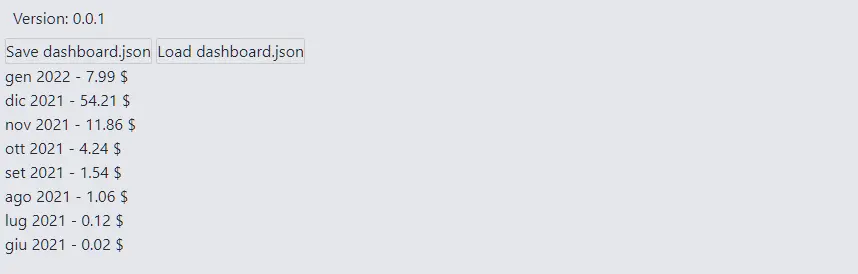

È abbastanza risaputo che Medium non fornisce statistiche molto approfondite. Di per sé non è un problema però per abitudine e forma mentis sono abituato a registrare alcuni dati su quello che faccio. Per questo sto cercando un modo abbastanza semplice per conservare le informazioni base.

Ci sono alcuni post interessanti che offrono idee utili. Tra tutti quello che mi è servito di più è [How to Get Medium Story Stats with 3 Lines of Python Code](https://python.plainenglish.io/how-to-get-medium-story-stats-with-3-lines-of-python-code-c28df3501392) di [Saul Dobilas](https://solclover.com/). Sono partito da qui per capire come scaricare e analizzare le statistiche di Medium che interessano a me.

### Partner Dashboard

Prima di tutto una precisazione: per scaricare le varie statistiche occorre prima essere già loggati in Medium. Dopodiché è possibile scaricare alcuni file JSON con dei dati.

Saul consiglia l'indirizzo [medium.com/me/stats?format=json&count=100](https://medium.com/me/stats?format=json&count=100). Da quella pagina è possibile scaricare un file JSON con i dati degli ultimi 30 giorni. Io però preferisco un approccio leggermente diverso.

Estremizzando il ragionamento, permettetemelo, l'unico parametro davvero oggettivo di Medium è legato alla monetizzazione. Poi, sì, contano anche le views, le reads, i claps e via discorrendo. Ma, per quello che interessa a me, basta un numero: quanto ha monetizzato ogni storia?

Sì, lo so, sembra un discorso venale. E per di più i miei "incassi" sono piccoli, anzi, piccolissimi. Ma voglio partire da qui.

Per farlo mi serve un file JSON contenente i dati relativi agli incassi. Per ottenerlo uso l'indirizzo: [medium.com/me/partner/dashboard?format=json](https://medium.com/me/partner/dashboard?format=json).

Questo file è molto interessante, contiene alcuni dati che possono venire utili. Oltre a tanti altri che non comprendo appieno. Di conseguenza la prima cosa da fare è capire come leggerlo.

Innanzitutto vanno eliminate le prime lettere:

```js
])}while(1);</x>
```

Questa stringa è il rimasuglio di un vecchio problema oramai risolto. C'è un articolo di più di dieci anni fa che lo spiega bene: [JSON Hijacking](http://haacked.com/archive/2009/06/25/json-hijacking.aspx/).

Il file JSON è composto da più parti:

```json
{
  "success": true,
  "payload": {
    "currentMonthAmount": {},
    "completedMonthlyAmounts": [],
    "postAmounts": [],
    "userId": "...",
    "monthlyPaymentPeriod": {},
    "userTaxDocuments": {},
    "userTaxWithholding": {},
    "includesNonEarningPosts": true,
    "username": "...",
    "references": {}
  },
  "v": 3,
  "b": "..."
}
```

Non mi interessa tutto, ovviamente. Quello che mi interessa è concentrato su:

```json
{
  "currentMonthAmount": {},
  "completedMonthlyAmounts": [],
  "postAmounts": []
}
```

### Current Month Amount

`currentMonthAmount` contiene i dati del mese corrente, ed è abbastanza stringato:

```json
{
  "currentMonthAmount": {
    "periodStartedAt": 1640995200000,
    "periodEndedAt": 1643673600000,
    "createdAt": 1640995200000,
    "amount": 324,
    "minimumGuaranteeAmount": 0,
    "hightowerUserBonusAmount": 0,
    "hightowerConvertedMemberEarnings": 0
  }
}
```

Non so bene cosa significhino le ultime tre voci, ma le prime sono delle date che identificano il periodo di riferimento.

Per convertire una timestamp in un formato più leggibile basta usare [Date.prototype.toDateString()](https://developer.mozilla.org/en-US/docs/Web/JavaScript/Reference/Global_Objects/Date/toDateString):

```js
const converToString = (timestamp) => new Date(timestamp).toDateString();
```

`amount` invece rappresenta il totale "guadagnato" durante il mese. Ovviamente sono centesimi di dollaro, non dollari interi.

### Completed Monthly Amounts

`completedMonthlyAmounts` contiene i dati dei mesi conclusi. È un array con un oggetto per ogni mese precedente:

```json
{
  "completedMonthlyAmounts": [
    {
      "periodStartedAt": 1638316800000,
      "periodEndedAt": 1640995200000,
      "createdAt": "2022-01-03 18:36:47",
      "userId": "...",
      "collectionId": "",
      "amount": 5421,
      "state": 2,
      "stateUpdatedAt": 1641319862000,
      "withholdingPercentage": 0,
      "withholdingAmount": 0,
      "payoutAmount": 5421,
      "minimumGuaranteeAmount": 0
    }
  ]
}
```

Oltre ai dati precedenti vengono salvate alcune informazioni aggiuntive: l'id dell'utente e il momento in cui il dato viene consolidato. Non so cosa si intende per `state`.

### Post Amounts

Infine `postAmounts`, un array contenente un po' di dati interessanti per ogni post pubblicato:

```json
{
  "postAmounts": [
    {
      "periodStartedAt": 1640995200000,
      "periodEndedAt": 1643673600000,
      "createdAt": 1640995200000,
      "userId": "...",
      "post": {
        "id": "...",
        "homeCollectionId": "...",
        "title": "...",
        "detectedLanguage": "en",
        "createdAt": 1638488763608,
        "updatedAt": 1641277823221,
        "firstPublishedAt": 1638475200000,
        "virtuals": {
          "wordCount": 942,
          "imageCount": 3,
          "readingTime": 4.104716981132076,
          "subtitle": "...",
          "links": {
            "entries": [
              {
                "url": "...",
                "alts": [],
                "httpStatus": 200
              }
            ]
          }
        },
        "slug": "...",
        "importedUrl": "...",
        "importedPublishedAt": 1638475200000,
        "visibility": 2,
        "isEligibleForRevenue": true,
        "curationEligibleAt": 1638489502373,
        "isShortform": false
      },
      "amount": 97,
      "totalAmountPaidToDate": 2175,
      "totalAmountInCents": 97
    }
  ]
}
```

Non sto a fare la disamina di tutte le voci, anche perché non le ho copiate tutte. Ci sono però alcuni dati su cui voglio mettere l'accento:

- `totalAmountPaidToDate`: è quanto ha guadagnato una storia dal giorno in cui è stata pubblicata
- `totalAmountInCents`: è il guadagno della storia nel mese corrente
- `post.id`: è l'`id` che identifica in maniera univoca una storia all'interno di Medium. Posso accedere al post con la storia usando un indirizzo del tipo `https://medium.com/story/id`. Per esempio il mio ultimo post è raggiungibile tramite l'indirizzo [medium.com/story/9db50dff8f38](https://medium.com/story/9db50dff8f38)
- `post.homeCollectionId` è invece l'`id` che identifica la pubblicazione che ospita una storia.
- `post.title`, `post.virtuals.wordCount` e `post.virtuals.readingTime` contengono alcuni il titolo della storia, il conteggio delle parole e una stima del tempo di lettura

Con queste informazioni posso cominciare a creare qualcosa per scaricare, conservare e analizzare i dati delle mie storie su Medium.

### Salvare i dati di Medium su PC

Quindi, riassumendo, si tratta di andare all'indirizzo [medium.com/me/partner/dashboard?format=json](https://medium.com/me/partner/dashboard?format=json) e salvare la pagina. Basta usare il tasto destro del mouse e scegliere `Save As...`. Per aiutarmi, e per ricordarmi tutti i passaggi, creo una piccola app. Parto da un template con già configurato [Svelte](https://svelte.dev/), [Typescript](https://www.typescriptlang.org/) e [TailwindCSS](https://tailwindcss.com/): [el3um4s/memento-svelte-typescript-tailwind](https://github.com/el3um4s/memento-svelte-typescript-tailwind):

```bash
npx degit el3um4s/memento-svelte-typescript-tailwind medium-stats
cd medium-stats
npm install
```

Quindi, il primo passo è ricordarsi di scaricare le statistiche più aggiornate. Aggiungo un link alla pagina usando Svelte:

```html
<script lang="ts">
  import "./css/tailwind.pcss";
  const urlMedium: string =
    "https://medium.com/me/partner/dashboard?format=json";
</script>

<p>
  1.
  <a
    sveltekit:prefetch
    href="{urlMedium}"
    target="_blank"
    rel="noopener noreferrer"
    >Save dashboard.json</a
  >
</p>
```


### Importare un file JSON

Dopo aver scaricato il file `dashboard.json` posso importarlo nella mia applicazione usando le [File System Access API](https://web.dev/file-system-access/). L'idea è di caricare il file con le statistiche ed estrarre solamente quelle che mi interessano. Poi, in un secondo momento, e probabilmente in un prossimo post, combinerò questi dati in modo da dargli la forma che mi interessa.

Ma cominciamo con il creare un pulsante:

```html
<p>2. Load dashboard.json</p>
<button on:click="{loadDashboardJSON}">Open</button>
```

Aggiungo quindi una funzione legata al pulsante

```js
async function loadDashboardJSON() {
  let [fileHandle] = await window.showOpenFilePicker();
  const file = await fileHandle.getFile();
  const contents = await file.text();
  const stats = JSON.parse(contents);
  return stats;
}
```

In sintesi, uso `showOpenFilePicker()` per aprire una finestra di sistema e selezionare il file da usare. Quindi con `getFile()` carico il file nella pagina. Infine uso `text()` per estrarne il contenuto e salvarlo in una variabile di tipo `string`.

Con un file JSON normale a questo punto sarebbe sufficiente usare [JSON.parse()](https://developer.mozilla.org/en-US/docs/Web/JavaScript/Reference/Global_Objects/JSON/parse) per ottenere un oggetto. Ma in questo caso devo prima eliminare i caratteri `])}while(1);</x>`. Creo quindi la funzione `sanitizeOriginalStats()`

```js
function sanitizeOriginalStats(contents) {
  const result = contents.startsWith(`])}while(1);</x>`)
    ? contents.replace(`])}while(1);</x>`, "")
    : contents;
  return result;
}
```

Aggiungo questa funzione a `loadDashboardJSON()`.

```js
async function loadDashboardJSON() {
  let [fileHandle] = await window.showOpenFilePicker();
  const file = await fileHandle.getFile();
  const contents = await file.text();
  const stats = JSON.parse(sanitizeOriginalStats(contents));
  return stats;
}
```

### Ricavo alcuni dati dal file scaricato

Adesso che ho i miei dati posso decidere come visualizzarli a schermo. Come prima prova, per testare il funzionamento della mia idea, decido di limitarmi a qualcosa di semplice. Voglio creare due elenchi. Il primo con il ricavato di ogni mese. Il secondo con il ricavo progressivo di ogni post.

Comincio con il ricavato mensile. Per ricavarlo uso le proprietà `currentMonthAmount` e `completedMonthlyAmounts`. Per entrambe è sufficiente usare `periodStartedAt` e `amount`. Creo una funzione che mi aiuti a estrarre queste informazioni:

```js
function getMonthStats(month, isCurrentMonth = false) {
  return {
    isCurrentMonth,
    month: month.periodStartedAt,
    amount: parseInt(month.amount),
  };
}
```

Le date sono un tipo di oggetto non molto intuitivo da trattare. Per ottenere qualcosa di leggibile devo usare alcuni metodi:

- [getFullYear()](https://developer.mozilla.org/en-US/docs/Web/JavaScript/Reference/Global_Objects/Date/getFullYear)
- [getMonth()](https://developer.mozilla.org/en-US/docs/Web/JavaScript/Reference/Global_Objects/Date/getMonth)
- [toLocaleString()](https://reactgo.com/convert-month-number-to-name-js/)

Quindi creo la funzione `getDate()`:

```js
function getDate(periodStartedAt) {
  const date = new Date(parseInt(periodStartedAt));
  return {
    year: date.getFullYear(),
    month: date.getMonth(),
    monthName: date.toLocaleString("default", { month: "short" }),
  };
}
```

E la uso in `getMonthStats()`:

```js
function getMonthStats(month, isCurrentMonth = false) {
  return {
    isCurrentMonth,
    month: getDate(month.periodStartedAt),
    amount: parseInt(month.amount),
  };
}
```

Adesso posso estrarre i dati del mese in corso e quelli dei mesi precedenti con:

```js
function getMonthlyAmounts(stats) {
  const currentMonth = getMonthStats(stats.payload.currentMonthAmount, true);
  const previousMonths = stats.payload.completedMonthlyAmounts.map((month) => {
    return getMonthStats(month);
  });

  return [currentMonth, ...previousMonths];
}
```

Di conseguenza modifico il pulsante creato all'inizio e aggiungo una lista in cui mostrare i vari valori:

```html
<button
    on:click={() => {
      window.open(urlMedium, "medium stats");
    }}>Save dashboard.json</button>

<button
  on:click={async () => {
    const stats = await loadDashboardJSON();
    monthlyAmounts = [...getMonthlyAmounts(stats)];
  }}>Load dashboard.json</button>

{#if monthlyAmounts.length > 0}
  <ul>
    {#each monthlyAmounts as data (data.month)}
      <li>
        {data.month.monthName}
        {data.month.year} - {data.amount / 100} $
      </li>
    {/each}
  </ul>
{/if}
```

In questo modo a schermo posso vedere qualcosa di simile a questo:



### Aggiungo un grafico

Il passo successivo è capire come mostrare graficamente i valori. Ci sono tre librerie che vale la pena di prendere in considerazione:

- [Layer Cake](https://github.com/mhkeller/layercake)
- [Pancake](https://github.com/Rich-Harris/pancake)
- [Ffoodd Chaarts](https://ffoodd.github.io/chaarts/index.html)

Però quello che mi interessa è abbastanza semplice quindi mi creo un componente basilare per disegnare un istogramma.

Comincio con impostare le variabili che mi servono:

- `data` per i dati da mostrare
- `labels` per le etichette
- `columns` per il numero delle barre verticali da mostrare
- `maxData` per scalare correttamente le barre

```js
export let data = [];
export let labels = [];

$: columns = data.length;
$: maxData = Math.max(...data);
```

Mi serve anche un modo per gestire alcuni stili in base alla quantità di dati da mostrare:

```js
$: positionColumns = `grid-template-columns: repeat(${columns}, minmax(0, 1fr));`;
```

Aggiungo la parte `html`:

```html
<section>
  <div class="columns data" style={positionColumns}>
    {#each data as d }
      <div class="column" style="height:{(d / maxData) * 100}%;">
        <span class="value">{d / 100}</span>
      </div>
    {/each}
  </div>
  <div class="columns labels" style={positionColumns}>
    {#each labels as l}
      <div>{l}</div>
    {/each}
  </div>
</section>
```

Per le colonne uso `height:{(d / maxData) * 100}%` in modo da rendere proporzionale la rappresentazione grafica.

Per quanto riguarda la parte CSS uso una [grid](https://css-tricks.com/snippets/css/complete-guide-grid/):

```css
section {
  @apply w-full h-full grid items-end;
  grid-template-rows: auto 32px;
}

.columns {
  display: grid;
  justify-items: center;
  column-gap: 4px;
}

.data {
  @apply h-5/6 items-end;
}

.labels {
  @apply border-t border-slate-600 h-8 align-top;
}

.column {
  @apply bg-orange-600 w-full text-center font-bold;
  color: transparent;
}

.column:hover {
  @apply bg-red-600 text-red-600;
}

.value {
  position: relative;
  top: -32px;
}
```

Creo una funzione di aiuto per estrarre la serie di dati che mi interessa:

```js
function getDataForChart(monthly) {
  const data = monthly.map((m) => m.amount).reverse();
  const labels = monthly.map((m) => m.month.monthName).reverse();
  return { data, labels };
}
```

Per gestire in maniera dinamica la rappresentazione grafica uso [$](https://svelte.dev/docs#component-format-script-3-$-marks-a-statement-as-reactive):

```js
$: chartData = [...getDataForChart(monthlyAmounts).data];
$: chartLabels = [...getDataForChart(monthlyAmounts).labels];
```

Infine aggiungo il grafico alla pagina principale:

```html
{#if monthlyAmounts.length > 0 && showMonthlyAmounts}
  <div class="monthly-amounts">
    <div class="monthly-list">
      <ul>
        {#each monthlyAmounts as data (data.month)}
          <li>
            {data.month.monthName}
            {data.month.year} - {data.amount / 100} $
          </li>
        {/each}
      </ul>
    </div>
    <div class="istogram">
      <Istogram labels={chartLabels} data={chartData} />
    </div>
  </div>
{/if}
```

In questo modo posso ottenere qualcosa di simile a questo:


Ok, direi che per il momento è abbastanza. Restano ancora delle cose da dire ma credo che scriverò un altro articolo su questo argomento nei prossimi giorni.
