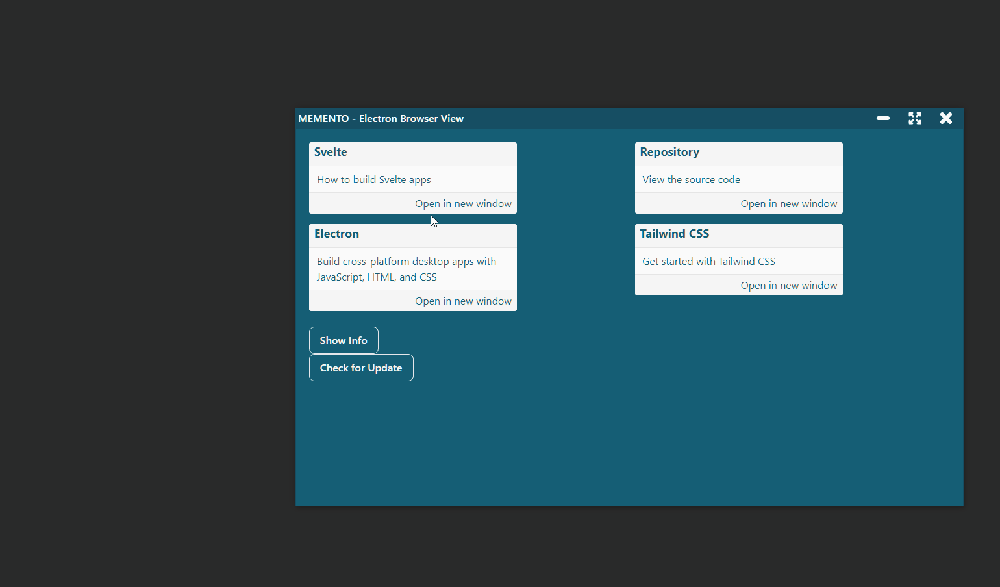
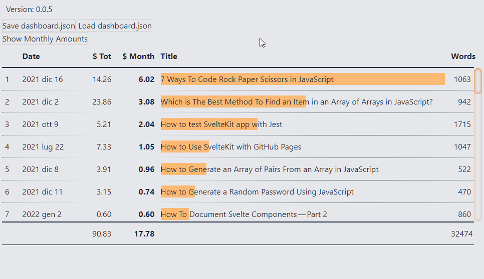

È passato poco più di un mese dal mio ultimo aggiornamento: direi che è l'ora di fare un punto sulla situazione. Prima o poi riuscirò a raggiungere una regolarità con questi report. La cosa ottimale, credo, è di farli diventare a cadenza mensile. Servono, sopratutto a me, per capire come sto procedendo: dare una regolarità maggiore a tutto ciò dovrebbe portarmi dei vantaggi.

Comunque, parto da quello che ho scritto l'ultima volta (a [metà dicembre 2022](https://blog.stranianelli.com/an-update-for-my-patreons-november-2021/))

### Patreon

Ancora non riesco a capire come usare questa piattaforma. Probabilmente non è quella adatta al mio scopo. Quale? Tenere un diario di quello che faccio e, possibilmente, ricevere dei feedback. Su Medium ho ricevuto alcuni commenti interessanti. Non tutti positivi, non tutti d'accordo con quello che scrivo. Ma tutti istruttivi e utili per crescere e migliorare. Su Patreon non ho ancora trovato la quadra.

Quindi, boh. La soluzione potrebbe essere riprendere a pubblicare anche su Patreon una copia dei miei articoli? Oppure segnalare quando pubblico qualcosa sul mio blog e su Medium?

Riguardo a questo, potrei usare Patreon per segnalare la pubblicazione di qualcosa su Medium, inserendo il friend link? In questo modo i lettori del pezzo su Patreon hanno accesso alla versione completa dell'articolo senza dover pagare un abbonamento a Medium. È una cosa su cui devo ragionare.

### GEST-DASHBOARD

Riguardo il mio progetto principale, GEST-DASHBOARD, ho fatto dei passi avanti. E sono soddisfatto.

A dicembre avevo evidenziato alcuni dei problemi che stavo incontrando. Sono problemi legati ad Electron e alla gestione dei file tramite Browser. Bene, sono riuscito a risolvere (in parte) entrambi. Anche se però ci sono ancora molti dettagli da definire. E devo capire come mettere insieme i vari pezzi.

Ho creato due repository. Nel primo, [el3um4s/memento-electron-browser-view](https://github.com/el3um4s/memento-electron-browser-view), ho sperimentato su come usare una browser view per mostrare pagine web esterne ad Electron. Non ripeto i ragionamenti già fatti, rimando a un articolo più completo:

- [How To Use BrowserView With Electron](https://blog.stranianelli.com/how-to-use-browser-view-with-electron/)

L'idea è di usare questa tecnica per visualizzare delle app indipendenti salvati su PC. Come? Usando una tecnica ispirata da questo repository di Ashley Gullen: [AshleyScirra/servefolder.dev](https://github.com/AshleyScirra/servefolder.dev). Partendo da questo canovaccio ne ho creato una mia versione, [el3um4s/svelte-server-folder](https://github.com/el3um4s/svelte-server-folder). Per i dettagli tecnici rimando a questo post:

- [Host a Local Folder of Web Dev Files Directly in the Browser Using TypeScript and Svelte](https://blog.stranianelli.com/how-to-serve-a-local-folder-of-files-in-your-browser/)

Il prossimo passo sarà unire questi due progetti e capire se posso farli funzionare assieme.

### SVELTE

Come si può capire dalla cronologia dei miei articoli mi sto concentrando molto su Svelte.

Tra i progetti in sospeso a Dicembre avevo era capire come documentare i miei componenti Svelte. Bene, sono riuscito a completare i repository collegati a questa idea. Ne ho parlato estesamente qui:

- [How To Document Svelte Components — Part 2](https://blog.stranianelli.com/how-to-document-svelte-components-part-2/)

È stato un lavoro più lungo di quanto avessi pianificato e mi ha costretto ad approfondire alcuni aspetti tecnici.

Dopo di ché mi sono cimentato con un progetto un po' più complesso: creare una dashboard per visualizzare le mie statistiche di Medium. Lavorare su qualcosa di più complesso è stato molto istruttivo. Ho dedicato molto tempo per trovare un modo per [creare tabelle responsive](https://blog.stranianelli.com/how-to-create-responsive-data-tables-with-css-grid/) e inserire [grafici](https://blog.stranianelli.com/5-charts-example-to-get-you-started/).

Ovviamente sono ben distante da quello che voglio ottenere ma non ho fretta: è un buon allenamento.

Nei prossimi giorni e settimane voglio approfondire due cose:

- come creare un menù contestuale
- come creare un menù laterale

### Esercizi

E a proposito di allenamenti, a Dicembre ho partecipato alla Dev Advent Calendar. È stato molto utile per due ragioni:

1. mi ha aiutato ad affrontare ogni giorno un problema diverso
2. mi ha aiutato a scrivere ogni giorno qualcosa

A Gennaio ho sentito la mancanza di questa abitudine. All'inizio del mese credevo di poter fare qualcosa del genere ma... ecco, no, non sono nemmeno partito. Mi piacerebbe trovare un equilibrio tra gli esercizi e gli esperimenti un po' più complessi. Devo però trovare un buon "libro degli esercizi". Leggendo di qua e di là molti consigliano questi siti:

- [CodeWars](https://www.codewars.com/)
- [LeetCode](https://leetcode.com/)
- [HackerRank](https://www.hackerrank.com/)
- [CodinGame](https://www.codingame.com/)

In questo mese voglio capire cosa si adatta di più alle mie esigenze.

### Medium

Infine Medium. A Gennaio ho scritto meno, l'ho già detto. Apprezzo però molto i commenti ricevuti, e in particolar i suggerimenti di [Better Programming](https://betterprogramming.pub/) e [JavaScript in Plain English](https://javascript.plainenglish.io/). Scrivere mi aiuta a mettere a fuoco le idee, a tenere traccia di quello che imparo e a ricordare tecniche e procedimenti.

Ma c'è una cosa che mi piacerebbe fare. Ogni giorno leggo diverse cose, non solo su Medium. Alcune sono dimenticabili, ma a volte ci sono delle storie davvero interessanti. Che per un motivo o per l'altro mi colpiscono, o mi insegnano qualcosa. Non solo riguardo alla programmazione e al coding. Ecco, mi piacerebbe tenere traccia di queste piccole scoperte. Magari scrivendo, ogni tanto, un post con dei "consigli di lettura". È un'altra cosa a cui voglio pensare.

Bene, questo è tutto. Per lo meno per questo mese di Gennaio 2022.
