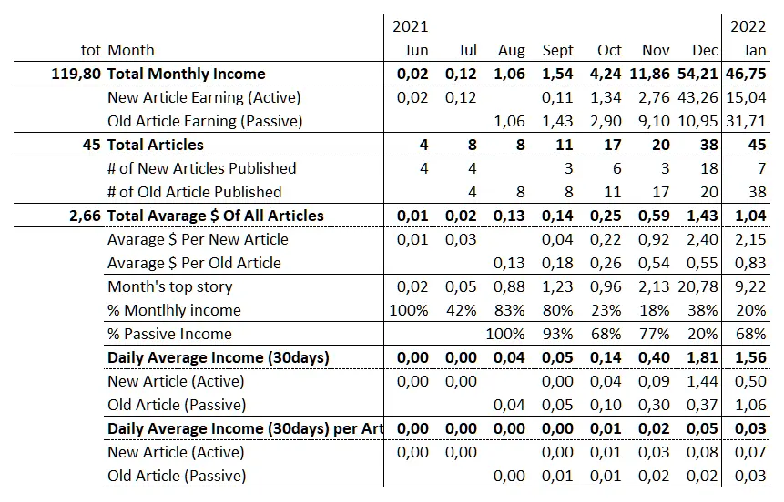
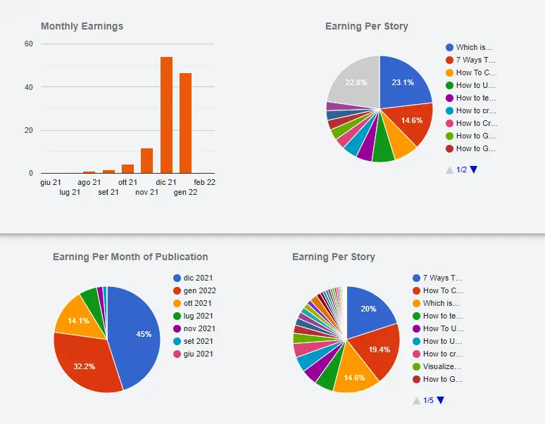
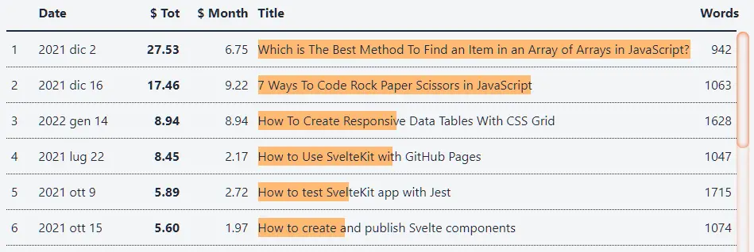
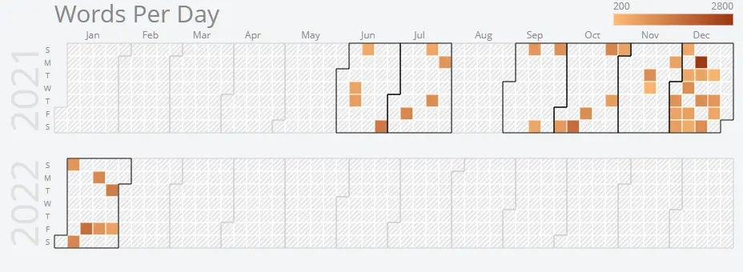

Non ho ancora deciso se posterò regolarmente degli aggiornamenti su Medium. Però voglio avere un luogo per tenere traccia di questo "esperimento" di scrittura. È un argomento che ho in parte affrontato nel mio [diario di viaggio](https://el3um4s.medium.com/the-journey-of-a-programmer-january-2022-65b46994dfa1) ma in questo post voglio andare un po' più sullo specifico.

Comincio con il riassunto, sullo stile di quelli di [John Cooper](https://medium.com/@John_Cooper):

Quindi, Gennaio 2022 ha portato 46 dollari. È il 14% in meno di Dicembre. Però ho anche scritto molto meno: sono 7 post invece di 18 (-60%).

Ci sono alcune tendenze interessanti:

- è il secondo mese di fila che le "nuove storie" producono in media più di 2 dollari ognuna; non è ancora il mio obiettivo (approssimare i 5 dollari medi per storia) ma è già qualcosa
- le storie "vecchie" incrementano la loro resa avvicinandosi a 1 dollaro ognuna
- in tre degli ultimi quattro mesi la storia più remunerativa pesa circa un quinto del totale: non so quanto sia possibile abbassare questa percentuale ma sono contento che on sia cresciuta questo mese
- sempre in tre degli ultimi 4 mesi i due terzi circa delle entrate sono date da articoli vecchi

Ovviamente è poco per fare delle considerazioni approfondite ma è interessante il consolidarsi di una rendita "passiva". Non so ancora prevedere se questo fenomeno si ripeterà anche a febbraio ma vale la pena tenerlo d'occhio.

Andando un po' più sullo specifico, le entrate di gennaio sono date per il 45% da storie pubblicate a dicembre, il 32% da storie del mese, il 14% da storie di ottobre.

Guardando i singoli post, invece, sono 3 le storie principali, che da sole valgono il 54%:

- [7 Ways To Code Rock Paper Scissors in JavaScript](https://betterprogramming.pub/7-ways-to-code-rock-paper-scissors-in-javascript-4189a5e7e535)
- [How To Create Responsive Data Tables With CSS Grid](https://betterprogramming.pub/how-to-create-responsive-data-tables-with-css-grid-9e0a37394450)
- [Which is The Best Method To Find an Item in an Array of Arrays in JavaScript?](https://betterprogramming.pub/which-is-the-best-method-to-find-an-item-in-an-array-of-arrays-in-javascript-5f51589d2086)

E sempre queste 3 valgono da sole il 45% del totale (ovvero di tutto quello che ho incassato da quando ho cominciato a scrivere su Medium).

Parlavo prima della soglia di 5 dollari per storia. Beh, diciamo che è una soglia psicologica che mi sono posto. Mi piacerebbe che ogni storia che pubblico produca almeno 5 dollari. Ovviamente si tratterebbe di una media. Per il momento solo 6 post su 45 (il 13%) sono su quel livello.

Come ho già detto, a gennaio ho scritto decisamente meno rispetto a dicembre. Lo si può vedere chiaramente guardando sul calendario i giorni in cui ho pubblicato. Questo mi porta a quello che voglio fare in questo mese di febbraio: scrivere di più.

Traducendo in numeri, l'ottimale sarebbe poter pubblicare 3 o 4 articoli a settimana, quindi tra i 12 e i 16 al mese. Non so se è fattibile: in genere quello che scrivo è strettamente legato al codice che sviluppo. E molti di questi articoli richiedono molto tempo. Scrivere di più vuol dire, per me, migliorare la mia tecnica di coding. Ed è un obbiettivo che mi voglio porre.

Più nel dettaglio, ci sono 3 articoli che voglio riuscire a scrivere entro la fine del mese:

1. come creare un context menu con JavaScript
2. come creare un menù laterale in HTML
3. come leggere file Excel con JavaScript

Vorrei inoltre riportare con una certa regolarità i miei consigli di lettura; ovvero un elenco degli articoli più interessanti che ho letto su Medium e non solo.

Dal punto di vista monetario, mi piacerebbe restare attorno a quello che ho fatto negli ultimi due mesi. Diciamo che un range 45-55 dollari di guadagno mi va bene.
