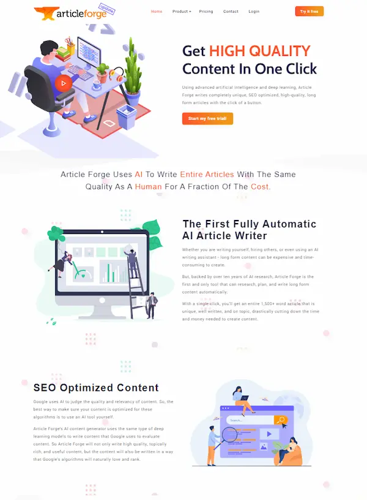
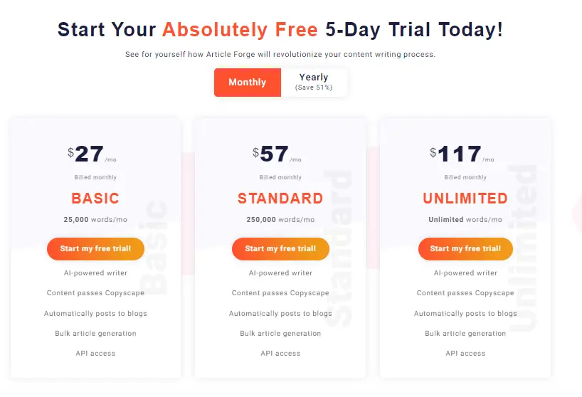
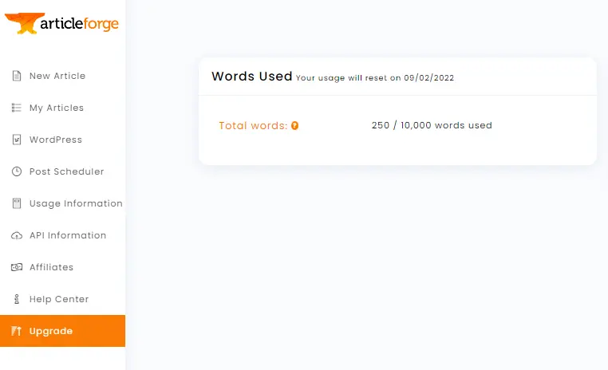
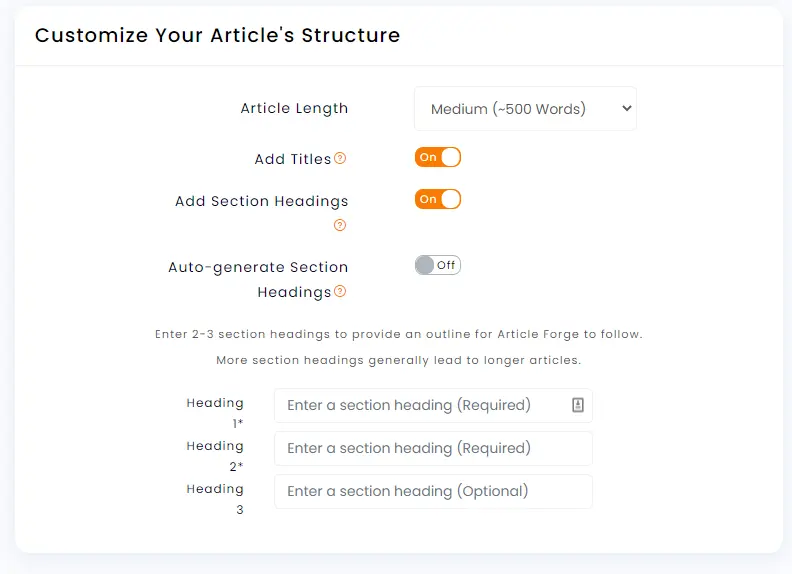
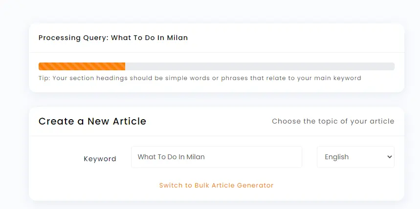
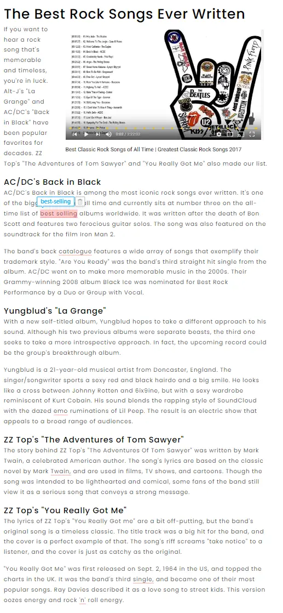
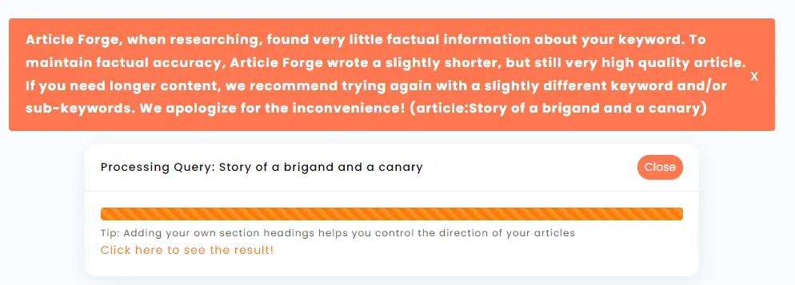
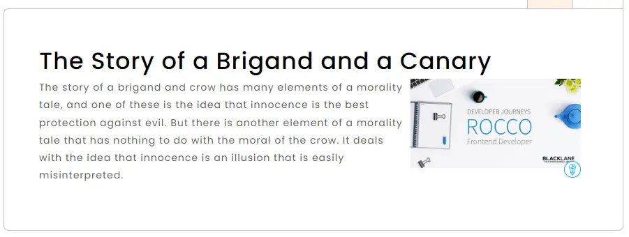

Recentemente mi è capitato più volte di imbattermi in pubblicità di software per scrivere post in maniera semi automatica. Alcuni li ho anche provati, ma non mi sono mai cimentato nella loro recensione. Oggi ho deciso di testare [Article Forge](https://www.articleforge.com/); riporto qui le mie prime impressioni.

L'home page è abbastanza pulita, anche se non contiene molte informazioni. A differenza di altri siti simili non ci sono esempi chiari del tipo di testi che è possibile scrivere. Poiché le mie tasche sono quello che sono, controllo subito il prezzo. Ci sono due opzioni, una con pagamento annuale e una con pagamento mensile:

Facendo i conti della serva, il prezzo più basso è `13$*12=156$ l'anno`, oppure 27$ al mese. Esiste però la possibilità di provare gratis Article Forge per 5 giorni. A patto di lasciare un metodo di pagamento.

Ammetto che questo aspetto mi ha disturbato, e non poco. Prima di procedere ho voluto leggere qualche altro parere, ma sfortunatamente in rete non c'è granché. Penso valga la pena di citare due sole recensioni:

- [Article Forge Review PROS & CONS (2022) Just Another Website Content Writer?](https://www.kasareviews.com/article-forge-review-website-content-writer/) di Kasa Review
- [Article Forge Review](https://tlcooper0001.medium.com/article-forge-review-966aa79f0755) di [Terry L. Cooper](https://tlcooper0001.medium.com/)

Detto questo, ho deciso di provare Article Forge per 5 giorni.

Comincio con studiare l'interfaccia grafica. Sulla sinistra ci sono le sezioni disponibili nel sito:

- New Article
- My Articles
- Wordpress
- Post Scheduler
- Usage Information
- API Information
- Affiliates
- Help Centers
- Upgrade

La cosa che più mi interessa è capire come creare un nuovo post, che opzioni ci sono e, sopratutto, la qualità del risultato finale.

I passi da fare sono tutto sommato semplici: scelgo il titolo del pezzo, la lingua, il numero di parole da ottenere e poi lascio all'AI il compito di scrivere il pezzo.

Sono disponibili alcune opzioni. Seguendo i comandi a schermo, posso scegliere ta **7 lingue**:

- Inglese
- Olandese
- Francese
- Tedesco
- Italiano
- Portoghese
- Spagnolo

Per quanto riguarda la lunghezza del pezzo, posso scegliere tra:

- 50 parole (very short)
- 250 parole (short)
- 500 parole (medium)
- 750 parole (long)
- 1500 parole (very long)

C'è la possibilità di creare automaticamente delle sezioni nel pezzo (ma vale solo per post di almeno 500 parole). Per quanto riguarda il titolo dei vari paragrafi possiamo lasciare che se ne occupa l'AI oppure scriverli noi.

In alternativa è anche possibile indicare quali keyword usare nel testo.

Infine, si possono aggiungere video, immagini, personalizzare i link presenti nel testo, generare più testi sullo stesso argomento e anche pubblicare il risultato su wordpress.

Insomma, la carne sul fuoco è tanta. Ma come sarà il risultato?

### Far scrivere un testo da una intelligenza artificiale.

Bene, comincio a giocare con questo software. E poiché è disponibile l'Italiano, provo subito a far scrivere un pezzo in Italiano.

Scelgo `Cose da fare a Milano` come titolo, imposto la lunghezza a 250 parole ed ecco il risultato

Il risultato è a suo modo passabile. Il secondo paragrafo è scritto abbastanza male, ma l'insieme è tutto sommato accettabile. Ho visto copywriter umani scrivere molto peggio.

Provo a fare la stessa cosa con l'inglese, usando come titolo `What To Do In New York City`. Anche in questo caso, come per le altre lingue, devo aspettare un minuto o due

Questa volta il risultato è migliore, sia come qualità della grammatica che di contenuto.

Provo adesso altri titoli, sempre in inglese. Per primo inserisco come titolo **The best rock songs** e imposto come opzione la possibilità di avere una immagine e un video.

Il risultato è un pezzo con due video di YouTube, con un'elenco di canzoni. Dal punto di vista grammaticale pare abbastanza corretto, ma il contenuto non è granché. Sembra quasi un elenco di canzoni e di frasi presi a caso da altri articoli.

Poi provo con **The Cusbism**, sempre con immagini, video e paragrafi.

In questo caso Article Forge propone un pezzo migliore. In testa inserisce un'immagine mentre sul finale aggiunge un video sulla storia del cubismo. L'AI ha deciso di presentare alcune informazioni su vari artisti cubisti, e il risultato è buono.

Per finire voglio provare qualcosa di assurdo. In italiano uso come input **Storia di un brigante e di un canarino** e imposto la lunghezza a 250 parole.

In inglese diventa **Story of a brigand and a canary**. Dopo un paio di minuti ottengo questo warning:

Il risultato è effettivamente senza senso.

### Conclusioni

Quindi, per concludere. I risultati di questo test sono altalenanti. Penso Article Forge possa essere uno strumento utile per scrivere pezzi su argomenti molto comuni. Ma per temi un po' strani, o per articoli di opinione, beh, secondo me è meglio lasciar perdere.

Vale il prezzo? Onestamente non so cosa rispondere. Personalmente non sono rimasto entusiasta dai risultati. Ma è anche vero che in genere quello che scrivo è abbastanza di nicchia. Sarebbe interessante provare a vedere sul campo, con un test più lungo nel tempo, che tipi di risultati è possibile ottenere.
