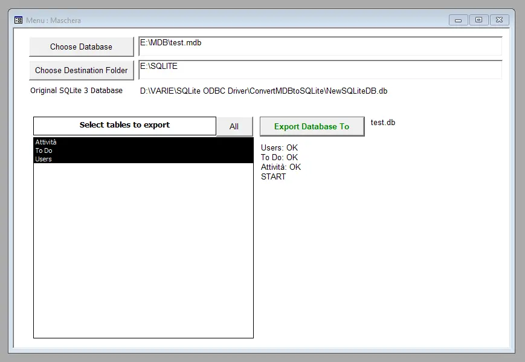
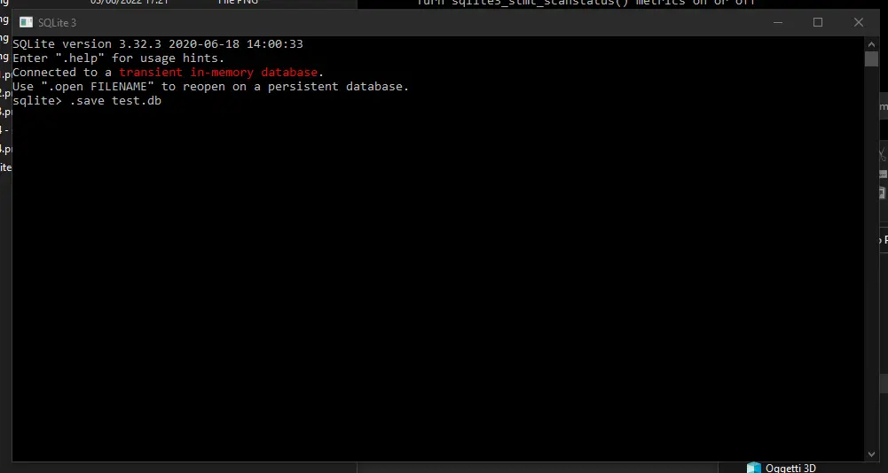
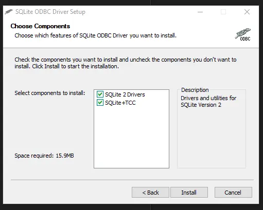
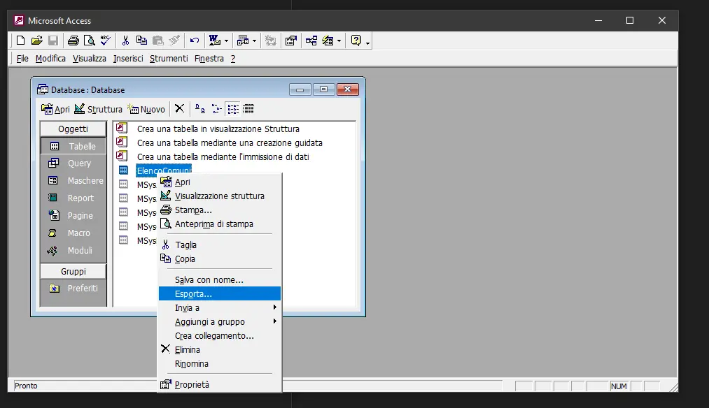
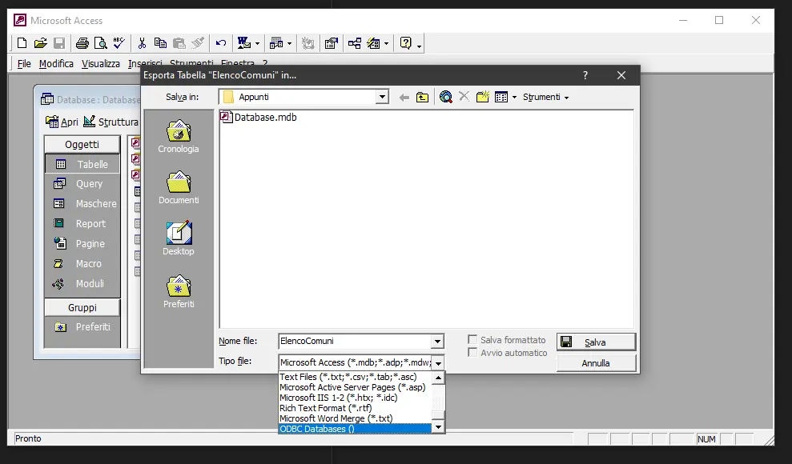
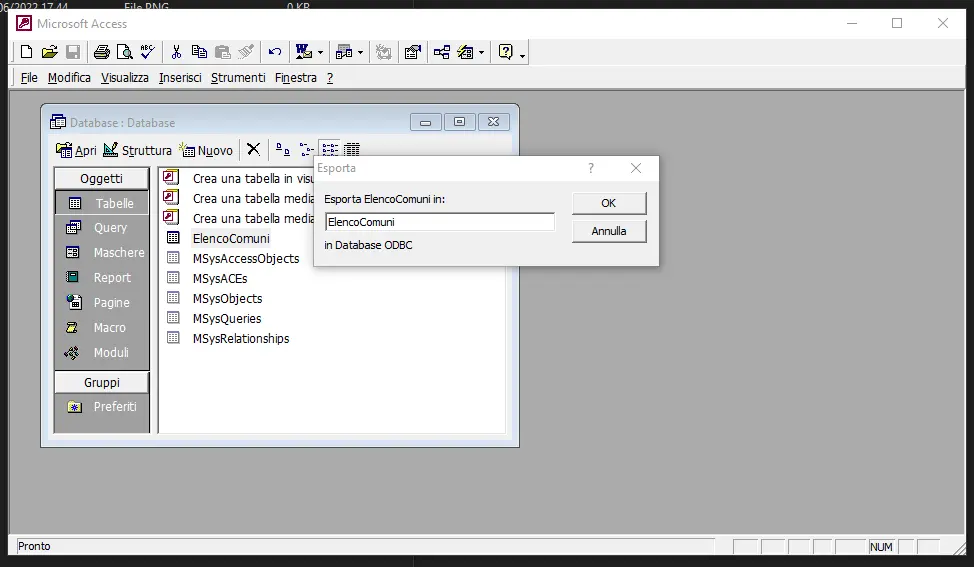
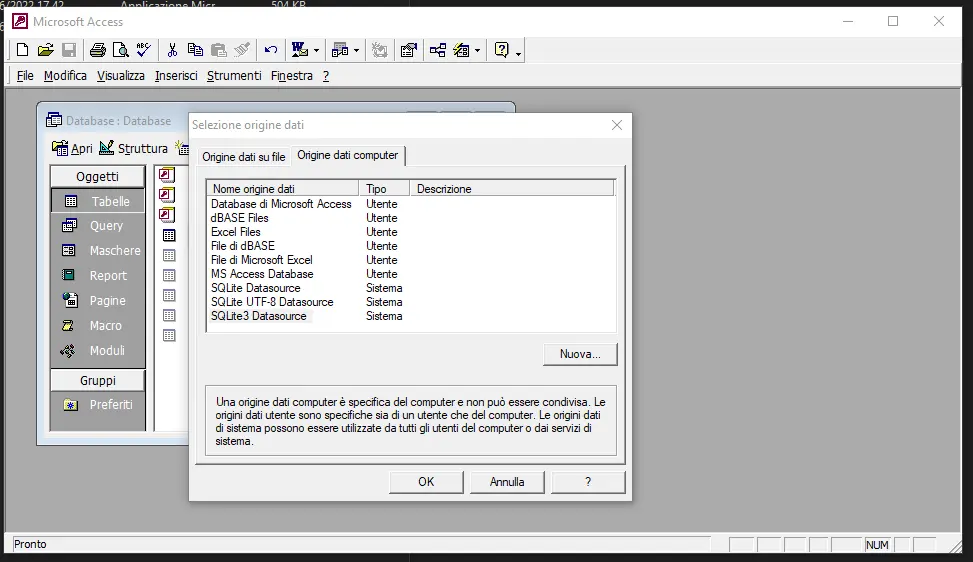
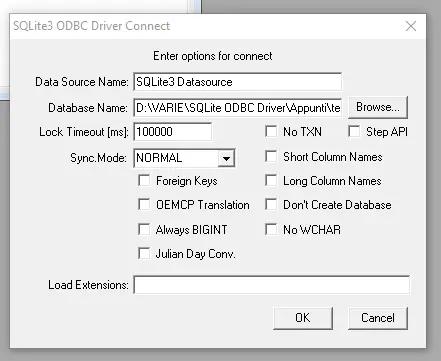

Quindi, come posso convertire un file MDB in un database SQLite? Alla fin della fiera il modo più semplice è creare un database MDB da usare per convertire in maniera semi automatica gli altri file MDB. Voglio ottenere una maschera simile a questa, da usare o far usare ad altri:

Ma prima di poter arrivare a questo devo configurare il PC. Comincio con scaricare SQLite. Posso farlo abbastanza rapidamente usando i file precompilati presenti su [sqlite.org](https://www.sqlite.org/download.html). Per Windows scarico gli **sqlite-tools-win32-x86**. Dopo aver scompattato la cartella ho a disposizione 3 file:

- sqlite3.exe
- sqldiff.exe
- sqlite3_analyzer.exe

Posso usare **sqlite3.exe** da terminale per creare un database vuoto:

Microsoft Access non riconosce nativamente i file SQLite, mi servono dei driver. Online non ci sono molte alternative: ce ne sono solo due:

- [ODBC Driver for SQLite](https://www.devart.com/odbc/sqlite/) by devart. Ma costa 170 dollari.
- [SQLite ODBC Driver](https://www.sqlitetutorial.net/download-install-sqlite/) by Christian Werner. Ma è fermo alla versione SQLite 3.32.3

Per quello che voglio ottenere la versione gratis è più che sufficiente. Installo quindi gli **SQLite ODBC Driver**.

Dopo aver creato un database SQLite vuoto posso cominciare a esportare le varie tabelle di un database MS Access. Apro il file con Access, vado nell'elenco delle tabelle, seleziono la tabella da esportare. Clicco quindi con il tasto destro del mouse e seleziono l'opzione **Esporta**.

Come tipo file scelgo **ODBC Databases ()**

Decido poi il nome da assegnare alla tabella esportata:

Quindi seleziono il driver da usare per l'esportazione. Nel mio caso va bene _SQLite3 Datasource_.

Quindi seleziono il database SQLite (usando il pulsante _Browse..._), se serve imposto i parametri e quindi clicco su _OK_ per completare l'esportazione della tabella da Access a SQLite.

Finché si tratta di una manciata di database, e di poche tabelle, è possibile fare tutto a mano. Ma quando le cose diventano più grandi, quando ci sono decine, centinaia o addirittura migliaia di tabelle, è necessario usare una soluzione più automatica. Per questo motivo, ho creato una soluzione che mi permette di esportare un database MS Access in un database SQLite. Ho caricato il codice su GitHub nel repository [el3um4s/how-to-export-mdb-to-sqlite-3](https://github.com/el3um4s/how-to-export-mdb-to-sqlite-3).

Scarico su PC due file:

- [ExportMDBToSQLite3.mdb](https://github.com/el3um4s/how-to-export-mdb-to-sqlite-3/raw/main/export-mdb-to-sqlite3/ExportMDBToSQLite3.mdb)
- [NewSQLiteDB.db](https://github.com/el3um4s/how-to-export-mdb-to-sqlite-3/raw/main/export-mdb-to-sqlite3/NewSQLiteDB.db)

Per semplicità li metto nella stessa cartella. Poi apro il file mdb:

Posso selezionare il database di origine, la cartella di destinazione, le tabelle da esportare e il file di destinazione. Cliccando il pulsante _Export database to_ avvio l'esportazione delle tabelle selezionate. In base alla quantità di dati presenti nel database, e alla potenza del pc utilizzato, possono volerci anche alcuni minuti per ogni database. Ma è comunque più semplice e veloce che fare a mano tabella per tabella.

Per automatizzare ancora di più è possibile scrivere del codice personalizzato. Ma di questo parlerò nel prossimo articolo, in cui andrò un po' più a fondo sulla parte VBA (Visual Basic for Applications) di questa applicazione.
