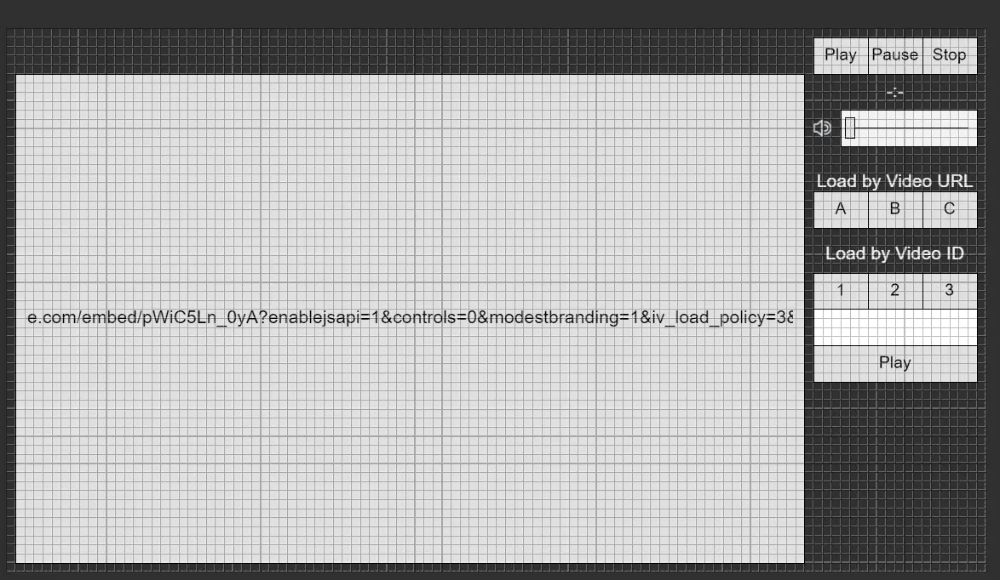
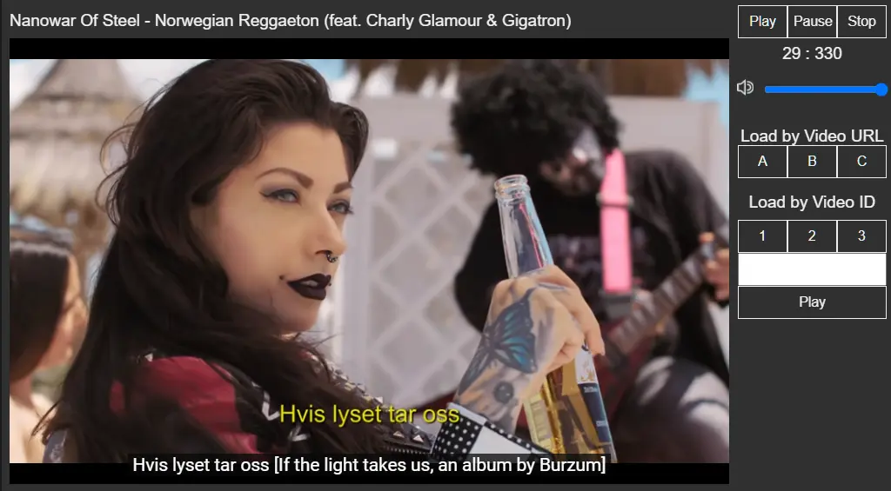

Uno dei miei progetti open source che ha avuto più successo è la mia raccolta di template per Construct 3. Non tanto la parte dedicata ai video giochi quanto quella dove ho sperimentato integrando JavaScript e event sheets. Recentemente ho ripreso in mano quello che illustrava come usare video YouTube all'interno di una web app. Penso possa essere utile anche ad altri se riporto qui alcuni suggerimenti su come creare un lettore personalizzato di video YouTube.

Per prima cosa, vediamo quello che voglio ottenere:



L'interfaccia è abbastanza semplice. La maggior parte dello schermo è occupata dal video. In alto c'è lo spazio per il titolo, e sulla destra alcuni pulsanti per controllare la riproduzione (`Play`, `Pause`, `Stop`, e il volume del suono). Sempre sulla destra, ma più in basso, alcuni pulsanti permettono di scegliere quale video riprodurre, ed eventualmente di selezionarne degli altri tramite l'ID di YouTube.

È un progetto pensato come dimostrazione, quindi nel codice ho messo la possibilità di visualizzare i video di YouTube partendo da due file JSON distinti. Il primo con gli ID dei video, il secondo con gli URL. Ovviamente è possibile scegliere il proprio metodo preferito.

È inoltre possibile scaricare il codice da questo link: 
- [simple-youtube-player.c3p](./simple-youtube-player.c3p)

Eseguendo il progetto l'interfaccia è simile a questa:



### Let's coding

Bene, finito con i preamboli, passo alla parte più interessante, ovvero come usare Javascript per creare un semplice player per YouTube. Per prima cosa, ovviamente, consiglio di consultare la [documentazione ufficiale](https://developers.google.com/youtube/iframe_api_reference).

Mi servono due funzioni da eseguire all'avvio della pagina. Con `LoadAPI` importo le api di YouTube nel mio progetto:

```js
export async function LoadAPI() {
  const scriptTag = document.createElement("script");
  scriptTag.src = "https://www.youtube.com/iframe_api";
  var firstScriptTag = document.getElementsByTagName("script")[0];
  firstScriptTag.parentNode.insertBefore(scriptTag, firstScriptTag);

  return new Promise((resolve) => {
    globalThis["onYouTubeIframeAPIReady"] = resolve;
  });
}
```

Mi serve, inoltre, un altra funzione per creare effettivamente il player e assegnare gli eventi che mi interessa monitorare (ovvero poter controllare l'esecuzione del video tramite dei pulsanti personalizzati)

```js
export async function CreatePlayer(iframeId, eventHandlers) {
  return new Promise((resolve) => {
    if (!eventHandlers) eventHandlers = {};
    eventHandlers["onReady"] = (e) => resolve(e.target);

    // ADD ON PLAYER STATE CHANGE
    eventHandlers["onPlayerStateChange"] = (e) => resolve(e.target);

    new globalThis["YT"]["Player"](iframeId, {
      events: eventHandlers,
    });
  });
}
```

Finalmente posso creare il video vero e proprio usando la funzione `createVideo` e passando l'ID dell'iFrame come argomento:

```js
import * as YouTube from "./youTube.js";

export async function createVideo(iframeId) {
  Globals.ytPlayer[iframeId]["player"] = await YouTube.CreatePlayer(iframeId, {
    onStateChange: (e) => {
      console.log(e.data);
    },
    onReady: (e) => {
      console.log(e);
    },
  });
  return true;
}
```

Come usare questo codice dipende dal tipo di progetto e dal framework utilizzato. Nel progetto di esempio uso questa funzione per passare alcune informazioni all'interfaccia principale. A titolo esemplificativo riporto il codice:

```js
export const Globals = {
  ytPlayer: {},
};

export function initializeVideo(iframeId) {
  Globals.ytPlayer[iframeId] = {};
  Globals.ytPlayer[iframeId]["player"] = null;
}

export async function createVideo(iframeId) {
  Globals.ytPlayer[iframeId]["player"] = await YouTube.CreatePlayer(iframeId, {
    onStateChange: (e) => {
      Globals.ytPlayer[iframeId]["state"] = e.data;
      g_runtime.globalVars[`YTStatus_${e.target.i.id}`] = e.data;
      g_runtime.globalVars[`YTTitle_${e.target.i.id}`] = e.target.videoTitle;
    },
    onReady: (e) => {
      g_runtime.globalVars[`YTReady_${frameID}`] = true;
    },
  });
  return true;
}
```

### Creare dei comandi personalizzati

Poiché ho legato il player YouTube all'iFrame della pagina web, posso creare delle funzioni personalizzate da usare nel mio codice. Posso inoltre avere più video nella stessa pagina, a patto che ognuno abbia un ID diverso.

### Riprodurre un video, metterlo in pausa e fermarlo

```js
export function playVideo(iframeId) {
  Globals.ytPlayer[iframeId]["player"].playVideo();
}
export function pauseVideo(iframeId) {
  Globals.ytPlayer[iframeId]["player"].pauseVideo();
}
export function stopVideo(iframeId) {
  Globals.ytPlayer[iframeId]["player"].stopVideo();
}
```

### Gestire il volume di un video di YouTube

```js
export function setVolume(iframeId, volume) {
  Globals.ytPlayer[iframeId]["player"].setVolume(volume);
}
export function getVolume(iframeId) {
  return Globals.ytPlayer[iframeId]["player"].getVolume();
}

export function mute(iframeId) {
  Globals.ytPlayer[iframeId]["player"].mute();
}
export function unMute(iframeId) {
  Globals.ytPlayer[iframeId]["player"].unMute();
}
```

### Caricare un video ma non eseguirlo automaticamente

```js
export function cueVideoById(iframeId, videoId) {
  Globals.ytPlayer[iframeId]["player"].cueVideoById(videoId);
}
export function cueVideoByUrl(iframeId, videoId) {
  Globals.ytPlayer[iframeId]["player"].cueVideoByUrl(videoId);
}
```

### Caricare un video e farlo partire immediatamente

```js
export function loadVideoById(iframeId, videoId) {
  Globals.ytPlayer[iframeId]["player"].loadVideoById(videoId);
}
export function loadVideoByUrl(iframeId, videoId) {
  Globals.ytPlayer[iframeId]["player"].loadVideoByUrl(videoId);
}
```

### Caricare una playlist

```js
export function loadPlaylist(iframeId, videoId) {
  Globals.ytPlayer[iframeId]["player"].loadPlaylist(Globals.playlist[videoId]);
}

export function lengthPlaylist(iframeId) {
  return Globals.ytPlayer[iframeId]["player"].getPlaylist().length;
}
```

### Ricavare la durata di un video

```js
export function getCurrentTime(iframeId) {
  return Globals.ytPlayer[iframeId]["player"].getCurrentTime();
}
export function getDuration(iframeId) {
  return Globals.ytPlayer[iframeId]["player"].getDuration();
}
```

E così via.

### YouTube senza codice

Per quello che riguarda la parte in JavaScript penso di potermi fermare qui. Per chi invece volesse guardare la parte inserita negli Event Sheets del progetto, si tratta semplicemente di richiamare le corrispondenti funzioni.


Per esempio, la funzione C3 non è altro che questo:

```js
import * as VideoYT from "./videoYT.js";
VideoYT.loadVideoById(localVars.iframeId, localVars.videoId);
```

Allo stesso modo, per gestire la riproduzione del video posso usare JS in maniera "nascosta":


