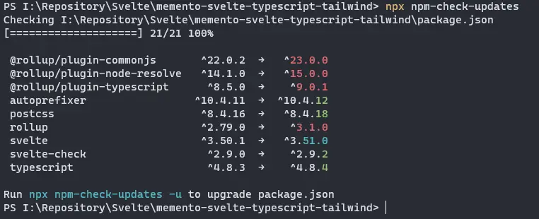
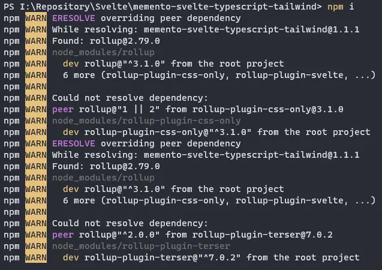
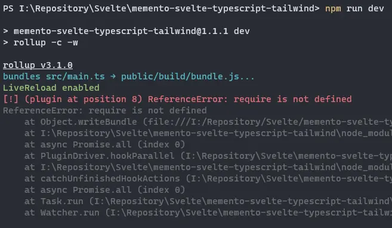

Qualche giorno fa [Rollup](https://rollupjs.org/guide/en/) ha raggiunto la versione 3. Ho aggiornato alcuni miei progetti, ma non è stata una operazione indolore. Ci sono alcune modifiche da fare nel codice, e alcuni plugin da aggiornare. In questo post riporto i passi che ho seguito, sperando che possano essere utili anche a qualcun altro.

Per cominciare, in questo post uso come esempio un mio repository aggiornato più di un mese fa, [MEMENTO - Svelte, Typescript & TailwindCSS](https://github.com/el3um4s/memento-svelte-typescript-tailwind), ma il processo è lo stesso per tutti i progetti che usano Rollup.

Per prima cosa controllo quali pacchetti sono da aggiornare, per questo uso il comando

```bash
npx npm-check-updates
```

In questo modo ottengo la lista dei pacchetti da aggiornare



Ora aggiorno i pacchetti

```bash
npx npm-check-updates -u
npm install
```

I primi problemi cominciano adesso. Ottengo una serie di messaggi di errore; estrapolando la parte importante posso ricavare 3 errori;

- `ERESOLVE overriding peer dependency`
- `peer rollup@"1 || 2" from rollup-plugin-css-only@3.1.0`
- `peer rollup@"^2.0.0" from rollup-plugin-terser@7.0.2`



Sono collegati, perché ho due pacchetti che hanno come dipendenza `rollup` la versione 1 o 2. Per risolvere questo problema, devo aggiornare questi due pacchetti. Il problema è che al momento i due repository appaiono dormienti. Ho fatto per entrambi una pull request con una possibile soluzione. Spero che vengano aggiornati presto.

Nell'attesa ho creato due fork, con due pacchetti che dovrebbero risolvere il problema:

- [@el3um4s/rollup-plugin-css-only](https://www.npmjs.com/package/@el3um4s/rollup-plugin-css-only)
- [@el3um4s/rollup-plugin-terser](https://www.npmjs.com/package/@el3um4s/rollup-plugin-terser)

Quindi, disinstallo i due plugin problematici:

```bash
npm uninstall rollup-plugin-css-only rollup-plugin-terser
```

E li sostituisco con i miei fork

```bash
npm install @el3um4s/rollup-plugin-css-only @el3um4s/rollup-plugin-terser
```

Devo anche cambiare i riferimenti presenti nel file `rollup.config.js`:

```javascript
import css from "@el3um4s/rollup-plugin-css-only";
import { terser } from "@el3um4s/rollup-plugin-terser";
```

invece di `import css from "rollup-plugin-css-only";` e `import { terser } from "rollup-plugin-terser";`

Ora, se provo a lanciare il comando `npm run dev` ottengo un altro errore

```text
[!] (plugin at position 8) ReferenceError: require is not defined
ReferenceError: require is not defined
```



In questo caso il problema è legato alla funzione `serve`:

```javascript
function serve() {
  let server;

  function toExit() {
    if (server) server.kill(0);
  }

  return {
    writeBundle() {
      if (server) return;
      server = require("child_process").spawn(
        "npm",
        ["run", "start", "--", "--dev"],
        {
          stdio: ["ignore", "inherit", "inherit"],
          shell: true,
        }
      );

      process.on("SIGTERM", toExit);
      process.on("exit", toExit);
    },
  };
}
```

Devo sostituire `require("child_process")` con `import { spawn } from "child_process"`:

```javascript
import { spawn } from "child_process";

function serve() {
  let server;

  function toExit() {
    if (server) server.kill(0);
  }

  return {
    writeBundle() {
      if (server) return;
      server = spawn("npm", ["run", "start", "--", "--dev"], {
        stdio: ["ignore", "inherit", "inherit"],
        shell: true,
      });

      process.on("SIGTERM", toExit);
      process.on("exit", toExit);
    },
  };
}
```

Fatto questo posso usare `npm run dev` e `npm run build` senza problemi.

