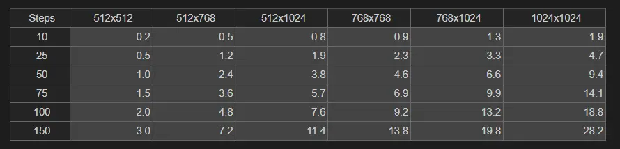
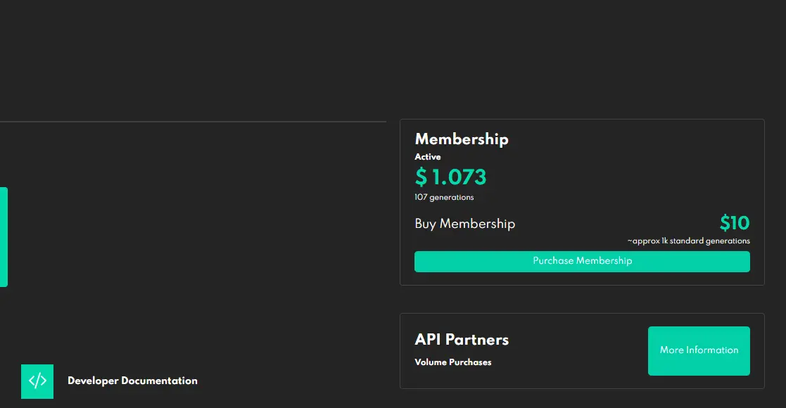
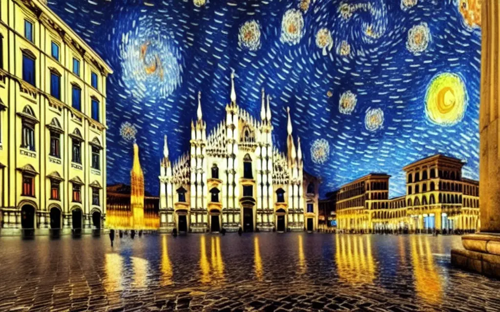
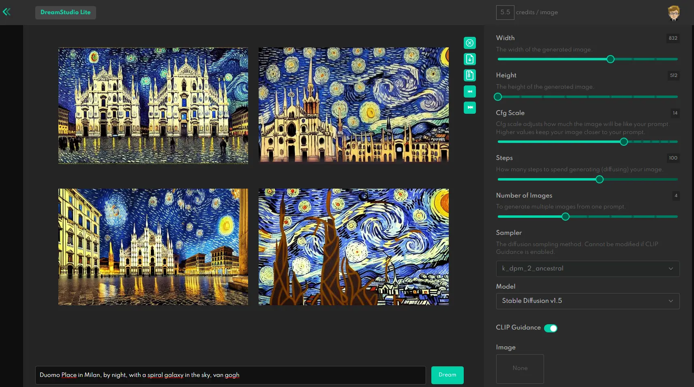
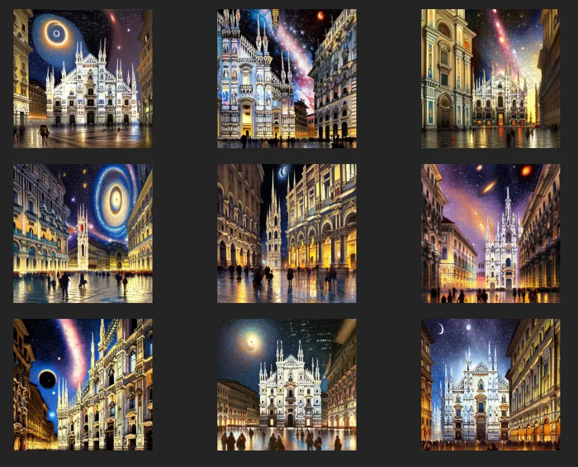
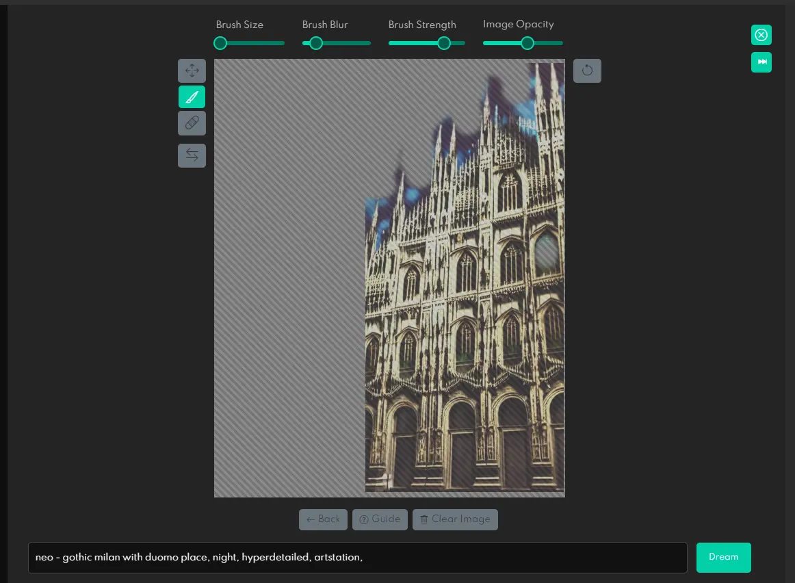
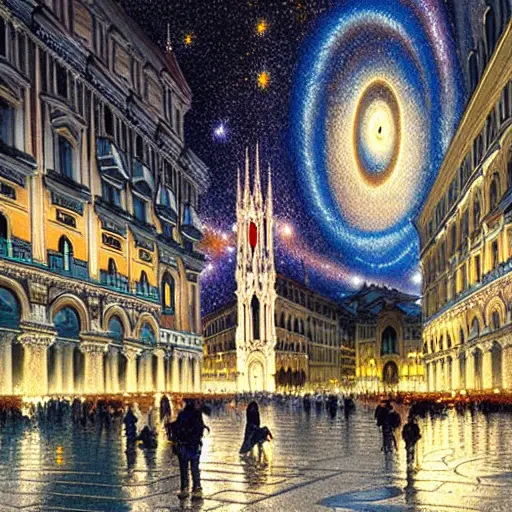

Nei giorni scorsi sono incappato in alcuni articoli riguardo [Dream Studio](https://dreamstudio.ai/) e [Lexica Art](https://lexica.art). Sono due servizi che permettono di creare immagini a partire da testo. L'approccio è leggermente diverso. Dream Studio è a tutti gli effetti un editor che permette di creare le immagini, Lexica è principalmente un motore di ricerca con alcune informazioni interessanti. In questo post voglio però parlare solamente del primo strumento.

Strumento che non è gratuito, anzi. Richiede l'acquisto di pacchetti di "punti". Ogni punto costa 0.01$ e permette di creare una immagine. Il prezzo è quindi di 1$ per 100 immagini. Non è un prezzo esagerato, ma è comunque un costo da considerare. Per chi non vuole spendere, Dream Studio offre un pacchetto di 200 punti gratis. Per chi vuole provare, è un'ottima occasione.

Anche se non è esattamente vero che un punto vale un'immagine

In qualche modo, più un'immagine è grande e "bella" più costa. Inoltre viene conteggiata ogni immagine generata, non solo quella con il risultato finale. Questo fa sì che sia molto facile spendere punti, magari anche in solo mezz'ora di test:

Però. Però dopo aver capito il funzionamento si possono creare immagini molto interessanti. Per esempio questa:

Per generare un'immagine come questa ho usato il testo `Duomo Place in Milan, by night, with a spiral galaxy in the sky, van gogh`. Dopo averlo inserito, imposto i parametri sulla barra a destra.

**Width** e **Height** permettono di definire le dimensioni dell'immagine. Più sono grandi, più costano.

**Cfg Scale**, aka _Classifier Free Guidance_ definisce quanto dare peso alla descrizione testuale. In pratica, più è alto, più l'immagine sarà simile a quanto scritto. Più è basso, più l'immagine sarà generata in modo casuale. È un parametro abbastanza complesso da maneggiare, ma è quello che permette di ottenere i risultati più interessanti.

**Steps** indica il numero di passaggi da usare per ogni immagine generata. Più sono bassi, più la generazione è veloce, più la qualità è bassa. Al contrario, aumentando gli steps la qualità aumenta, ma aumenta anche il tempo di generazione. Inoltre, il miglioramento non è lineare, e dopo un certo punto non si ottiene più nulla. In pratica, è un parametro da usare con cautela.

**Seed** è il seme da usare per la generazione. Se si vuole ripetere la generazione, è necessario usare lo stesso seme. Se si vuole generare immagini diverse, è necessario cambiare il seme. O impostare un seme casuale.

**Number of Images** permette di creare molte immagini diverse contemporaneamente. Ogni immagine costa dei punti. Creare nove immagini alla volta è forse il modo migliore per finire i punti in poco tempo.

Oltre a creare le immagini, è possibile modificare quelle già create, o usarne di proprie. Per farlo si utilizza un editor

Qui cominciano i miei problemi. Non è proprio facile capire come usarlo, e come combinare i vari aspetti. Per di più ogni tentativo costa dei punti, rendendo un po' difficile fare dei test in modo spensierato. Su YouTube ci sono alcuni tutorial: forse approfondirò questo aspetto in un altro articolo.

### Conclusione

Beh, che dire? Mi piace, mi piace, mi piace. Anche se è una beta, e quindi ci sono delle cose da sistemare qui e là (sopratutto sull'interfaccia), il prezzo è comunque molto interessante. E le immagini che si possono creare sono davvero belle. Se avete bisogno di immagini per un sito, un blog, un libro, un poster, ecc. ecc. ecc. potrebbe essere un'ottima soluzione.

Ho notato che si ottengono risultati migliori scrivendo delle descrizioni precise, e aggiungendo informazioni sullo stile da tenere, magari indicando degli artisti a cui ispirarsi.
