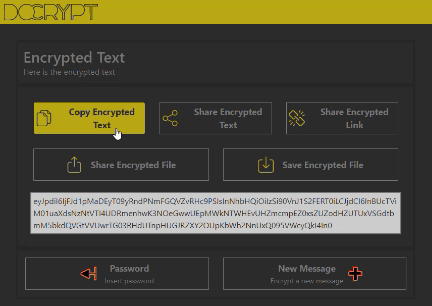
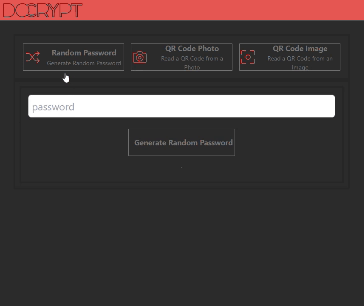

Nell'ultimo mese ho lavorato a un mio side project, un'applicazione web che permette di cifrare e decifrare messaggi di testo ([DoCrypt.org](https://docrypt.org/)). È ancora un work in progress, ma ho già implementato alcune funzionalità che mi piacerebbe condividere. Penso sia un progetto interessante, e intendo dedicarci alcuni articoli in futuro. Per ora, voglio concentrarmi su una funzionalità che ho implementato recentemente: le notifiche.

### Il problema da risolvere

Il mio problema è tutto sommato semplice: mi interessa confermare in maniera visiva il successo di alcune operazioni. In particolare l'azione di "copia negli appunti del dispositivo" del testo cifrato. Questa è una funzionalità che ho implementato per consentire agli utenti di copiare il testo cifrato in un'applicazione esterna, come ad esempio un messaggio di testo. Per questo motivo, ho deciso di implementare una notifica che conferma la copia negli appunti del dispositivo.

Visivamente, questo è il risultato che voglio ottenere:



Come si può vedere, la notifica è una piccola barra che appare in alto a destra. La barra è di colore verde, e contiene un messaggio di testo. La barra rimane visibile per un breve periodo di tempo, e poi scompare. La cosa interessante è che posso usare lo stesso metodo per mostrare diverse notifiche, di diversi colori e con diversi messaggi.

### Creo uno store per le notifiche

Per risolvere questo problema ho usato un componente [Svelte](https://svelte.dev/). L'idea alla base non è mia, mi sono ispirato a questo [repl](https://svelte.dev/repl/2254c3b9b9ba4eeda05d81d2816f6276) di [@kevmodrome](https://twitter.com/kevmodrome), e poi ovviamente ho personalizzato il tutto in base alle mie esigenze.

Praticamente mi servono due cose: un elemento html da usare a schermo per mostrare le notifiche, e un qualcosa che tenga traccia delle notifiche stesse e del loro ciclo di vita. Comincio da questo aspetto. E per risolverlo uso uno [store](https://svelte.dev/docs#run-time-svelte-store).

Creo il file `Notification.ts` e comincio con l'impostare alcune interfacce e a creare uno store semplice:

```typescript
import { writable } from "svelte/store";
import type { Writable } from "svelte/store";

const TIMEOUT = 3000;

type MessageType = "default" | "danger" | "warning" | "info" | "success";

export interface Msg {
  type: MessageType;
  message: string;
  timeout?: number;
}

interface Message {
  id: string;
  msg: Msg;
}

const notificationStore: Writable<Message[]> = writable([]);

const notifications = {
  subscribe: notificationStore.subscribe,
};

export default notifications;
```

Come si può vedere, ho creato un'interfaccia `Msg` che rappresenta una notifica. La notifica ha un tipo, che può essere `default`, `danger`, `warning`, `info` o `success`. Il tipo di notifica determina il colore della barra. Il messaggio è il testo che viene mostrato nella barra. Infine, il timeout è il tempo che la notifica rimane visibile. Se non viene specificato, viene usato il valore di default di 3000 millisecondi.

A ogni notifica assegno un ID; mi serve un identificato unico per poter interagire con la notifica stessa in un secondo momento. Non posso usare un contatore basato sulla lunghezza dell'array, perché potrei cancellare una notifica e quindi il contatore non sarebbe più valido. Per questo motivo, uso la funzione `idGenerator()` per generare un ID univoco.

```typescript
const idGenerator = (): string =>
  "_" + Math.random().toString(36).substring(2, 9);
```

Mi serve quindi un metodo per aggiungere notifiche allo store:

```typescript
const notifications = {
  // ...
  send: (msg: Msg, id: string = idGenerator()) => {
    notificationStore.update((n) => {
      return [...n, { id, msg }];
    });
  },
};
```

Uso il metodo `update()` dello store per aggiungere una nuova notifica all'array. Il metodo `update()` accetta una funzione che riceve lo stato attuale dello store, e restituisce lo stato aggiornato. In questo caso, aggiungo una nuova notifica all'array.

Mi interessa passare l'id in maniera esplicita perché possono esserci dei casi in cui mi interessa accedere alla notifica dall'esterno del componente. Se invece scelgo di non passare l'id, allora lo genero internamente.

Ora mi serve un metodo per rimuovere una notifica dallo store:

```typescript
const notifications = {
  // ...
  remove: (id: string) => {
    notificationStore.update((n) => {
      return n.filter((m) => m.id !== id);
    });
  },
};
```

Anche in questo caso uso il metodo `update()`, unito al metodo [filter()](https://developer.mozilla.org/en-US/docs/Web/JavaScript/Reference/Global_Objects/Array/filter), per rimuovere la notifica dall'array.

Per gestire la scompara delle notifiche mi serve un timer, o qualcosa di simile. Per fortuna viene in mio aiuto il metodo [SetTimeout()](https://developer.mozilla.org/en-US/docs/Web/API/setTimeout):

```typescript
// ...
setTimeout(
  () => {
    notificationStore.update((n) => {
      return n.filter((m) => m.id !== id);
    });
  },
  msg?.timeout ? msg.timeout : TIMEOUT
);
// ...
```

Unendo il tutto ottengo il file `Notification.ts` completo:

```typescript
import { writable } from "svelte/store";
import type { Writable } from "svelte/store";

const TIMEOUT = 3000;

type MessageType = "default" | "danger" | "warning" | "info" | "success";

export interface Msg {
  type: MessageType;
  message: string;
  timeout?: number;
}

interface Message {
  id: string;
  msg: Msg;
}

const idGenerator = (): string =>
  "_" + Math.random().toString(36).substring(2, 9);

const notificationStore: Writable<Message[]> = writable([]);

const notifications = {
  subscribe: notificationStore.subscribe,
  send: (msg: Msg, id: string = idGenerator()) => {
    notificationStore.update((n) => {
      return [...n, { id, msg }];
    });
    setTimeout(
      () => {
        notificationStore.update((n) => {
          return n.filter((m) => m.id !== id);
        });
      },
      msg?.timeout ? msg.timeout : TIMEOUT
    );
  },
  remove: (id: string) => {
    notificationStore.update((n) => {
      return n.filter((m) => m.id !== id);
    });
  },
};

export default notifications;
```

Sistemata la parte dello store, passo alla parte del componente.

### Creo un componente per le visualizzare notifiche

Creo il file `Notification.svelte` e comincio con l'importare lo store:

```js
import notifications from "./Notification";
```

Per accedere ai valori dello store posso usare la [reactive `$store` syntax](https://svelte.dev/docs#component-format-script-4-prefix-stores-with-$-to-access-their-values). Inoltre per mostrare tutti i valori contenuti nello store, uso il metodo [`{#each...}`](https://svelte.dev/docs#template-syntax-each):

```html
<div class="notifications">
  {#each $notifications as notification (notification.id)}
    <div class="toast">
      <div class="content">{notification.msg.message}</div>
    </div>
  {/each}
</div>
```

Come si può vedere, uso il metodo `each` per iterare su tutti i valori dello store. Per ogni valore, creo un div con il testo della notifica.

Il componente di per sé sarebbe anche completo, ma mi interessa aggiungere qualche stile per rendere il tutto più succoso.

```css
.notifications {
  position: fixed;
  top: 64px;
  left: 0;
  right: 8px;
  margin: 0 auto;
  padding: 0;
  z-index: 9999;
  display: flex;
  flex-direction: column;
  justify-content: flex-start;
  align-items: flex-end;
  pointer-events: none;
}

.toast {
  flex: 1;
  margin-bottom: 10px;
  min-width: 240px;
  padding: 10px;
  text-align: center;
  border: 4px solid transparent;
  border-radius: 2px;
}

.content {
  padding: 10px;
  display: block;
  color: white;
  font-weight: 500;
}
```

In questo modo mostro le notifiche in alto a destra nello schermo, una sopra l'altra.

Ma come faccio a mostrare le notifiche con un colore diverso a seconda del tipo? Per farlo, aggiungo una classe al div `toast` in base al tipo di notifica e un oggetto da usare come riferimento per i colori:

```html
<script>
  export let themes = {
    danger: "#E26D69",
    success: "#1f8c34",
    warning: "#f0ad4e",
    info: "#5bc0de",
    default: "#aaaaaa",
  };
</script>

<!-- ... -->
<div
  class="toast"
  style="background: {themes[notification.msg.type]};">
<!-- ... -->
```

Posso rendere il tutto più bellino aggiungendo un'animazione per evidenziare l'apparire e lo scomparire delle notifiche. Per farlo uso [svelte/transition](https://svelte.dev/docs#run-time-svelte-transition) e [svelte/animate](https://svelte.dev/docs#run-time-svelte-animate):

```html
<script>
  import { flip } from "svelte/animate";
  import { fly } from "svelte/transition";
</script>

<!-- ... -->
<div
  animate:flip
  class="toast"
  style="background: {themes[notification.msg.type]};"
  transition:fly={{ y: 128, duration: 500 }}
>
<!-- ... -->
```

Unendo il tutto ottengo, finalmente, il mio componente `Notification.svelte` completo:

```html
<script lang="ts">
  import { flip } from "svelte/animate";
  import { fly } from "svelte/transition";

  import notifications from "./Notification";

  export let themes = {
    danger: "#E26D69",
    success: "#1f8c34",
    warning: "#f0ad4e",
    info: "#5bc0de",
    default: "#aaaaaa",
  };
</script>

<div class="notifications">
  {#each $notifications as notification (notification.id)}
    <div
      animate:flip
      class="toast"
      style="background: {themes[notification.msg.type]};"
      transition:fly={{ y: 128, duration: 500 }}
    >
      <div class="content">{notification.msg.message}</div>
    </div>
  {/each}
</div>

<style>
  .notifications {
    position: fixed;
    top: 64px;
    left: 0;
    right: 8px;
    margin: 0 auto;
    padding: 0;
    z-index: 9999;
    display: flex;
    flex-direction: column;
    justify-content: flex-start;
    align-items: flex-end;
    pointer-events: none;
  }

  .toast {
    flex: 1;
    margin-bottom: 10px;
    min-width: 240px;
    padding: 10px;
    text-align: center;
    border: 4px solid transparent;
    border-radius: 2px;
  }

  .content {
    padding: 10px;
    display: block;
    color: white;
    font-weight: 500;
  }
</style>
```

Ora non resta che usarlo nella nostra app.

### Aggiungo il componente alle pagine

Per aggiungere il componente alle pagine, devo importarlo nel file `App.svelte`:

```html
<script>
  // ...
  import Notification from "./Notification.svelte";
  // ...
</script>

<Notification />
<Header />
<main>
  <!-- ... -->
</main>
```

Mi basta importarlo una sola volta, nella pagina principale dell'app. In questo modo posso mostrare una notifica partendo da qualunque pagina dell'app.

Per esempio, per mostrare una notifica quando ho copiato il testo cifrato, aggiungo il seguente codice al componente:

```ts
import notifications from "./Notification";

const copyText = () => {
  navigator.clipboard.writeText(cipherText);
  notifications.send({
    message: "Copied to clipboard",
    type: "success",
    timeout: 1500,
  });
};
```



Oppure, se voglio mostrare una notifica di colore diverso mi basta cambiare il `type` del messaggio:

```ts
// ...
import notifications from "../Notification/Notification";

const goHome = () => {
  page.set("Home");
  if ($password != "") {
    password.set("");
    notifications.send({
      message: "Password cleared",
      type: "danger",
      timeout: 1500,
    });
  }
  window.history.replaceState({}, document.title, "/");
};
```

Bene, direi che per il momento è tutto. Se vuoi vedere il codice completo, puoi trovarlo su [GitHub](https://github.com/el3um4s/docrypt). L'applicazione invece è disponibile su [docrypt.org](https://docrypt.org/).
