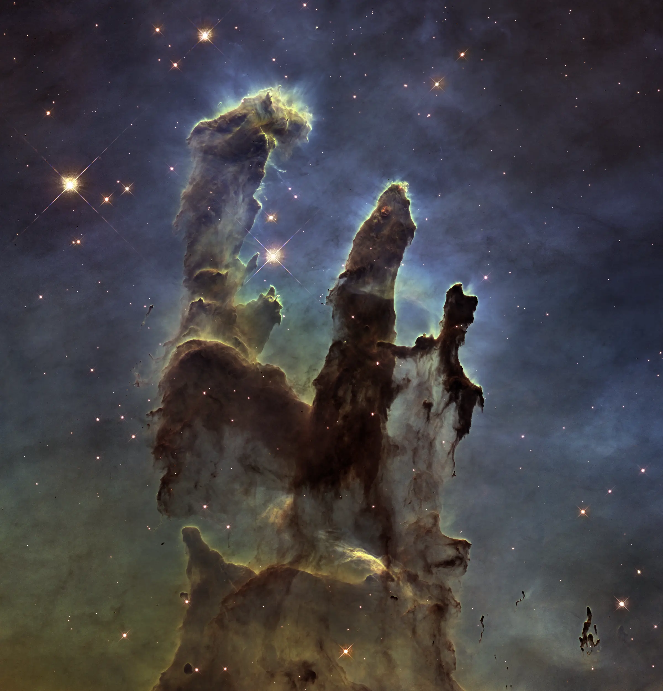

Negli ultimi giorni sono entrato in fissa con l'arte generata tramite l'Intelligenza Artificiale. Non ho le conoscenze necessarie per comprendere davvero il funzionamento di questi algoritmi, ma mi diverte molto sperimentare con le varie opzioni. Uno dei concetti più strani, per me, è quello di _guidance scale_. In questo post cercherò di capire cosa significa.

Allora, per quello che mi è dato di capire, è un numero che indica quanto è importante il prompt, ovvero la descrizione testuale dell'immagine da generale. Più basso è il numero, più l'immagine sarà "creativa"; più il numero è alto più l'immagine sarà simile al prompt.

Meglio fare un esempio. Uso come prompt questo testo:

```
ultra-cute Moebius king, a starry background, high quality, 3d render 4k, soft shadow, soft light
```

E comincio con `Guidance Scale = 1`. Il risultato è questo:


Passo quindi a `Guidance Scale = 5`


Proseguo con `Guidance Scale = 10`


Adesso tocca a `Guidance Scale = 15`


Finisco con `Guidance Scale = 20`


Come si può vedere, i risultati migliori si trovano da qualche parte tra 5 e 10. Ovviamente, dipende anche dal prompt. Ma anche quelli più bassi hanno una loro ragione d'essere, anche se non c'entrano nulla con il prompt.


### Altri esempi

Continuo a provare. Intendo usare come prompt alcuni suggerimenti di [Jim Clyde Monge](https://medium.com/@jimclydemonge). Tra parentesi, consiglio di seguire questo autore, ha articoli molto interessanti, e anche se non sono un esperto di IA, mi diverte molto leggerli. Per me è una fonte d'ispirazione, e credo che scriverò ancora qualche altro post partendo dai suoi suggerimenti.

Detto questo, facciamo un po' di test [con il prompt](https://medium.com/codex/stable-diffusion-arrives-in-photoshop-heres-how-to-install-3db277491023):

```
a misty valley with exposed fossils, extremely detailed oil painting, unreal 5 render, rhads, sargent and leyendecker, savrasov levitan polenov, bruce pennington, studio ghibli, tim hildebrandt, digital art, landscape painting, octane render, beautiful composition, trending on artstation, award winning photograph, masterpiece
```


Adesso provo [questo prompt](https://medium.com/mlearning-ai/how-to-make-super-cute-stickers-with-ai-in-under-2-minutes-782892641ba7):

```
cut sticker, kawaii, blue puppy
```


Quindi un prompt preso da un'immagine, [i pilastri della creazione](https://it.wikipedia.org/wiki/Pilastri_della_Creazione#/media/File:Heic1501a.png):

```
hubble space telescope pillars of creation
```

Il risultato che voglio ottenere è qualcosa di simile a questo:



Questo invece è quello che l'Intelligenza Artificiale crea:


Come ultimo tentativo, provo a realizzare un ritratto (il prompt è lo stesso di [queste immagini](https://lexica.art/prompt/d1dadd1c-20a6-4586-b39a-0a970812431d))

```
character portrait of young woman as a heroic retrofuturistic punk, pixie cut with shaved side hair, bad attitude, dystopian cyberpunk steampunk soviet mood, intricate, wild, highly detailed, digital painting, artstation, upper body, concept art, smooth, sharp focus, illustration, art by artgerm and greg rutkowski and alphonse mucha, vibrant deep colors
```


Bene, con questo è tutto.
