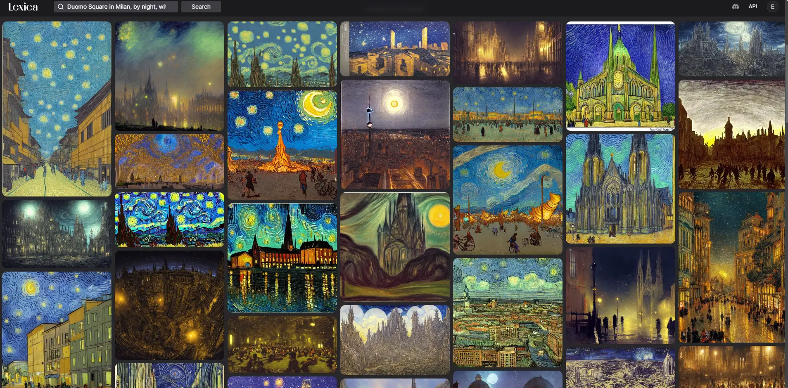
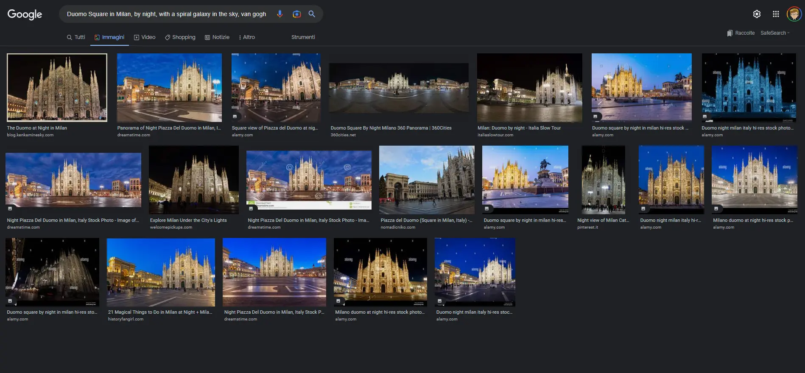
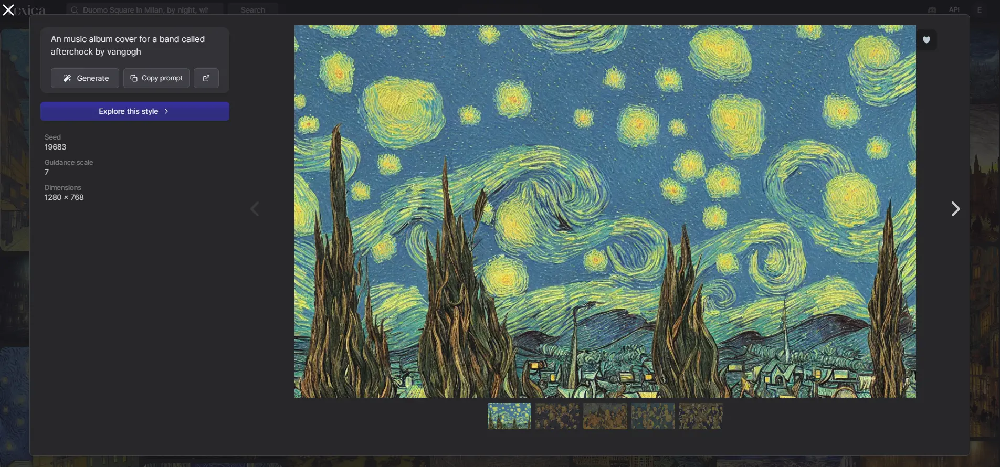
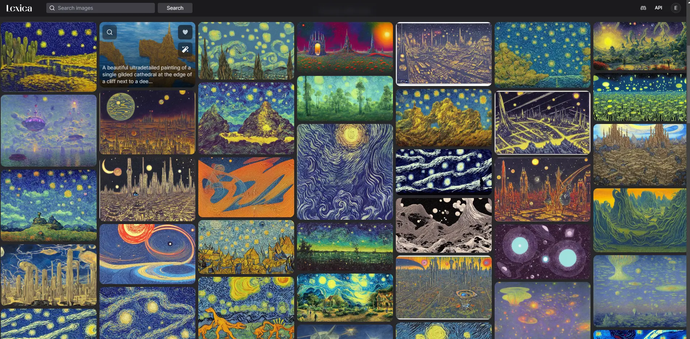
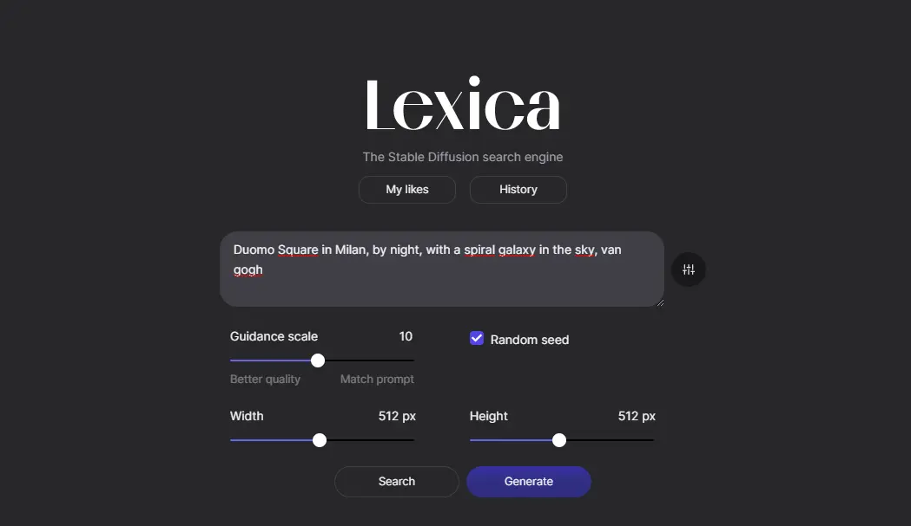
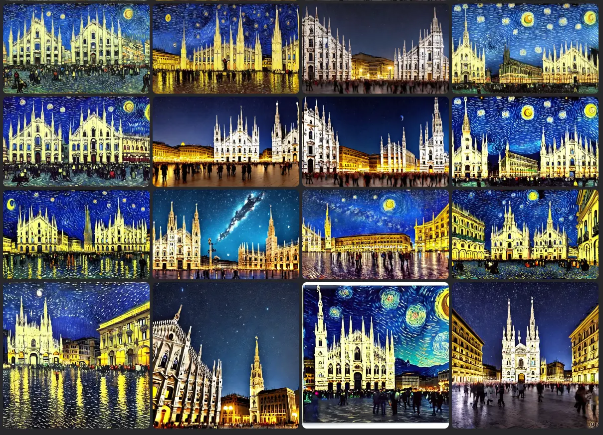
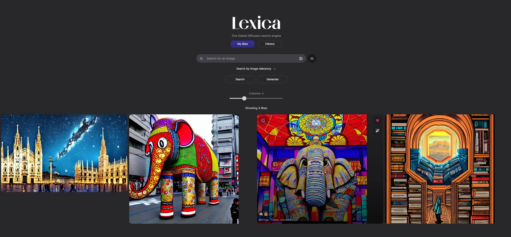
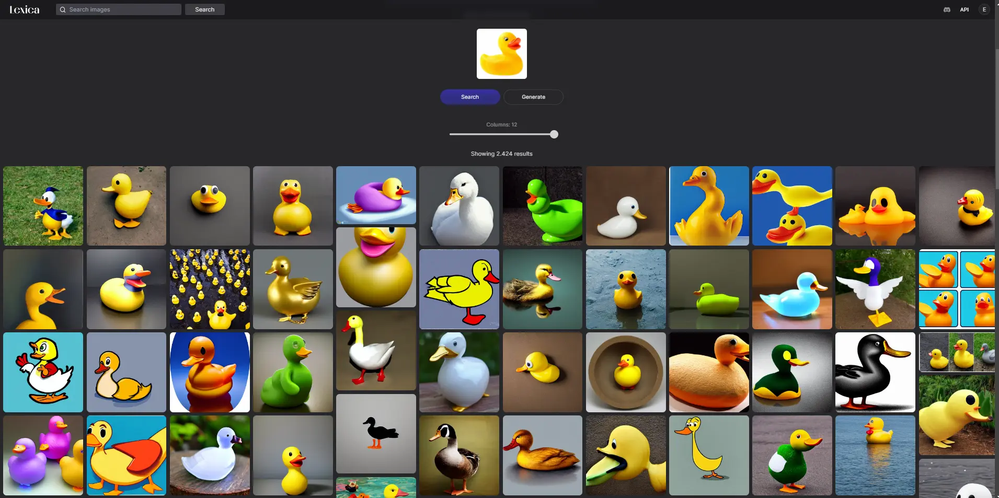
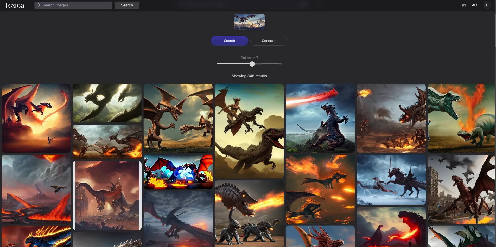

Dopo aver provato [Dream Studio](https://blog.stranianelli.com/my-first-look-at-stable-diffusion-dreamstudio-beta/) ho deciso di testare [Lexica Art](https://lexica.art/), un altro progetto di [Stable Diffusion](https://stability.ai/), che permette di cercare immagini e di creare immagini a partire da un testo. È meno personalizzabile rispetto a Dream Studio, ma è più semplice da usare e, sopratutto, è gratuito.

È un progetto recente ma molto promettente. Nasce come motore di ricerca di immagini generate dall'Intelligenza Artificiale ma in realtà è qualcosa di più.

L'interfaccia è semplice: una barra di ricerca da usare per cercare immagini. E poi sotto le anteprime dei risultati.

Anche in questo test ho usato la frase `Duomo Square in Milan, by night, with a spiral galaxy in the sky, van gogh`. Come si può facilmente vedere, ci sono molti risultati, alcuni davvero interessanti, altri meno. Ma tutti frutto dell'Intelligenza Artificiale.

Come confronto possiamo provare a cercare la stessa cosa con Google Images:

La quantità di immagini trovate è decisamente diversa. E la qualità è decisamente inferiore.

Ma questo non è l'unico punto di forza di Lexica Art. Per ogni immagine sono disponibili anche le informazioni di provenienza, ovvero il testo che ha generato l'immagine, il _seed_ e la _Classifier Free Guidance_ scale.

Sono le stesse informazioni che servono per ricreare un'immagine simile con Dream Studio. Il che significa che è possibile usare Lexica Art per cercare immagini, capire come usare il testo, analizzare i seed. In pratica è un gigantesco database di reference, e di materiale per studiare e capire come funziona l'Intelligenza Artificiale.

Per esempio, se clicchiamo su _explore this style_ vediamo una galleria di immagini simili

Già questo sarebbe un motivo valido per usare Lexica Art, ma c'è di più. È possibile anche creare immagini a partire da un testo. E questo è davvero interessante. Se clicchiamo sul pulsante _Generate_ possiamo vedere alcune opzioni:

Sono meno opzioni rispetto a Dream Studio, non è possibile scegliere il numero di iterazioni e il numero di immagini generate (sono sempre e solo 4). Ma è possibile scegliere la dimensione dell'immagine, la _Classifier Free Guidance_ scale e il _seed_.

La generazione richiede un po' di tempo (circa 20 secondi), ma il risultato è davvero interessante. E soprattutto, è possibile salvare l'immagine e usarla per scopi personali.

Mi pare che Dream Studio sia leggermente più potente, ma Lexica Art è più semplice da usare e, soprattutto, è gratuito. E questo è un punto a favore.

C'è un'altra cosa che mi piace molto di Lexica Art: è possibile salvare le immagini preferite in una galleria personale. Cliccando _My Likes_ si accede alla propria galleria:

Ma non è ancora finita. C'è ancora un'altra cosa che mi piace. È possibile caricare un'immagine e usarla come base per crearne delle altre. Provo con una paperella di gomma:

I risultati sono un po' strani, ma non completamente fuori fuoco. Usando altre immagini il risultato è decisamente migliore.

Quindi per concludere, Lexica Art è un ottimo progetto, è un'esperienza divertente e permette di realizzare cose interessanti. E per di più è gratuito.
