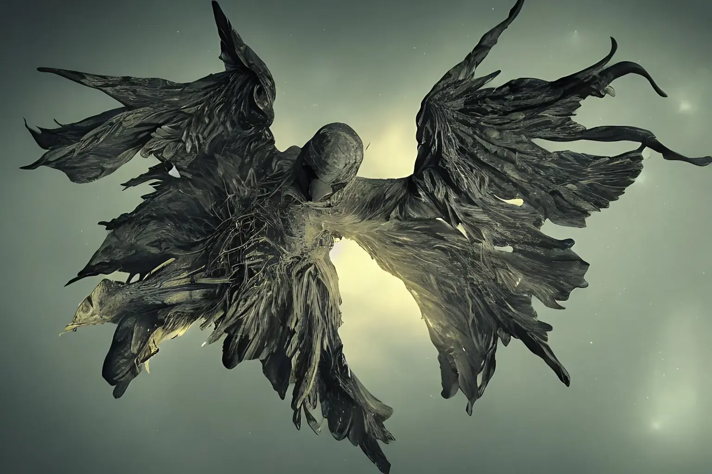

Una cosa che mi ha sempre incuriosito è la tradizione angelica. Sia perché la mia famiglia ha una forte connotazione spirituale, sia perché la rappresentazione tradizionale degli angeli è molto diversa dalla loro descrizione testuale. Quale argomento migliore per testare come appaiono gli angeli biblici a una Intelligenza Artificiale?

Oggi mi concentro sulla [prima gerarchia degli angeli](https://en.wikipedia.org/wiki/Hierarchy_of_angels), quella più importante e più vicina alla divinità. È composta da 3 ordini:

- Serafini (Seraphim - שרף)
- Cherubini (Cherubim - כְּרוּב)
- Troni (Thrones - θρόνος)

### Serafini

Comincio quindi con i **Serafini**, gli angeli più vicini a Dio, quelli più importanti nella loro vicinanza al creatore. Ma come vengono descritti nella Bibbia? Con queste parole di [Isaia](<https://en.wikisource.org/wiki/Bible_(King_James)/Isaiah#6:1>):

```
each one had six wings; with twain he covered his face, and with twain he covered his feet, and with twain he did fly
```

Ovvero, ogni serafino ha sei ali, due coprono il viso, due coprono i piedi e due gli permettono di volare. Passo quindi questa descrizione alla mia AI e vedo cosa produce.

La prima immagine è questa:



Non so bene perché, ma molti degli angeli generati partendo dalle descrizioni hanno colori più tetri e aspetto più cupo rispetto a come vengono di solito rappresentati. O, meglio, un sospetto ce l'ho. Angeli e Demoni appartengono alla stessa genia, quindi potrebbero avere un aspetto simile. Le rappresentazioni demoniache possono anche essere rappresentazioni angeliche. E viceversa.

Ma questo è un discorso per teologi, a me interessa di più il lato artistico della rappresentazione.

Al secondo tentativo ottengo


Questa rappresentazione angelica offre alcuni spunti di riflessione. Mi piace come questa rappresentazione abbia contemporaneamente qualcosa di alieno e di terrestre. Lo sfondo si adatta bene alla mitologia angelica ma nel contempo è straniante immaginare uno stormo di questi esseri volare in cielo.

Il terzo serafino somiglia già di più alla rappresentazione classica


Per lo meno ha delle ali piumate. Il corpo è antropomorfo. E in una qualche forma ricorda alcune rappresentazioni angeliche. Ma ha comunque un qualcosa di alieno, di strano, di inquietante. E una specie di corona sulla testa.


Il quarto è forse il serafino dall'aspetto più angelico. Per lo meno ha una sagoma più elegante, quasi femminile. Le ali sono più grandi e più simmetriche, anche se non hanno piume. La corona pare più un'aureola, il volto invece è nascosto anche se non si capisce bene da cosa.


L'AI ha elaborato anche altre immagini, penso siano interessanti ma è il momento di passare al prossimo ordine di angeli.

### Cherubini

Il secondo ordine angelico è quello dei Cherubini. Nel Libro di Ezechiele sono descritti più o meno così:

```
The cherub is depicted as having two pairs of wings, and four faces: that of a lion (representative of all wild animals), an ox (domestic animals), a human (humanity), and an eagle (birds). Their legs were straight, the soles of their feet like the hooves of a bull, gleaming like polished brass.
```

Insomma, un aspetto poco angelico, e più simile a un mostro. Proviamo a vedere cosa tira fuori l'IA da una descrizione del genere:


Qui l'IA fa decisamente confusione. Non riesce a concepire e conciliare la presenza di più teste, di ali e di gambe. Volendo fare una classificazione possiamo grosso modo dividere i cherubini in 3 categorie.

La prima rappresenta i cherubini come creature a 4 zampe


La seconda rappresenta i cherubini come creature complesse, di difficile interpretazione e con un aspetto molto simile a quello di un demone


Infine la terza rappresentazione crea una creatura molto alta in cui i vari volti si sovrappongono e concorrono a formare una creatura bizzarra.


### Troni

Infine i Troni

```
are great wheels containing many eyes, and reside in the area of the cosmos where material form begins to take shape
```

Forse sono gli angeli più alieni alla concezione comune. Sono delle ruote con degli occhi, che vivono nel cosmo. Hanno il compito di presiedere la giustizia divina.

A differenza dei Serafini e Cherubini, in questo caso l'IA ha un'opinione abbastanza precisa di come rappresentare i Troni:


Sono tutte immagini abbastanza simili, che differiscono solamente per qualche dettaglio. Rendono però bene l'idea di un essere in grado di scrutare il cosmo e di presiedere la giustizia divina.

### Conclusioni


Direi che è sufficiente, per il momento. L'IA ha fatto un lavoro egregio, generando immagini di angeli fuori dagli schemi. Sono a loro modo interessanti e bizzarre. E possono portare anche a riflessioni più profonde. Ovviamente quando si affronta l'immaginario sacro è buona cosa non pretendere la veridicità di quello che si è ottenuto. In fin dei conti la fede è un argomento delicato, individuale. E, onestamente, ben al di là di ogni algoritmo.
