Oggi voglio provare a capire se l'aggiunta di una lunghezza focale al prompt di un'intelligenza artificiale può cambiare drasticamente il risultato. Spoiler alert: sì. Inoltre mi interessa capire come usare questa caratteristica per migliorare le immagini generate con l'IA. Sia per renderle più realistiche, sia più interessanti. Se vi va, seguitemi in questo viaggio.

Per prima cosa un po' di teoria. Consiglio di leggere [What Is Focal Length in Photography?](https://photographylife.com/what-is-focal-length-in-photography). In sintesi, è un numero che serve a indicare l'angolo di visuale della lente utilizzata. Più è basso, più larga è la porzione di realtà che può essere immortalata. Questo grafico (che ho preso dall'articolo che ho appena consigliato) lo spiega meglio di me:

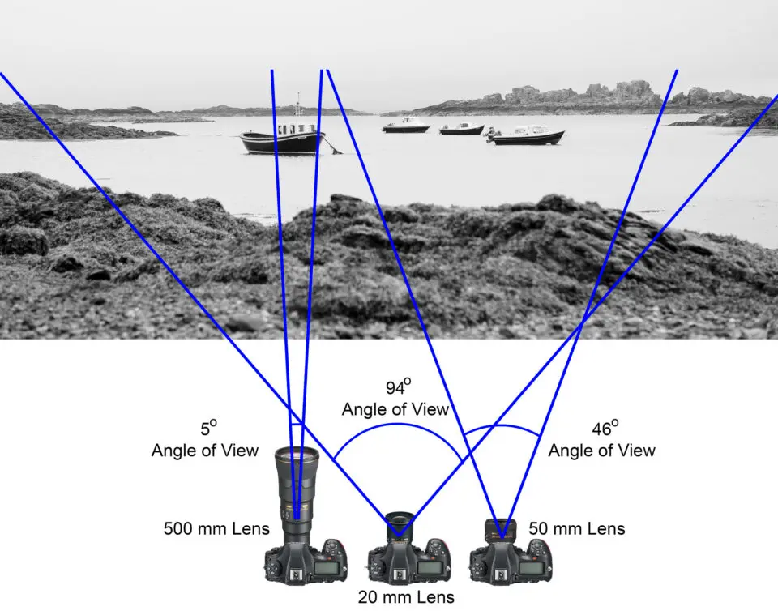

Un'altro articolo interessante, di [The Dark Room](https://thedarkroom.com/focal-length/), pubblica questo schema:

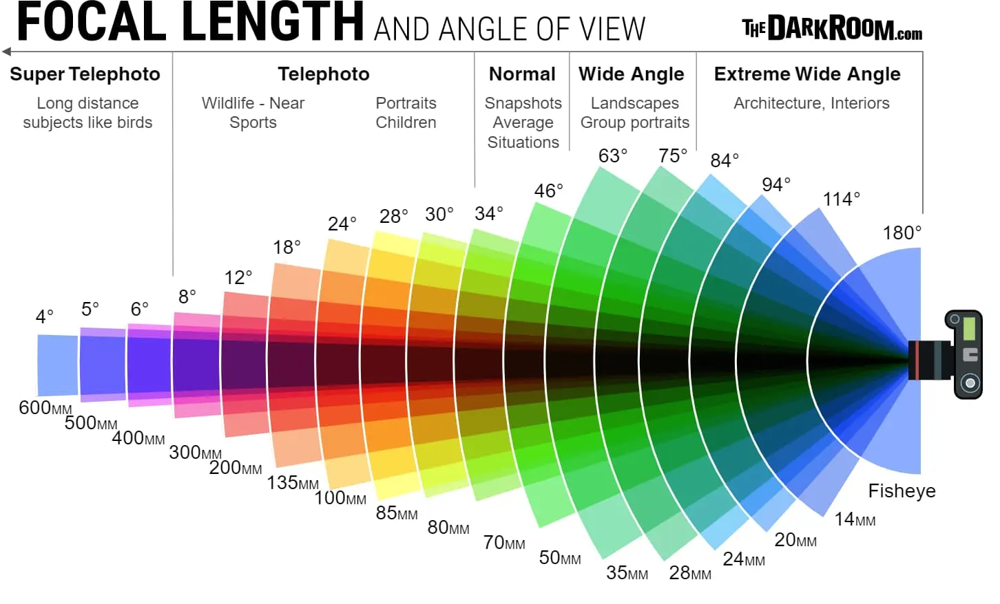

### Fish Eye

Bene, detto questo posso cominciare a provare cosa succede usando una lente fish eye. Questa lente ha una lunghezza focale di 8mm. In questo caso, la lente è molto più ampia di quanto non sia la nostra vista. Questo è il risultato:


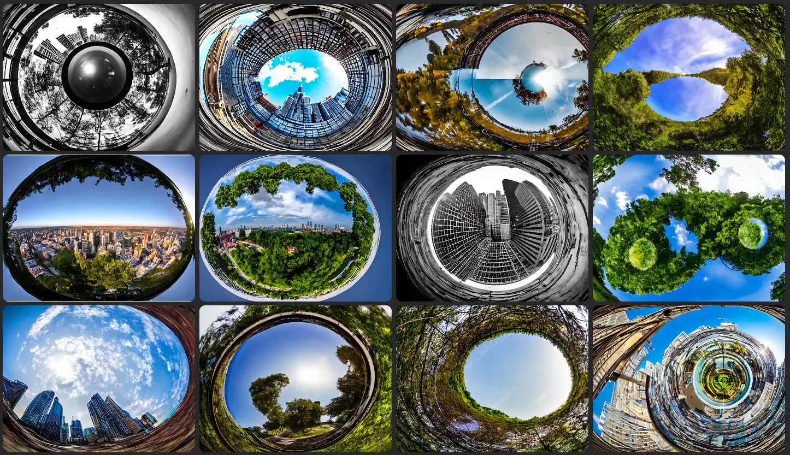

### Lenti per paesaggi: 14mm e 28 mm

Adesso provo a chiedere all'IA di usare una lente da 14mm. Uso come prompt:

```
high quality night photograph of docklands in london, dimly lit cirrus clouds, octane render, colorful, architecture photography, 14mm 114°
```


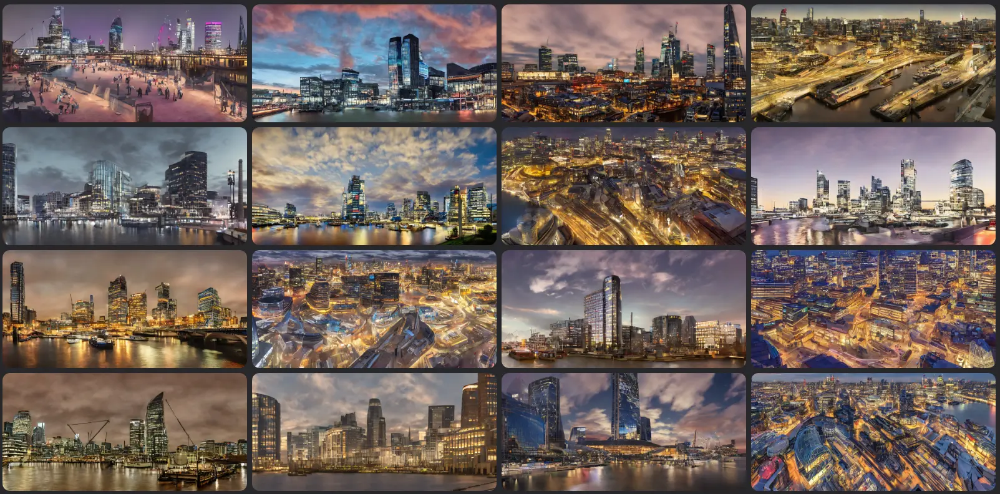

Se cambio lente passando a una di 28mm ottengo un risultato simile:

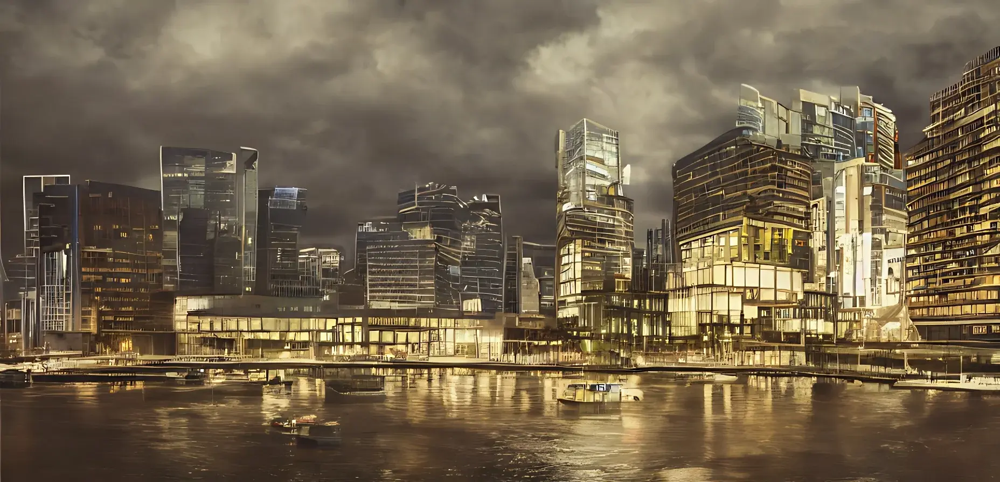

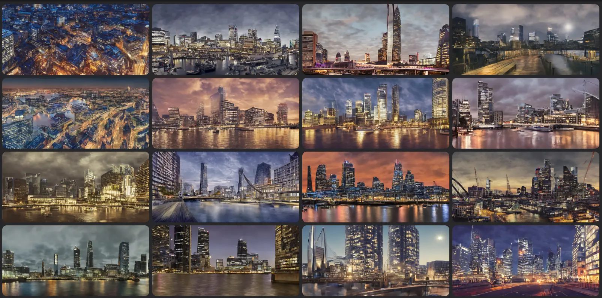

### Lenti per ritratti: 35mm, 50mm e 85mm

Per generare ritratti è possibile usare lenti da 35, 50 e 85 mm. Ho già pubblicato [alcuni esempi di ritratti](https://medium.com/mlearning-ai/10-ai-prompts-for-realistic-photography-portraits-da5edeacb031). Per esempio, con un 35mm ottengo risultati simili a questo:

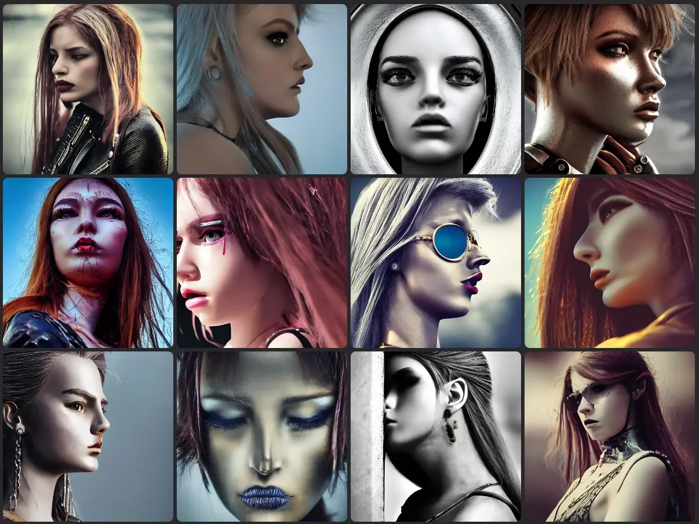

Se invece uso un obiettivo da 50mm ottengo questo:


Se invece uso un obiettivo da 85mm ottengo questo:

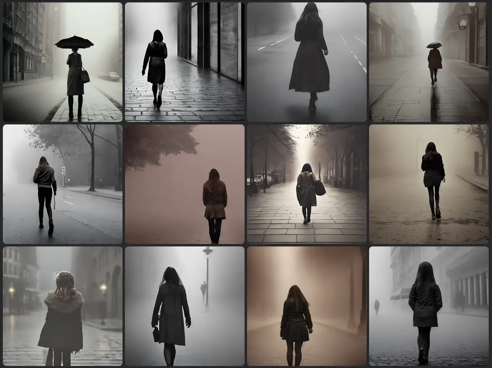

### Lenti per foto sportive: 135mm, 200mm e 300mm

Generare immagini di eventi sportivi richiede un po' più di lavoro. O forse semplicemente non è il mio campo preferito. In ogni caso, è possibile usare una lente con una lunghezza focale di 135mm, 200mm o 300mm. Questo è il risultato:

```
Basketball Photography with the Sony 135mm f/1.8 GM
```

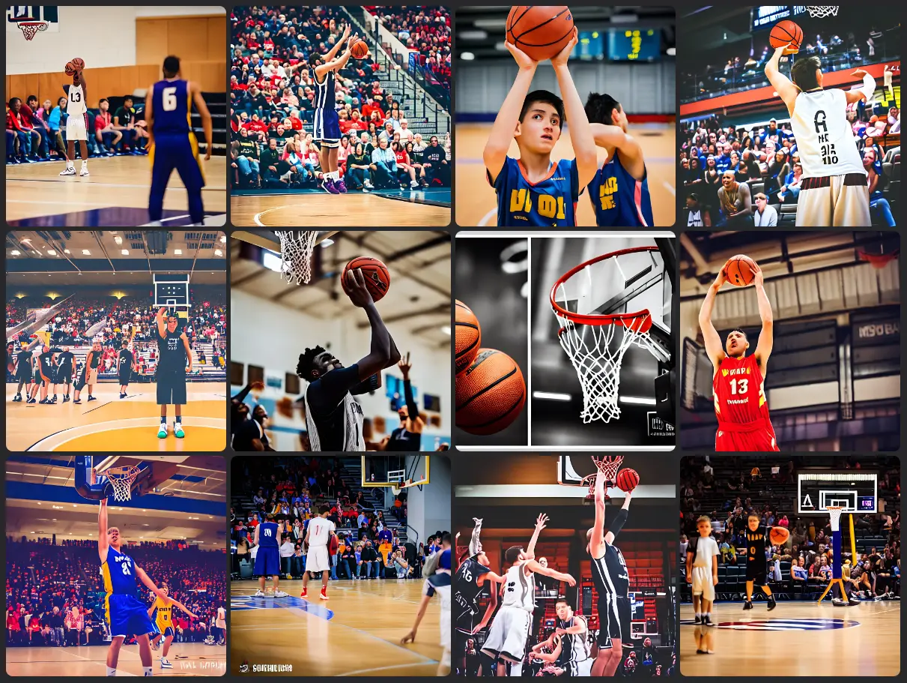

```
motocross race on dirt jump, garden of earthly delights painting by jerome bosch, canon 200mm, realistic, detailed, 4k
```

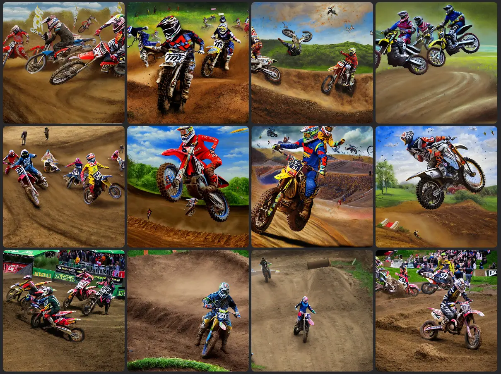

```
a man climbing up a rocky mountain, no ropes, highly cinematic, dramatic, beautiful lighting, god rays, award winning photograph, national geographic, highly detailed, 4k, canon 300mm, f/4
```

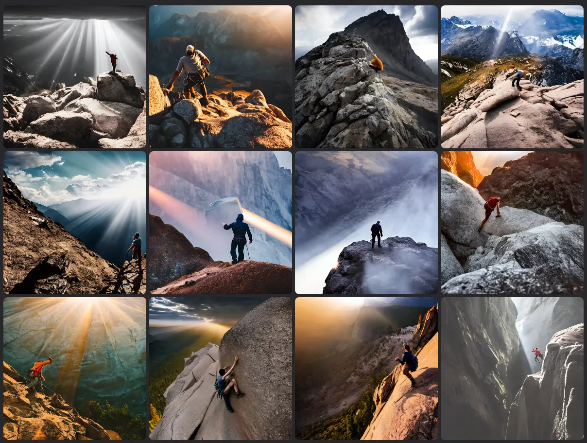

### Wildlife e Birds: 400mm e 800mm

Infine provo a generare immagini di animali e uccelli. In questo caso ho usato una lente da 400mm e 800mm.

```
a highly detailed cinematic photograph of a lonely penguin on the north pole, in the morning mist, ultra realistic, beautiful lighting, by annie leibovitz, hasselblad, 400mm, bokeh, photorealistic, hyperrealistic, octane, masterpiece
```

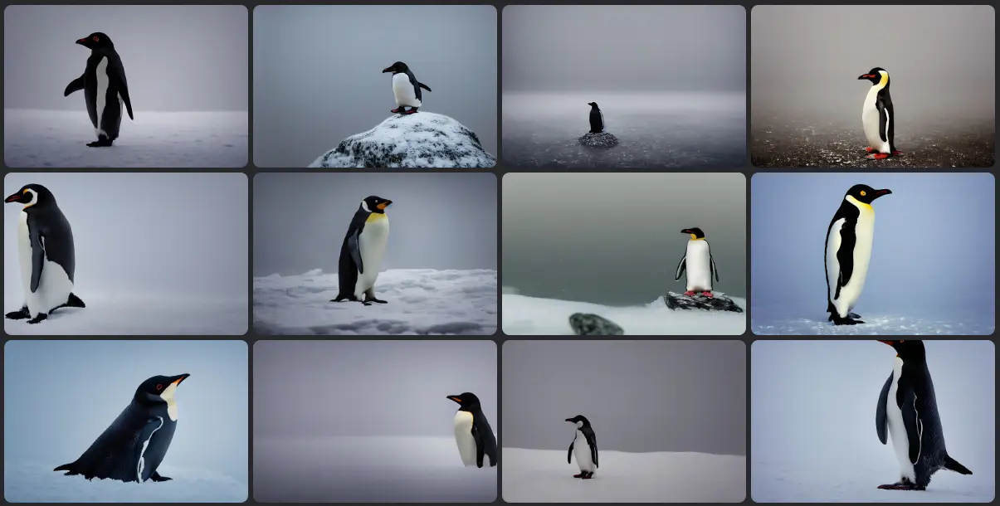

```
photograph of a flying eagle, ultra realistic, beautiful lighting,  hasselblad, 800mm, bokeh, photorealistic, hyperrealistic, octane render, unreal engine
```

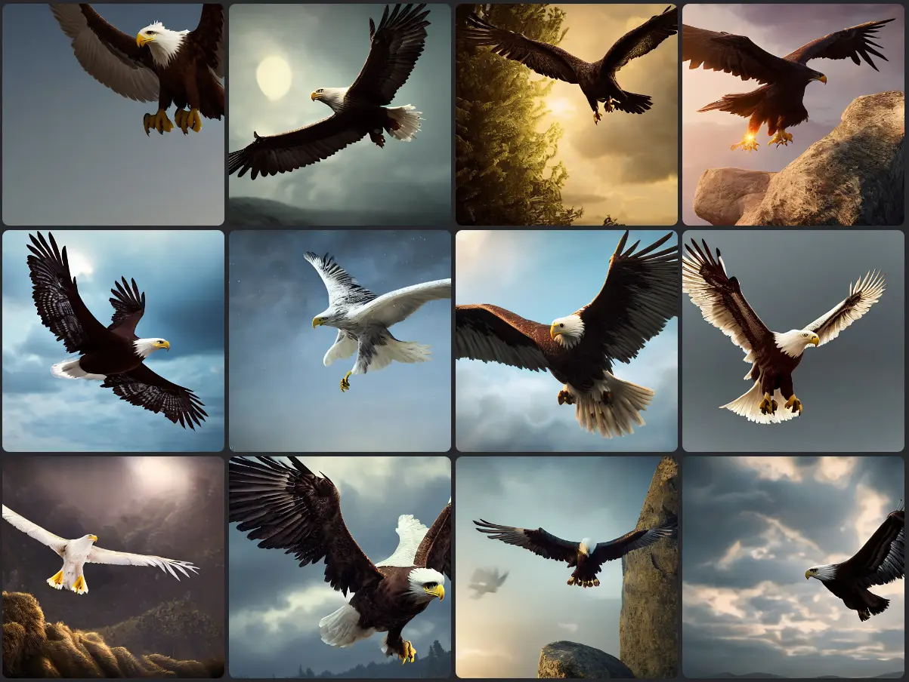

Ovviamente non basta inserire il nome della lente, bisogna usare anche un prompt adeguato. Sospetto che la generazione di immagini tramite IA segua delle regole simili a quelle della fotografica. Quindi, oltre al tipo di obiettivo conta anche il tempo di esposizione, la profondità di campo e la luce. Direi che ci sono ancora esperimenti da fare.
