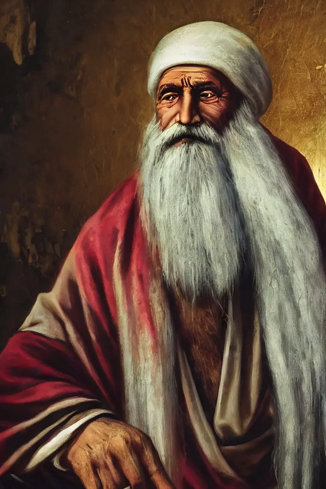
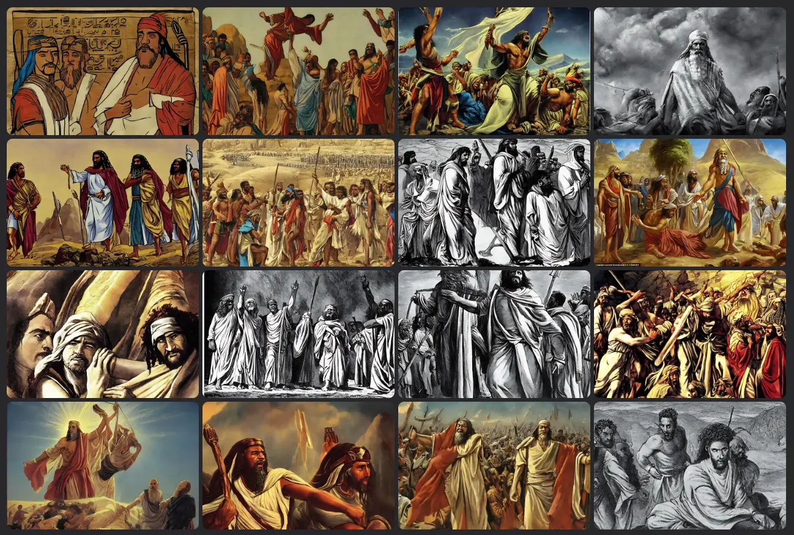
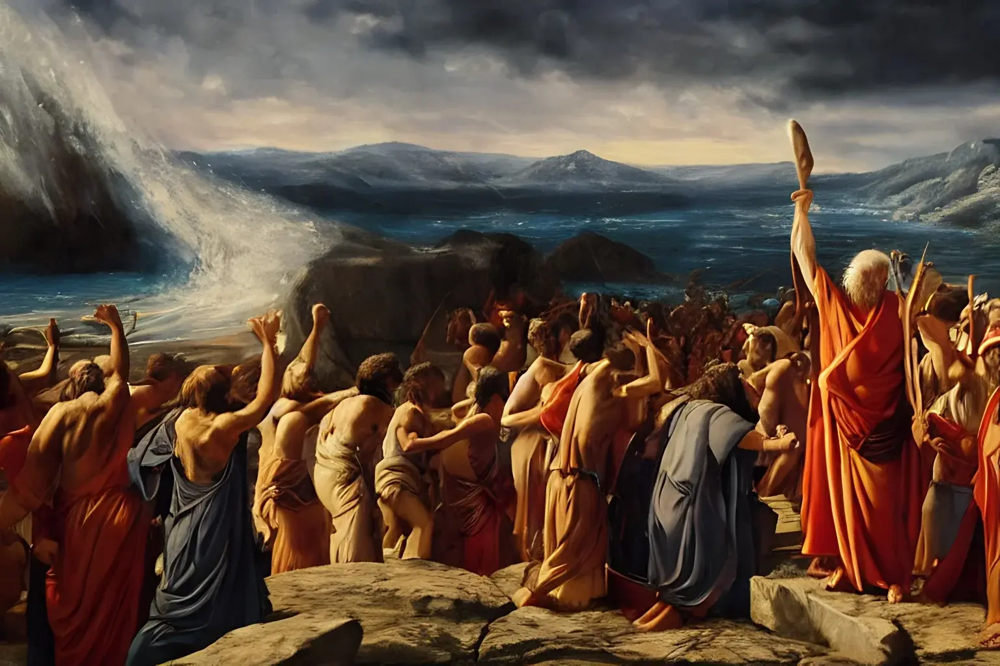
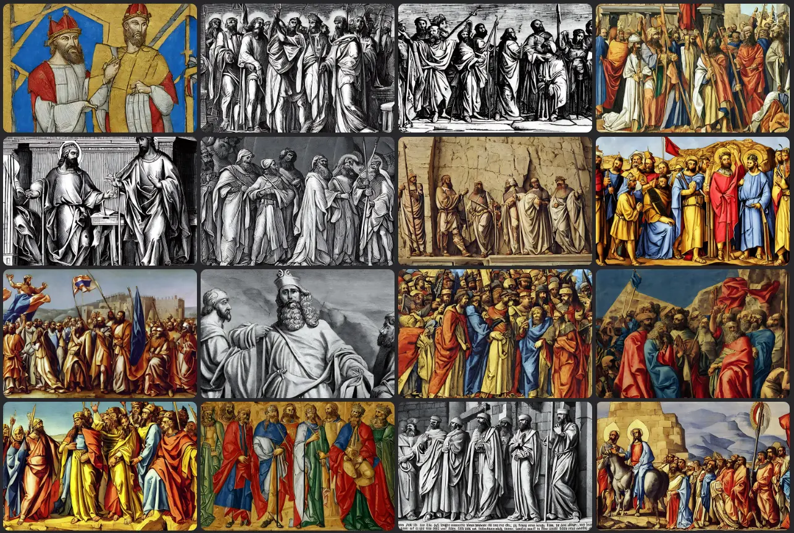
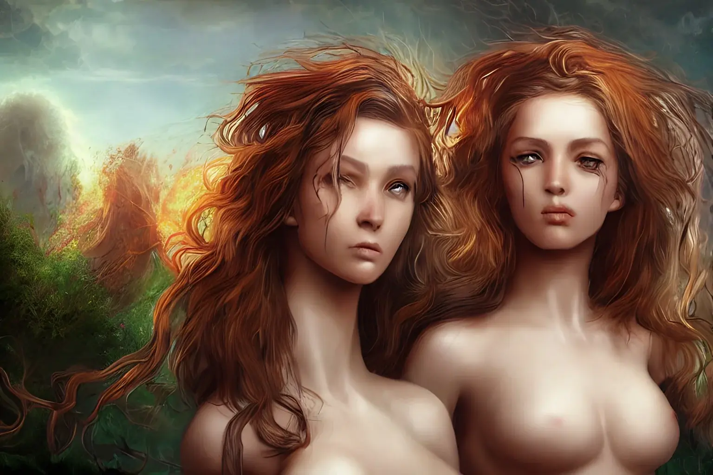
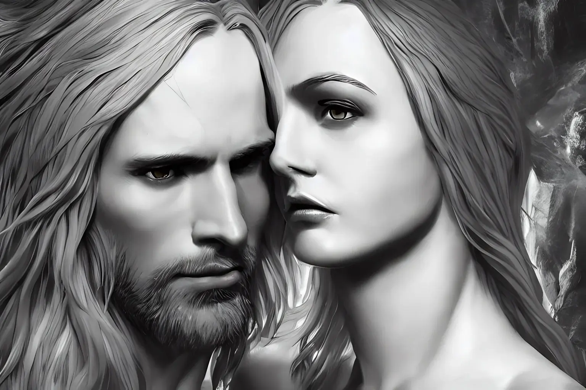
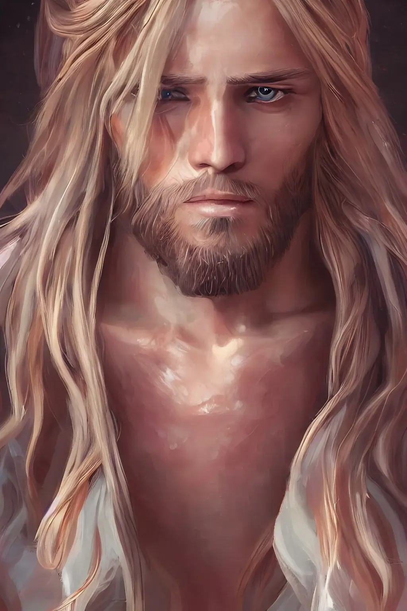

Finora mi sono limitato a giocare con immagini innocue, oggi sono curioso di testare come si comporta una Intelligenza Artificiale con alcuni personaggi biblici. Mi interessa per due ragioni. La prima, estetica, sono curioso di vedere cosa produce dal punto di vista artistico, o pseudo artistico. La seconda, mi incuriosisce vedere quale bias traspare.

Comincio con **Abraham (אַבְרָהָם)** Il primo profeta, il primo patriarca. Il suo nome significa "padre di molti", ed è il fondatore della nazione di Israele. In questo caso l'AI ha deciso di rappresentarlo come un anziano saggio, con lo sguardo volto la futuro. Una rappresentazione tutto sommato rassicurante.

Diverso il caso di **Moses (משֶׁה)**. Qui l'AI non ha una idea precisa e propone molte scene di azione. Effettivamente la vita di questo personaggio presenta molte possibilità di rappresentazione.

Passiamo adesso a **David (דָּוִד)** forse il re più famoso della Bibbia. In questo caso il bias dell'Intelligenza Artificiale è abbastanza evidente, richiamando per molti versi le leggende del ciclo arturiano.

Come inciso, perché non è una cosa di cui voglio parlare adesso, l'utilizzo delle immagini generate dalle intelligenze artificiali potrebbe diventare uno strumento per scovare connessioni non immediate tra diverse tradizioni, leggende e rappresentazioni.

.

Curiosa invece la scelta di rappresentare lo scontro tra Davide e Golia come fosse una battaglia fantasy. Personalmente avrei scommesso su un'immagine più simile al David di Donatello.

Invece, quello che davvero mi ha stupito è la scelta di rappresentare **Adamo ed Eva** come due fanciulle. Non ho idea del perché, anche perché non sono a conoscenza di rappresentazioni pittoriche simili.

Certo, il messaggio che traspare da una scelta del genere è molto forte, ma non credo che l'IA sia al punto di fare volutamente una scelta del genere. Forse, semplicemente, nel suo dataset ci sono più immagini di Eva rispetto a quante ce ne siano di Adamo.

Ovviamente non sono le uniche immagini proposte. Ad esempio questa rappresenta una coppia formata da un uomo e una donna.

Ma. Ma in tutte queste immagini generate dall'IA traspare un problema gigantesco. La Bibbia è un libro che racconta la storia di un popolo medio orientale. Eppure l'IA rappresenta tutti questi personaggi, con forse l'eccezione di Abraham, come fossero occidentali. Un po' come tutte, o quasi, le rappresentazioni di **Jesus Christ** che vediamo in occidente.

Questo esperimento evidenzia bene questo limite. L'IA è uno strumento potente, e lo sarà sempre di più. Ma non è al momento uno strumento creativo in senso stretto. Permette di avere uno sguardo nuovo, ma solo a partire da informazioni vecchie. E, spesso, parziali e incrostate da secoli o addirittura millenni di pregiudizi.
