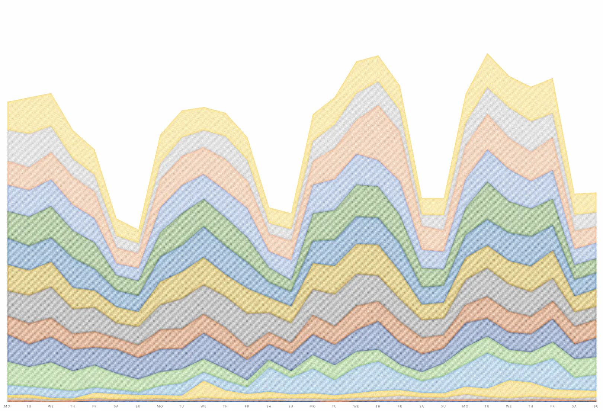

Qualche giorno fa, [Attila Vágó](https://attilavago.medium.com/) ha pubblicato un post interessante sull'[andamento delle sue storie su Medium](https://attilavago.medium.com/saturdays-are-weird-on-medium-31b1fbdf6631). Secondo la sua esperienza, ci sono dei sabati che registrano un picco di lettori. È un fenomeno che si presenta con una certa regolarità, e che trascina in alto anche la domenica. Incuriosito da questo dato, ho deciso di guardare un po' le mie statiche.

Ho messo in fila i vari dati dei giorni della settimana, dividendoli in gruppi da 4 settimane, partendo dal mio primo post (nell'estate del 2021). Non ho indicato i valori assoluti, perché non mi interessano in questo contesto. Devo però precisare che sono molti meno rispetto a quelli di Attila. Inoltre la qualità dei suoi pezzi è più alta rispetto a quella dei miei post. Questo è il grafico che ho ottenuto:

Bhe, che dire, nel mio caso non si nota nessuna anomalia nell'andamento delle views. Seguono un'andamento a onda, con un picco il mercoledì. Nel tempo le views complessive tendono ad aumentare, seguendo un andamento tutto loro. Non paiono legate ai giorni della settimana in cui pubblico gli articoli e nemmeno al numero delle storie pubblicate.

|      |           | Stories | Views |
| ---- | --------- | ------- | ----- |
| 2021 | July      | 4       | 88    |
| 2021 | August    | 0       | 295   |
| 2021 | September | 3       | 330   |
| 2021 | October   | 6       | 790   |
| 2021 | November  | 3       | 2213  |
| 2021 | December  | 18      | 5624  |
| 2022 | January   | 7       | 5424  |
| 2022 | February  | 6       | 5093  |
| 2022 | March     | 0       | 7216  |
| 2022 | April     | 0       | 6758  |
| 2022 | May       | 4       | 7141  |
| 2022 | June      | 0       | 7661  |
| 2022 | July      | 0       | 7521  |
| 2022 | August    | 5       | 8646  |
| 2022 | September | 0       | 6407  |
| 2022 | October   | 7       | 7930  |

Ovviamente non è un campione molto grande. E molte delle storie sono state pubblicate a Dicembre, sulla spinta del DevAdvent.

A complicare un po' le cose sono anche gli argomenti trattati. In questi mesi ho parlato di molte cose, da JavaScript a Svelte passando per alcune recensioni. E adesso sono concentrato su come creare immagini con l'Intelligenza Artificiale.

Quindi, niente, questo post è solamente un mio appunto sull'ipotesi di Attila.
