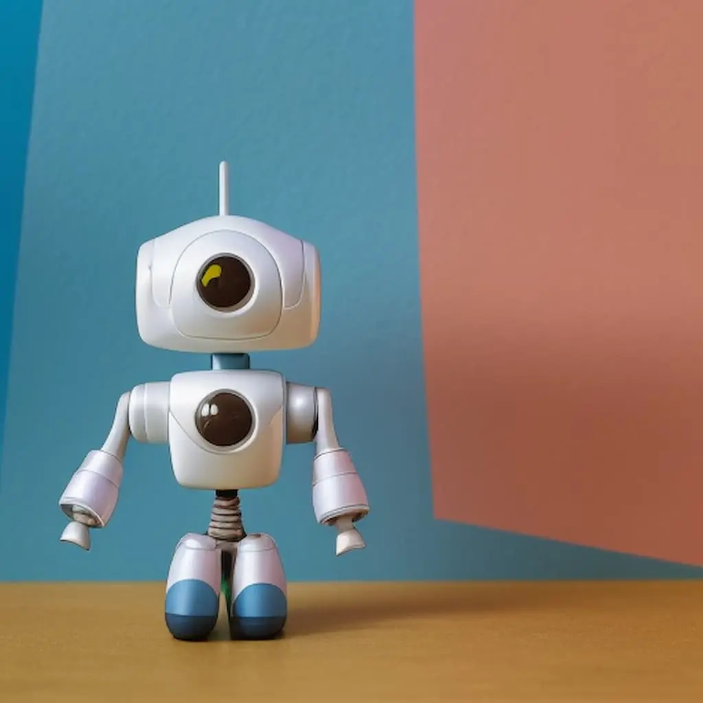
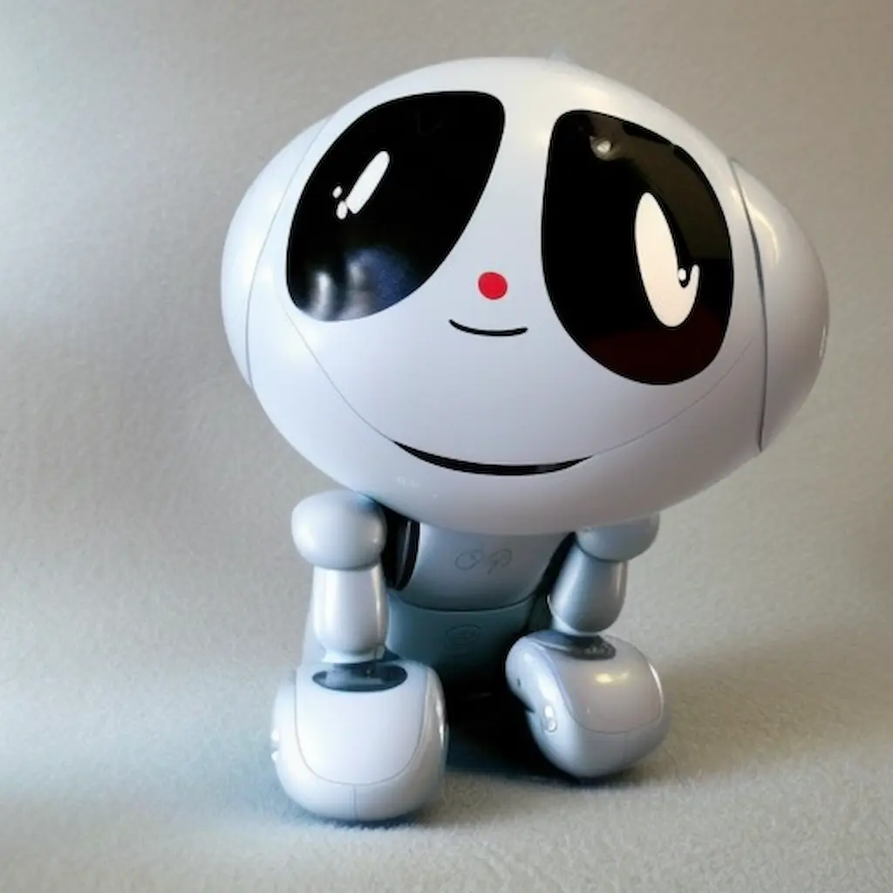
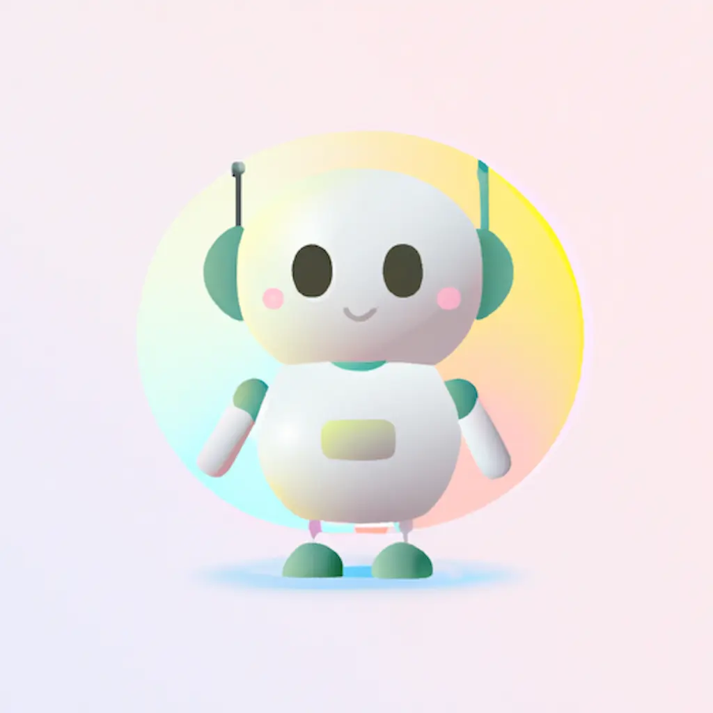
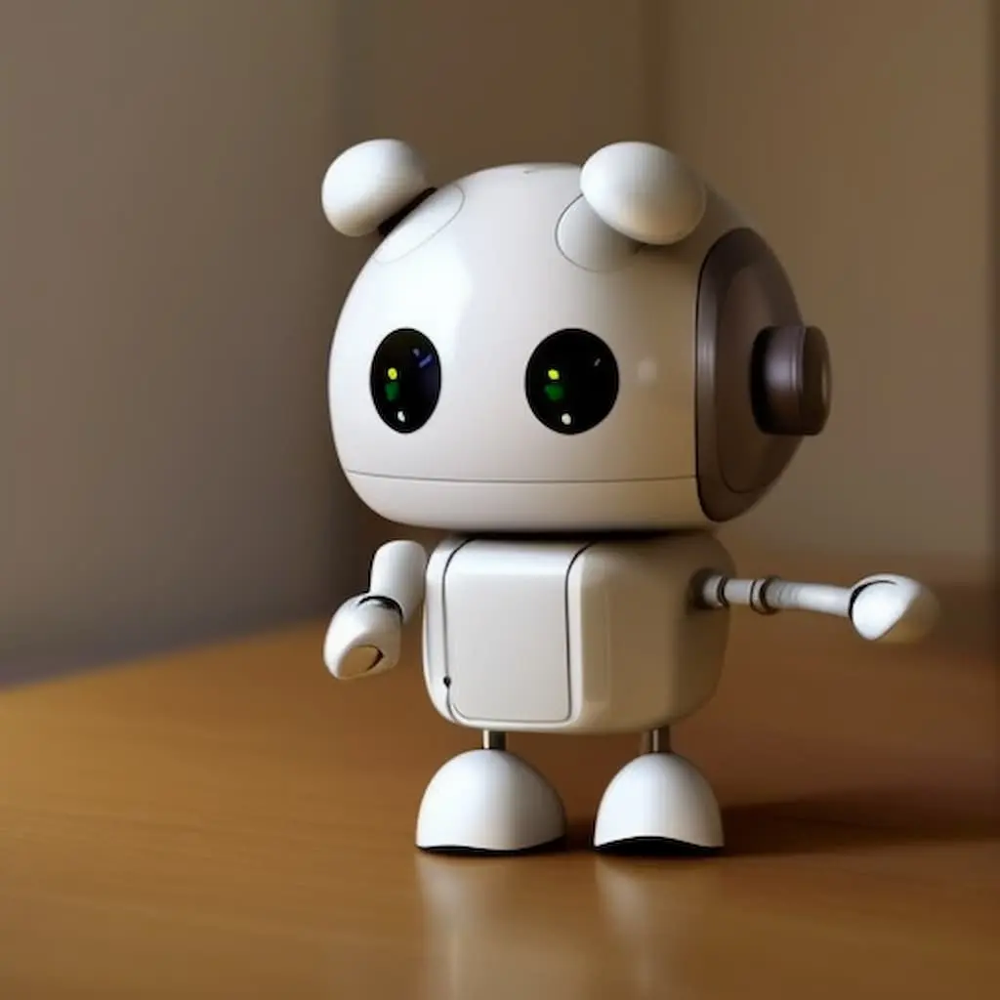

Nei miei esperimenti con l'Intelligenza Artificiale mi sono trovato a sperimentare con Google Translate e OpenAI GPT-3. Mi interessava capire quali fossero le differenze tra i due approcci, ragionare su quale affronta meglio il problema della traduzione e capire se fosse possibile utilizzare i due in modo combinato per ottenere un risultato migliore. E, come opzione aggiuntiva, capire se avesse senso ragionare su un'app che utilizzasse le api di entrambi i servizi.

Detto questo, ho cominciato a fare un po' di prove. Ho usato la versione online di Google Translate e la chat di OpenAI ChatGPT. Comincio con una traduzione semplice, da italiano a inglese e viceversa. Indico con _Original_ la frase originale, con _Google_ la traduzione di Google e con _OpenAI_ quella di OpenAI.

### Frasi semplici



**Italiano -> Inglese**

| Original        | Google             | OpenAI             |
| --------------- | ------------------ | ------------------ |
| Ciao            | Hello              | Hello              |
| Come stai?      | How are you?       | How are you?       |
| Come ti chiami? | What's your name?  | What is your name? |
| Dove abiti?     | Where do you live? | Where do you live? |
| Che lavoro fai? | What do you do?    | What is your job?  |

**Inglese -> Italiano**

| Original           | Google                | OpenAI                |
| ------------------ | --------------------- | --------------------- |
| Hello              | Ciao                  | Ciao                  |
| How are you?       | Come stai?            | Come va?              |
| What's your name?  | Come ti chiami?       | Come ti chiami?       |
| Where do you live? | Dove vivi?            | Dove abiti?           |
| What is your job?  | Qual è il tuo lavoro? | Qual è il tuo lavoro? |

Come si può notare, i risultati sono simili ma non identici. La traduzione dell'Italiano in Inglese è simile, a parte l'ultima domanda. La cosa interessante è il processo inverso, la traduzione dall'Inglese all'Italiano. Ci sono due risposte che si discostano. Pare quasi che la traduzione di OpenAi sia più simile al linguaggio informale.

### Frasi più complesse


Ma proviamo a fare un po' di prove con frasi più complesse. Vediamo come si comportano i due servizi. Per fare un confronto prendo l'inizio di due post de IlPost (un giornale online italiano) e provo a tradurli.

Il primo parla di intelligenza artificiale e audio libri.

**Original**

```
La scorsa settimana Apple ha presentato un catalogo di audiolibri la cui voce narrante è stata creata utilizzando un software di intelligenza artificiale: una voce sintetizzata da un computer, che legge il testo in un modo sorprendentemente realistico e simile a una persona in carne e ossa. Secondo Apple si tratta di «un prezioso accompagnamento agli audiolibri narrati da professionisti», che potrebbe ampliare il pubblico di chi ascolta romanzi e saggi.
```

**Google**

```
Last week, Apple unveiled a catalog of audiobooks whose narration was created using artificial intelligence software: a synthesized voice from a computer, which reads the text in a way that is surprisingly realistic and similar to a real person. According to Apple it is "a valuable accompaniment to professionally narrated audiobooks", which could expand the audience of those who listen to novels and essays.
```

**OpenAI**

```
Last week, Apple presented a catalog of audiobooks whose narrator voice was created using artificial intelligence software: a voice synthesized by a computer that reads the text in a surprisingly realistic and similar way to a real person. According to Apple, it is "a valuable accompaniment to audiobooks narrated by professionals", which could expand the audience of those who listen to novels and essays.
```



Il secondo post parla di Sherlock Holmes.

**Original**

```
Il primo gennaio sono entrati nel pubblico dominio gli ultimi due racconti con protagonista Sherlock Holmes, il celebre investigatore creato dallo scrittore scozzese Arthur Conan Doyle (1859-1930). La storia dei diritti d’autore su questo personaggio è particolarmente intricata: negli ultimi decenni infatti Sherlock Holmes ha ispirato film e serie di vario tipo, ma fino a pochi giorni fa i suoi eredi avevano spesso trovato il modo per guadagnarci nonostante in gran parte del mondo i diritti fossero terminati già più di vent’anni fa.
```

**Google**

```
On January 1, the last two stories starring Sherlock Holmes, the famous detective created by the Scottish writer Arthur Conan Doyle (1859-1930), entered the public domain. The history of copyrights on this character is particularly intricate: in fact, in recent decades Sherlock Holmes has inspired various types of films and series, but until a few days ago his heirs had often found a way to earn despite much of the world rights had already ended more than twenty years ago.
```

**OpenAI**

```
On January 1st, the last two stories featuring Sherlock Holmes, the famous detective created by Scottish writer Arthur Conan Doyle (1859-1930), entered the public domain. The story of the copyright on this character is particularly intricate: in recent decades, Sherlock Holmes has inspired various films and series, but until a few days ago, his heirs had often found ways to profit from it despite the fact that in much of the world, the rights had already expired over twenty years ago.
```

Cosa possiamo capire da questo? Beh, seppure in entrambi i casi la traduzione sia abbastanza calzante all'originale, la traduzione proposta da Google pare più accurata. Ma le differenze sono comunque minime. E a una lettura veloce appaiono sostanzialmente identiche.


Adesso proviamo a fare un po' di prove con il processo inverso. Comincio con un pezzo di un post di [Attila Vágó](https://medium.com/bricksnbrackets/japanese-art-and-lego-are-a-match-made-in-heaven-ca9a1574204), che parla di Lego.

**Original**

```
Well, a match made in Billund, Denmark, but I’m sure for some of us, LEGO’s headquarters are essentially Heaven. Full disclosure, I’m no art nerd, so my assessment of art is purely from an average human’s perspective. My reviewing LEGO’s new Hokusai set is very much a LEGO review with a side of art, rather than the other way around. Hey, that rhymed! 😄
```

**Google**

```
Bene, una partita fatta a Billund, in Danimarca, ma sono sicuro che per alcuni di noi il quartier generale di LEGO è essenzialmente il paradiso. Divulgazione completa, non sono un nerd dell'arte, quindi la mia valutazione dell'arte è puramente dal punto di vista di un essere umano medio. La mia recensione del nuovo set Hokusai di LEGO è decisamente una recensione LEGO con un lato dell'arte, piuttosto che il contrario. Ehi, quello faceva rima! 😄
```

**OpenAI**

```
Beh, un match fatto a Billund, in Danimarca, ma sono sicuro che per alcuni di noi, la sede di LEGO è essenzialmente il paradiso. Aperture di credito, non sono un esperto d'arte, quindi la mia valutazione dell'arte è puramente dal punto di vista di un umano medio. La mia recensione del nuovo set Hokusai di LEGO è molto più una recensione di LEGO con un tocco d'arte, piuttosto che l'altro modo intorno. Hey, che rima! 😄
```




Il secondo pezzo da tradurre è parte di un post di [Clive Thompson](https://medium.com/@clivethompson/the-disappearance-of-the-ashtray-4badc1be9e3b) e parla di posacenere.

**Original**

```
See that thing above?

I inherited it from my mother, who passed away in the summer of 2020. When I first handed it to one of my teenage sons, he was impressed. It’s beautiful, he said. But — what is it?

“It’s an ashtray,” I told him.

You could forgive him for not recognizing it. Rates of cigarette smoking have plummeted in the last half century; back in the 60s, over 40% of Americans smoked, but now it’s down to a mere 11%. These rates vary based on geography and educational attainment, but the overall trend-lines are a ski slope downwards. Sure there’s plenty of vaping going on. But the amount of Americans who need somewhere to flick their ash and stub out a cig are as low as they’ve been in a long, long while.
```

**Google**

```
Vedi quella cosa sopra?

L'ho ereditato da mia madre, che è morta nell'estate del 2020. Quando l'ho consegnato per la prima volta a uno dei miei figli adolescenti, è rimasto colpito. È bellissimo, disse. Ma cos'è?

"È un posacenere", gli dissi.

Potresti perdonarlo per non averlo riconosciuto. I tassi di fumo di sigaretta sono crollati nell'ultimo mezzo secolo; negli anni '60, oltre il 40% degli americani fumava, ma ora è sceso a un mero 11%. Questi tassi variano in base alla geografia e al livello di istruzione, ma le linee di tendenza generali sono una pista da sci verso il basso. Sicuramente c'è un sacco di svapo in corso. Ma il numero di americani che hanno bisogno di un posto dove gettare la cenere e spegnere una sigaretta è basso come lo è stato da molto, molto tempo.
```

**OpenAI**

```
Vedi quella cosa sopra?

L'ho ereditato dalla mia madre, che è morta nell'estate del 2020. Quando gliel'ho dato per la prima volta a uno dei miei figli adolescenti, lui era impressionato. È bello, ha detto. Ma - cos'è?

"È un portacenere", gli ho detto.

Puoi perdonarlo se non lo riconosceva. I tassi di fumo di sigarette sono scesi drasticamente negli ultimi cinquant'anni; negli anni '60, oltre il 40% degli americani fumava, ma adesso è sceso a solo l'11%. Questi tassi variano in base alla geografia e all'istruzione, ma le tendenze generali sono in calo. Certo, c'è un sacco di svapo in giro. Ma la quantità di americani che hanno bisogno di un posto dove buttare la cenere e spegnere una sigaretta è bassa come non lo è stata da molto, molto tempo.
```

In questo caso le due traduzioni dall'Inglese all'Italiano oscillano tra il pessimo e il "non si capisce nulla". I pezzi originali sono ben scritti, con stile personale e una costruzione delle frasi in grado di catturare il lettore. Tutto questo viene perso nella traduzione dall'Inglese all'Italiano. Forse la versione di Google è leggermente migliore, ma non è davvero una buona traduzione.

### Conclusioni



Quindi, come posso concludere? Con due considerazioni:

1. la traduzione verso l'Inglese è abbastanza simile tra Google e OpenAI; personalmente preferisco la versione di Google, ma non c'è una differenza enorme;
2. la traduzione dell'Inglese all'Italiano è molto peggio, e non mi piace nessuna delle due versioni.

Per il momento mi fermo qui; onestamente non credo che proverò a integrare né OpenAI né Google Translate in una app di prova per tradurre dall'Inglese all'Italiano.
