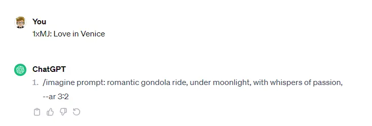
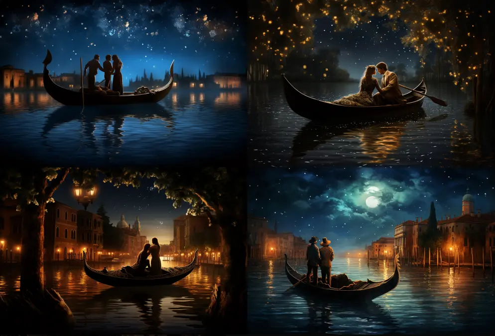
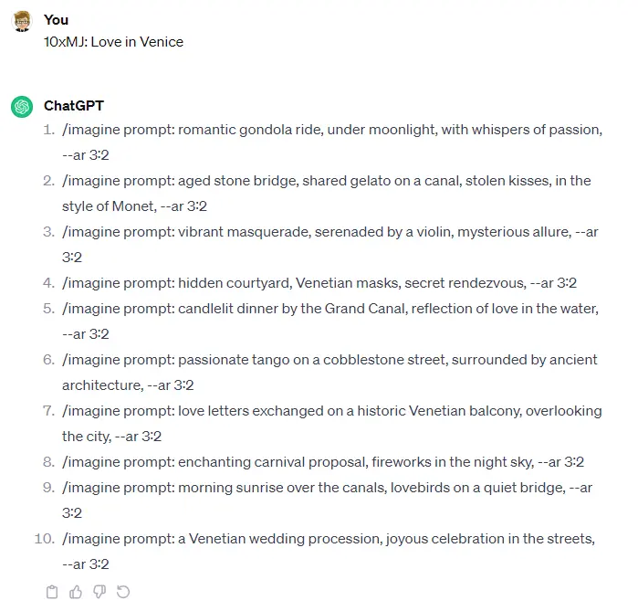
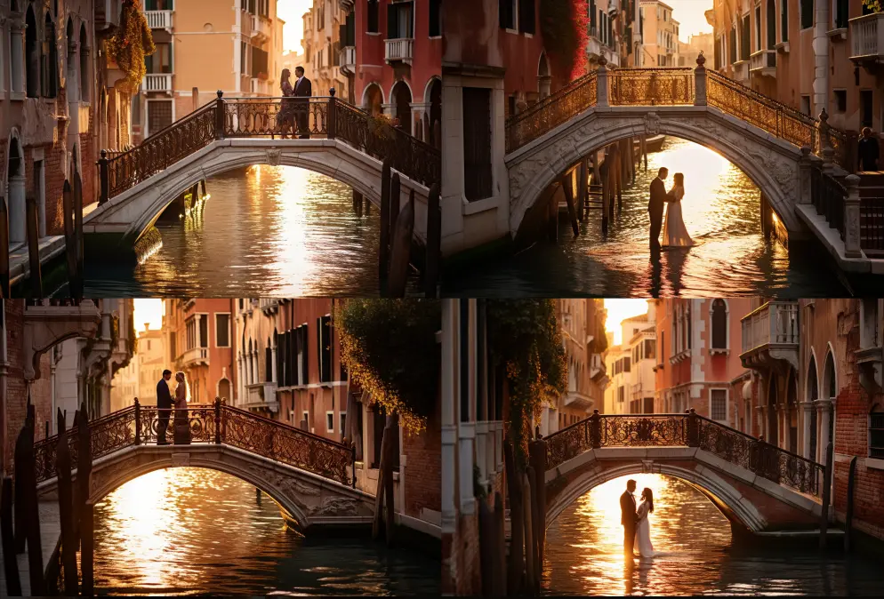
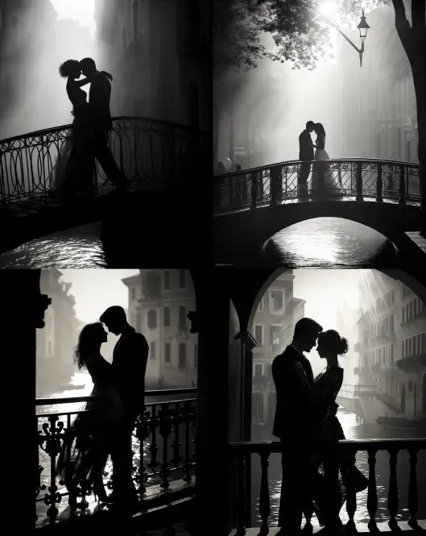
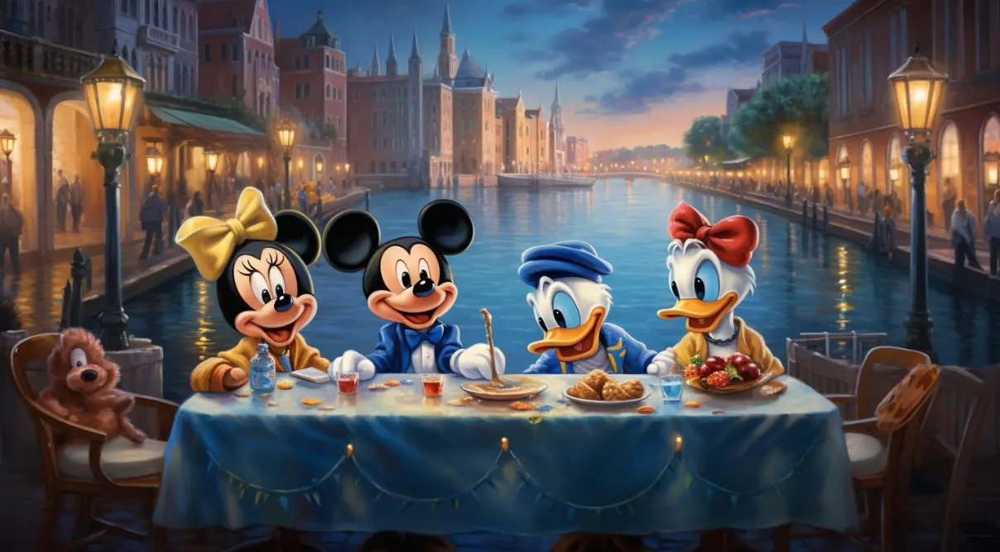
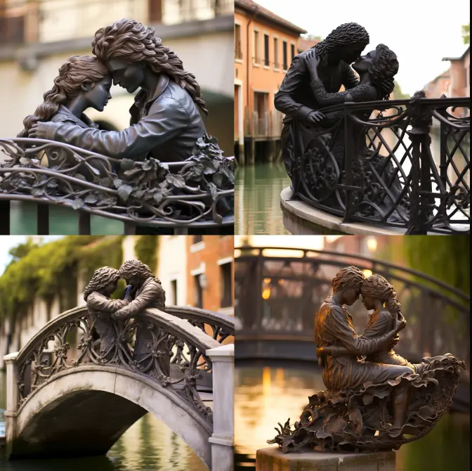
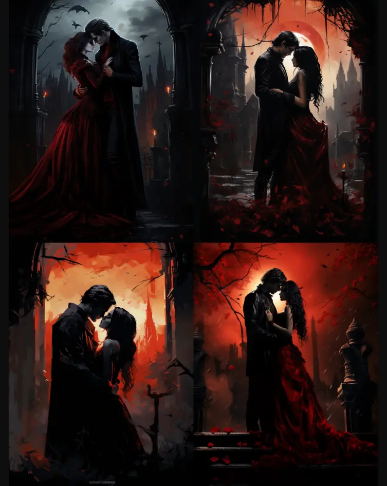
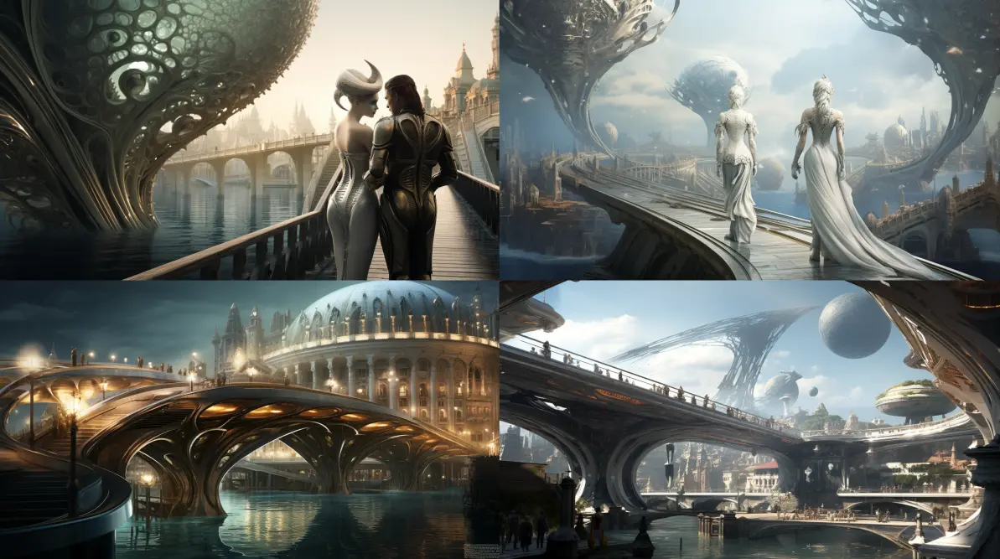

Oggi Medium mi ha consigliato un post di [Tristan Wolff](https://tristwolff.medium.com/) su come usare [ChatGPT per creare prompt per Midjourney](https://medium.com/the-generator/turn-chatgpt-into-a-midjourney-prompt-generator-a-step-by-step-guide-d447479f8a48). È stata una lettura interessante e mi ha spinto ad esplorare questa possibilità a mia volta. Dopo aver giocato un pochetto con ChatGPT ho avuto il mio momento "Eureka!": posso usare questo motore linguistico allo stesso modo di un qualsiasi altro linguaggio di programmazione.

Probabilmente è una cosa oramai banale. In fin dei conti ChatGPT è in circolazione da un po' di tempo, e molti più perspicaci di me hanno avuto modo di giocarci. Ma, fino ad oggi, non avevo mai davvero avuto la necessità di usarlo per qualcosa di non convenzionale. Ma partiamo dall'inizio.

Per prima cosa, ChatGPT non conosce Midjourney. Non ancora per lo meno. Quindi qualsiasi comando deve essere per forza di cosa in una forma algoritmica. In altre parole, istruzioni. Righe di codice.

Comincio con l'introdurre l'argomento di cui parlerò:

```text
Hello, today we're talking about Midjourney.
```

Salutare è buona educazione. Passo poi a spiegare cos'è Midjourney:

```text
Midjourney is an Artificial Intelligence capable of generating images based on textual instructions.
```

In questo modo ChatGPT ha un contesto su cui lavorare. Adesso è il momento di dichiarare il risultato che voglio ottenere:

```text
The simplest prompt is structured as follows:

/imagine prompt: PREFIX, SCENE, SUFFIX, IN THE STYLE OF, --ar 3:2

PREFIX indicates the style and material with which the image is created.
SCENE indicates the content of the image.
SUFFIX modulates PREFIX and SCENE.
IN THE STYLE OF indicates the name of an artist or artistic movement.
--ar 3:2 indicates the aspect ratio of the image (width to height).
```

In pratica, sto dicendo a ChatGPT quale risultato voglio ottenere. Ma aggiungo una possibilità:

```text
IN THE STYLE OF  is optional. If you don't use it, don't write "in the style of"
```

Poiché ChatGPT tende a essere prolisso, aggiungo un vincolo:

```text
The prompt should be shorter than 60 words.
```

E, per puro gusto estetico, voglio che:

```text
The prompt should be in lowercase.
I want the prompts like a numbered list.
```

Dopo aver spiegato a ChatGPT cosa voglio ottenere, è il momento di semplificare il mio modo per chiederglielo. Comincio con il dichiarare una funzione che restituisca un solo prompt:

```text
To request a prompt, I'll use the phrase:

MJ: THEME

THEME: indicates the idea I want to convey through the image.
```

La funzione `MJ` (che sta ovviamente per `Midjourney`) richiede un solo parametro, `THEME`.

Aggiungo poi una seconda funzione per creare più prompt con un'unica richiesta:

```text
To request more prompts, I'll use the phrase:

NxMJ: THEME

THEME: indicates the idea I want to convey through the image.
N: indicates the number of prompts I want
```

La funzione `NxMJ` richiede due parametri: `THEME` e `N`

Per finire registro questo codice nella chat di ChatGPT:

```
Is everything clear?
```

Mettendo tutto assieme, il prompt è:

```text
Hello, today we're talking about Midjourney. Midjourney is an Artificial Intelligence capable of generating images based on textual instructions. The simplest prompt is structured as follows:

/imagine prompt: PREFIX, SCENE, SUFFIX, IN THE STYLE OF, --ar 3:2

PREFIX indicates the style and material with which the image is created.
SCENE indicates the content of the image.
SUFFIX modulates PREFIX and SCENE.
IN THE STYLE OF indicates the name of an artist or artistic movement.
--ar 3:2 indicates the aspect ratio of the image (width to height).

IN THE STYLE OF  is optional. If you don't use it, don't write "in the style of"

The prompt should be shorter than 60 words.

The prompt should be in lowercase.
I want the prompts like a numbered list.

To request a prompt, I'll use the phrase:

MJ: THEME

THEME: indicates the idea I want to convey through the image.

To request more prompts, I'll use the phrase:

NxMJ: THEME

THEME: indicates the idea I want to convey through the image.
N: indicates the number of prompts I want

Is everything clear?
```

### Mettiamo alla Prova ChatGPT

È il momento di fare un po' di test. Comincio con il chiedere un solo prompt:

```text
Me:
1xMJ: Love in Venice

ChatGPT:
1. /imagine prompt: romantic gondola ride, under moonlight, with whispers of passion, --ar 3:2
```



Mettiamo subito alla prova Midjourney con questo prompt e vediamo cosa tira fuori:



Bene, adesso proviamo a chiedere più prompt in una volta sola:

```text
Me:
10xMJ: Love in Venice

ChatGPT:
1. /imagine prompt: romantic gondola ride, under moonlight, with whispers of passion, --ar 3:2
2. /imagine prompt: aged stone bridge, shared gelato on a canal, stolen kisses, in the style of Monet, --ar 3:2
3. /imagine prompt: vibrant masquerade, serenaded by a violin, mysterious allure, --ar 3:2
4. /imagine prompt: hidden courtyard, Venetian masks, secret rendezvous, --ar 3:2
5. /imagine prompt: candlelit dinner by the Grand Canal, reflection of love in the water, --ar 3:2
6. /imagine prompt: passionate tango on a cobblestone street, surrounded by ancient architecture, --ar 3:2
7. /imagine prompt: love letters exchanged on a historic Venetian balcony, overlooking the city, --ar 3:2
8. /imagine prompt: enchanting carnival proposal, fireworks in the night sky, --ar 3:2
9. /imagine prompt: morning sunrise over the canals, lovebirds on a quiet bridge, --ar 3:2
10. /imagine prompt: a Venetian wedding procession, joyous celebration in the streets, --ar 3:2
```



Direi che ci siamo. ChatGPT propone diverse soluzioni riguardo al tema che gli ho proposto. Interessante come non usi spesso "IN THE STYLE OF MONET". Proviamo a usare il prompt 2



Ok, qui c'è qualche problema su dove mettere la coppia di innamorati, se sopra o sotto il ponte.

### Chiediamo a ChatGPT di personalizzare il risultato

Far fare tutto a ChatGPT permette di velocizzare il processo di creazione dei prompt ma ci fa perdere il controllo sul risultato finale. Possiamo però usare lo stesso comando per creare prompt per degli usi particolari.

```text
Me:
4xMJ: Love in Venice
For a black and white newspaper

ChatGPT:
1. /imagine prompt: timeless embrace on a Venetian bridge, shadows dancing in black and white, --ar 4:5
2. /imagine prompt: candid moment of love in a narrow alley, vintage attire, captured in grayscale, --ar 4:5
3. /imagine prompt: silhouette of a romantic gondola ride, under the moonlight, minimalist black and white, --ar 4:5
4. /imagine prompt: classic Venetian masks at a masquerade, grayscale elegance, hinting at mystery, --ar 4:5
```

Interessante come in questo caso ChatGPT abbia deciso di cambiare le dimensioni delle immagini.



```text
Me:
4xMJ: Love in Venice
With Donald Duck
For a Disney comics

ChatGPT:
1. /imagine prompt: Donald Duck navigating a gondola in the Venetian canals, comical mishaps and love-struck expressions, --ar 16:9
2. /imagine prompt: Donald and Daisy in Venetian carnival attire, participating in lively antics during the festivities, --ar 16:9
3. /imagine prompt: Donald proposing to Daisy on a wobbly Venetian bridge, humorous and heartfelt, --ar 16:9
4. /imagine prompt: Donald, Daisy, and friends enjoying a romantic evening in a Venetian square, filled with Disney-style love and laughter, --ar 16:9
```



```text
Me:
4xMJ: Love in Venice
For a sculture project

ChatGPT:
1. /imagine prompt: Sculpture of intertwined lovers on a Venetian bridge, capturing the essence of eternal love, --ar 1:1
2. /imagine prompt: Abstract sculpture symbolizing the dance of passion in a Venetian square, harmonizing forms in stone, --ar 1:1
3. /imagine prompt: Sculpture depicting a romantic gondola ride frozen in time, evoking movement and emotion in marble, --ar 1:1
4. /imagine prompt: Sculpture ensemble portraying a Venetian masquerade, masks and figures elegantly carved in stone, --ar 1:1
```



```text
Me:
4xMJ: Love in Venice
But with only solid color (black, white, red, white)
Flattened image
For magazine illustration

ChatGPT:
1. /imagine prompt: Solid red silhouette of a romantic gondola ride in Venice, capturing the essence of love, --ar 4:5
2. /imagine prompt: Black and white illustration of a Venetian bridge with a couple in an embrace, timeless and elegant, --ar 4:5
3. /imagine prompt: White on red illustration of a Venetian masquerade, capturing the mystery and allure of love, --ar 4:5
4. /imagine prompt: Red and white minimalist depiction of a candlelit dinner by the Grand Canal, subtle and romantic, --ar 4:5
```


```text
ME:
4xMJ: Love in Venice
For a ghotic vampire romance

ChatGPT:
1. /imagine prompt: Gothic vampire couple in a Venetian cemetery, eternal love under a blood-red moon, --ar 3:4
2. /imagine prompt: Vampire masquerade in a darkened Venetian palace, shadows and seduction, --ar 3:4
3. /imagine prompt: Brooding vampire overlooking the canals, haunted by memories of love, black and white with a touch of crimson, --ar 3:4
4. /imagine prompt: Veiled vampire bride in a decaying Venetian mansion, a ghostly love story in shades of deep violet, --ar 3:4
```



```
ME:
4xMJ: Love in Venice
For a ghotic vampire romance

ChatGPT:
1. /imagine prompt: Futuristic cityscape with floating gondolas, a love story transcending time in a sci-fi Venice, --ar 16:9
2. /imagine prompt: Alien lovers on a technologically advanced Venetian bridge, a portal to a romantic sci-fi realm, --ar 16:9
3. /imagine prompt: Cyborgs in a cyberpunk masquerade, mysterious and alluring, set against a futuristic Venetian backdrop, --ar 16:9
4. /imagine prompt: Virtual reality depiction of a love connection in a Venetian simulation, merging sci-fi and romance, --ar 16:9
```


