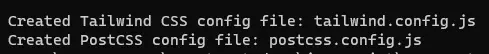
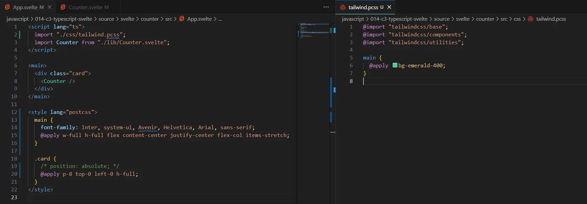
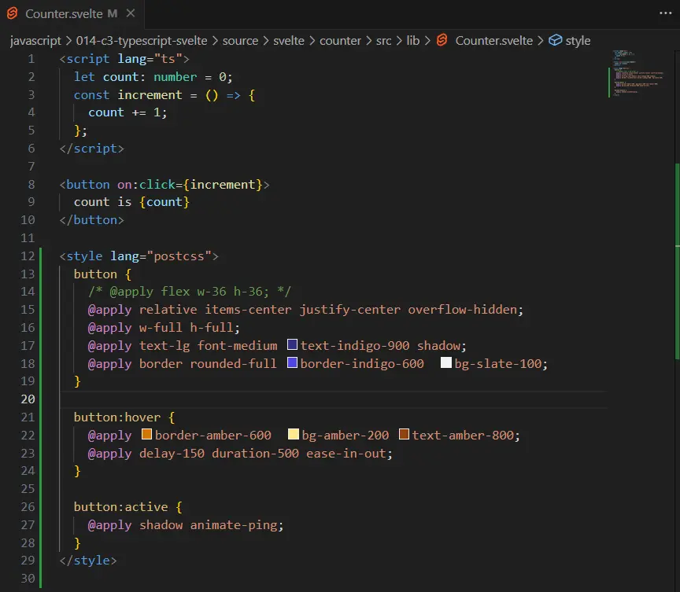
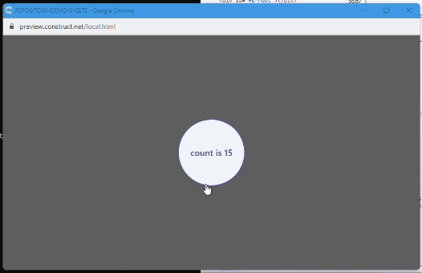

Dopo aver ripreso a giocare con Svelte, TypeScript e Construct 3 è arrivato il momento di aggiungere al mio progetto di test anche [Tailwind CSS](https://tailwindcss.com/). È un argomento che ho già affrontato nel 2021 ([Tailwind CSS & Svelte](https://blog.stranianelli.com/tailwind-and-svelte/)) ma sono passati, per l'appunto, un po' di anni. C'è un tutorial di LogRocket ([How to use Tailwind CSS with Svelte](https://blog.logrocket.com/how-to-use-tailwind-css-svelte/)) aggiornato a Luglio 2023 ma non presenta, a mio avviso, la soluzione migliore. Di conseguenza, ecco qui i miei appunti su come aggiungere Tailwind CSS a un progetto Svelte.

Riprendo il progetto del post di qualche giorno fa ([questo](https://blog.stranianelli.com/using-typescript-and-svelte-in-construct/)) e mi porto con il terminale nella cartella con il codice di Svelte. Inserisco a terminale il seguente comando:

```bash
npm install -D tailwindcss@latest postcss@latest
```

In questo modo aggiungo a Svelte i pacchetti di Tailwind e PostCSS. Poi aggiungo [Autoprefixer](https://www.npmjs.com/package/autoprefixer):

```bash
npm install -D autoprefixer@latest
```

E finalmente posso inizializzare Tailwind con il comando:

```bash
npx tailwindcss init -p
```



Questo comando crea due file:

- `tailwind.config.js`
- `postcss.config.js`

Comincio con il modificare `tailwind.config.js`:

```js
/** @type {import('tailwindcss').Config} */
export default {
  content: [],
  theme: {
    extend: {},
  },
  plugins: [],
  content: ["./index.html", "./src/**/*.{svelte,js,ts}"], //for unused css
};
```

Aggiungo alcuni elementi a `content` per permettere a Tailwind di rimuovere gli stili CSS non usati dal progetto.

Modifico anche il file `postcss.config.js`:

```js
import tailwind from "tailwindcss";
import tailwindConfig from "./tailwind.config.js";
import autoprefixer from "autoprefixer";

export default {
  plugins: [tailwind(tailwindConfig), autoprefixer],
};
```

Ho due modi per permettere a Svelte di usare gli stili di Tailwind. Il primo è di creare un componente `TailwindCSS.svelte`:

```html
<style>
  @tailwind base;
  @tailwind components;
  @tailwind utilities;
</style>
```

e di importarlo in `App.svelte`:

```html
<script>
  import TailwindCss from "./lib/TailwindCSS.svelte";
</script>

<TailwindCss />
```

Ma per quanto efficace non è il mio metodo preferito. Preferisco creare un file separato e importarlo direttamente come foglio di stile. Per farlo creo il file `tailwind.pcss` (per comodità lo salvo nella cartella `css`).

```css
@import "tailwindcss/base";
@import "tailwindcss/components";
@import "tailwindcss/utilities";
```

Poi importo il file in `App.svelte`:

```html
<script lang="ts">
  import "./css/tailwind.pcss";
</script>
```



Non è necessario importare nulla nei vari componenti. Posso aggiungere gli stili direttamente nel componente:



Per vedere l'anteprima della pagina uso il comando

```bash
npm run dev
```



Invece per ottenere i file compilati uso il comando:

```bash
npm run build
```

Posso anche eliminare il file `app.css` e togliere il riferimento da `main.ts`:

```ts
import App from "./App.svelte";

const app = new App({
  target: document.getElementById("app"),
});

export default app;
```
