L'ultima versione di Construct 3 integra una novità interessante: la possibilità di usare TypeScript. Ashley ha scritto una buona guida sui vari passi da fare (la trovate [qui](https://www.construct.net/en/tutorials/using-typescript-construct-3003)). Partendo da questa voglio aggiungere alcune note su come integrare Svelte all'interno di un progetto Construct.

Questi appunti sono divisi in due parti. Nella prima riassumo i passi principali per usare TypeScript all'interno di C3. È una versione sintetica della guida di Ashley. Nella seconda parte, invece, mi concentrerò su come usare Svelte, riproducendo l'esempio più semplice possibile:

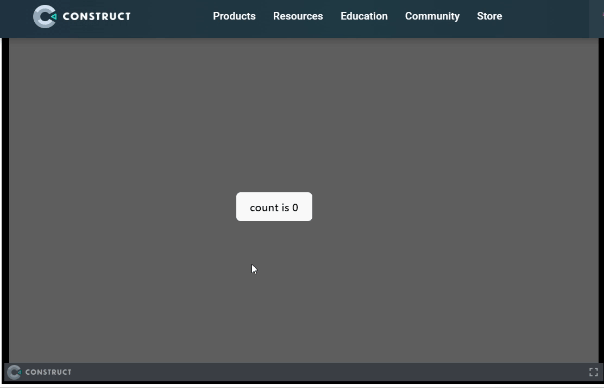

## TypeScript & Construct

### Configurare il computer

La prima cosa da fare è accertarsi di aver installato [Node.js](https://nodejs.org/) sul proprio computer. In secondo luogo, se non lo abbiamo già fatto, dobbiamo installare TypeScript da terminale usando il comando `npm install -g typescript`. Possiamo controllare la versione installata usando il comando `tsc --version`.

Ashley riporta anche questo potenziale errore

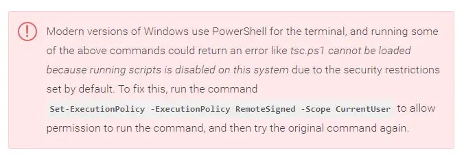

### Creare il progetto

Dopo aver impostato il proprio computer possiamo creare un progetto in Construct. Salviamo il progetto "As Folder" usando il comando `Menu ► Project ► Save as ► Save as project folder...`

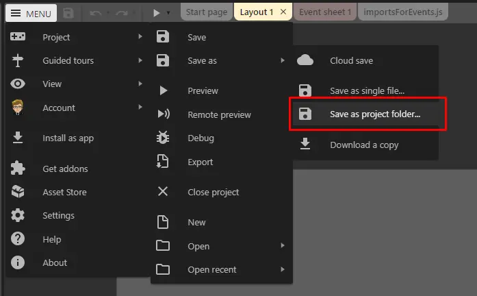

Il passo successivo è scegliere la cartella `Scripts`: usando il tasto destro del mouse clicchiamo su `TypeScript ► Set up TypeScript`

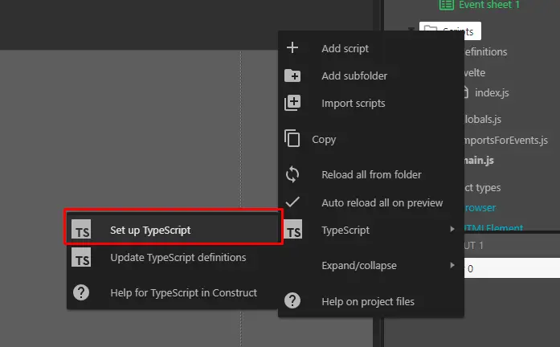

Poiché lavoreremo sui file nel pc ma testeremo le modifiche tramite Construct è una buona idea abilitare l'opzione "_Auto reload all on preview_"

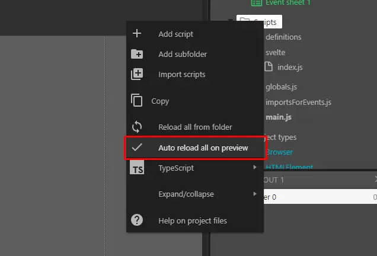

Adesso possiamo aprire il progetto con il nostro editor di testo preferito. Nel mio caso utilizzo Visual Studio Code.

In VS Code uso la combinazione di tasti `Ctrl + Shift + B` per selezionare `tsc: watch` e abilitare la compilazione automatica dei file `.ts` in `.js`.

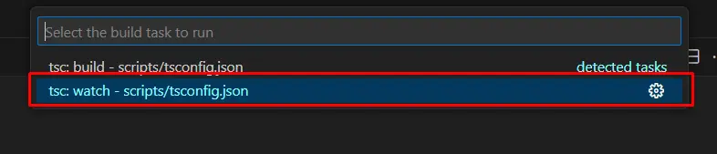

### Utilities

C3 imposta il progetto con tutti i file fondamentali ma possiamo aggiungere alcuni file per semplificare il nostro futuro workflow.

Creo il file `scripts/definitions/customGlobal.ts`:

```ts
export {};

declare global {
  var g_runtime: IRuntime;
}
```

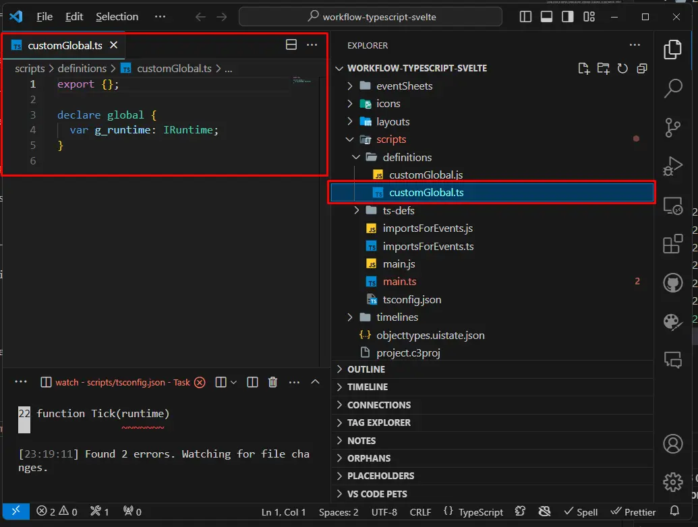

In questo modo posso personalizzare `globalThis`.

Aggiungo poi il file `scripts/definitions/defs.ts`:

```ts
export interface Globals {}
```

Questa interfaccia sarà utile per aggiungere variabili globali all'applicazione. Per usarla, creo il file `scripts/globals.ts`

```ts
import type { Globals } from "./definitions/defs";
const Globals: Globals = {};
export default Globals;
```

Adesso è il momento di sistemare i file generati da Construct. Apro `scripts/main.ts`, elimino tutto il contenuto e al suo posto scrivo:

```ts
runOnStartup(async (runtime: IRuntime) => {
  globalThis.g_runtime = runtime;
});
```

Questo codice mi permette di richiamare le runtime direttamente da C3.

Infine modifico il file `importsForEvents.ts`:

```ts
import * as Globals from "./globals.js";
```

Questo file mi permette di far comunicare gli Event Sheets di Construct direttamente con il codice generato a partire da TypeScript.

## Svelte & Construct

### Impostare Svelte

Bene, fin qui la parte legata a configurare C3 e TypeScript. Ma adesso è il momento di aggiungere [Svelte](https://svelte.dev/).

Ricordo lo scopo di questo tutorial: creare un pulsante che conta i click. Ovvero replicare l'esempio base.

Per farlo la prima cosa da fare è creare una cartella in cui salvare i file legati a Svelte. Con molta fantasia chiamerò questa cartella `Svelte`. Dal suo interno apro un terminale e uso il comando

```bash
npm create vite@latest
```

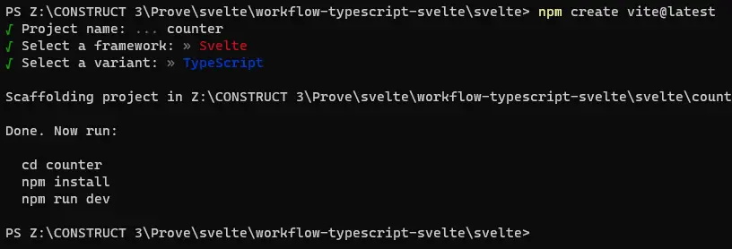

Ho scelto come nome del progetto `counter`, come framework `Svelte`, come variante `TypeScript`.

Sempre da terminale uso i comandi:

```bash
cd counter
npm install
npm run dev
```

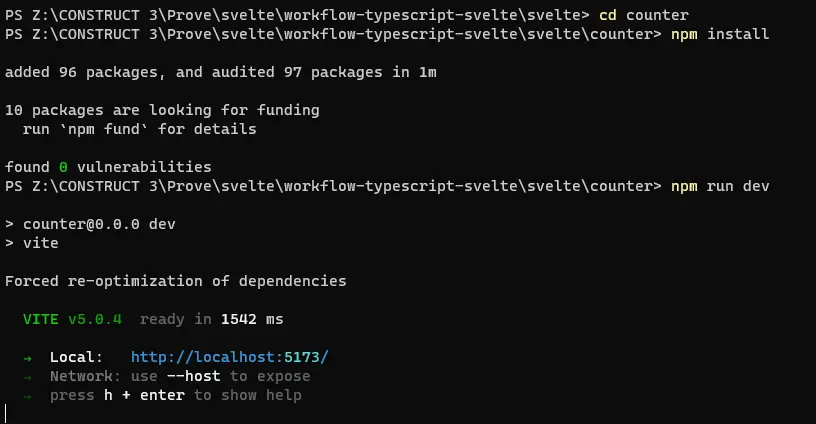
Usando il link `http://localhost:5173` posso vedere la pagina html generata da Svelte

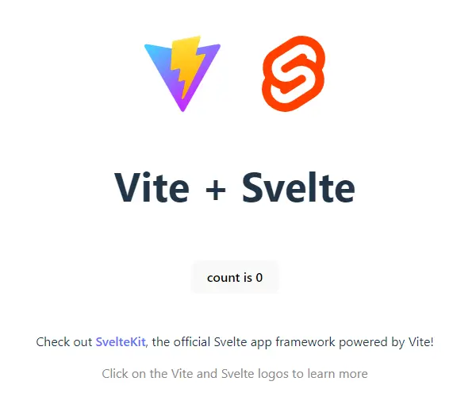

### Pulire il codice di Svelte

Possiamo semplificare il codice per tenere solamente la parte che ci interessa, ovvero il componente `Counter`. Modifico il file `\svelte\counter\src\App.svelte`:

```html
<script lang="ts">
  import Counter from "./lib/Counter.svelte";
</script>

<main>
  <div class="card">
    <Counter />
  </div>
</main>

<style>
  .card {
    position: absolute;
    top: 0;
    left: 0;
    padding: 2em;
  }
</style>
```

Aggiungo poi uno stile a `\svelte\counter\src\lib\Counter.svelte`:

```html
<script lang="ts">
  let count: number = 0;
  const increment = () => {
    count += 1;
  };
</script>

<button on:click={increment}>
  count is {count}
</button>

<style>
  button:hover {
    background-color: rgb(247, 218, 146);
    color: rgb(30, 4, 4);
  }
</style>
```

Infine modifico il file `\svelte\counter\src\main.ts`:

```ts
import "./app.css";
import App from "./App.svelte";

const app = new App({
  target: document.body,
});

export default app;
```

In questo modo il componente viene inserito direttamente nella pagina. Secondo me non è la soluzione migliore, più avanti spiegherò un metodo migliore.

Dopo queste modifiche l'anteprima di Svelte mostra questo:

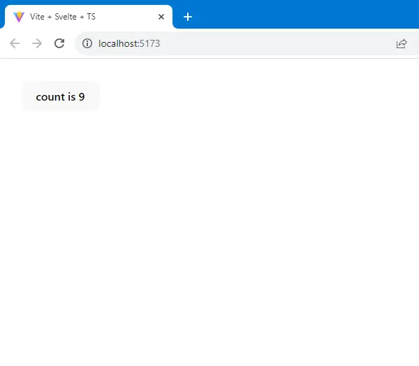
### Compilare il codice di Svelte

Per usare questo componente in Construct devo prima compilarlo e ottenere i file da importare in C3.

Uso il comando

```bash
npm run build
```

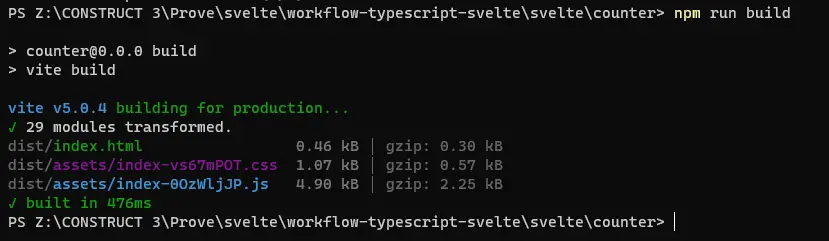

Questo comando crea due file: `\svelte\counter\dist\assets\index-XXXXX.css` e `\svelte\counter\dist\assets\index-XXXXX.js`. Per poterli usare con construct devo copiarli nelle cartelle `\files\` e `\scripts\`. Possiamo farlo a mano.

Ma consiglio di creare uno script che si occupi di spostare i file nella posizione corretta e di rinominarli in maniera più semplice. Creo il file `\svelte\counter\move-files.js`:

```js
import { existsSync, readdirSync, copyFileSync } from "fs";
import path from "path";

function renameDist(arg) {
  const { dir, match, replace, destination } = arg;
  console.log(`Rename js and css in "${dir}"...`);
  if (existsSync(dir)) {
    const files = readdirSync(dir);
    console.log(files);
    files
      .filter((file) => file.match(match))
      .forEach((file) => {
        const filePath = path.join(dir, file);
        const newFilePath = path.join(
          destination,
          file.replace(match, replace)
        );
        copyFileSync(filePath, newFilePath);
      });
  }
}

const dir = "./dist/assets";

renameDist({
  dir,
  match: RegExp(/\-(.*?)\.js/, "gi"),
  replace: ".js",
  destination: "../../scripts/svelte",
});

renameDist({
  dir,
  match: RegExp(/\-(.*?)\.css/, "gi"),
  replace: ".css",
  destination: "../../files",
});
```

Modifico il file `\svelte\counter\package.json`:

```json
{
  // ...
  "scripts": {
    "build": "vite build && npm run move-files",
    "move-files": "node move-files.js"
  }
  // ...
}
```

Se non esistono, creo le cartelle `\files` e `\scripts\svelte`. Eseguo da terminale il comando

```bash
npm run build
```

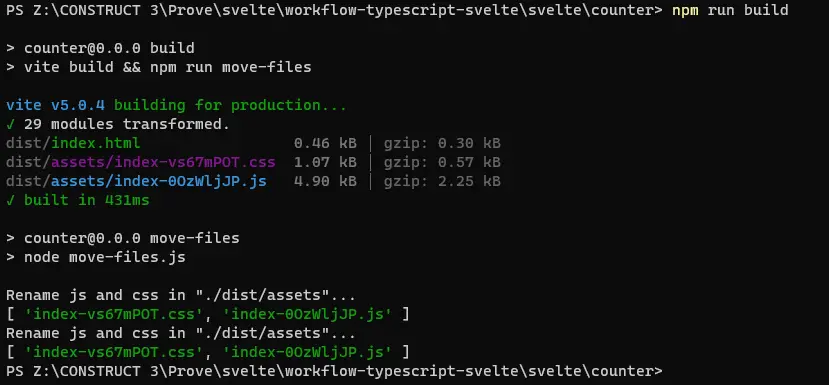

### Integrare Svelte in Construct 3

Torno al file `\scripts\importsForEvents.ts` e aggiungo

```ts
//@ts-ignore
import * as svelte from "./svelte/index.js";
```

Poi importo il foglio di stile

```text
+ System: On start of layout
-> Browser: Load stylesheet from "index.css"
```

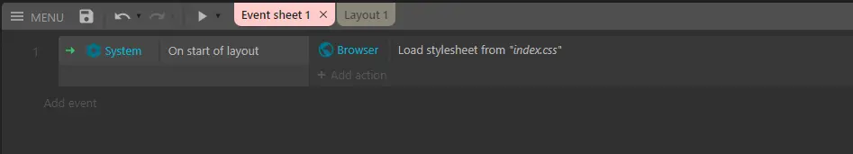

Mostro quindi l'anteprima del progetto con Construct:

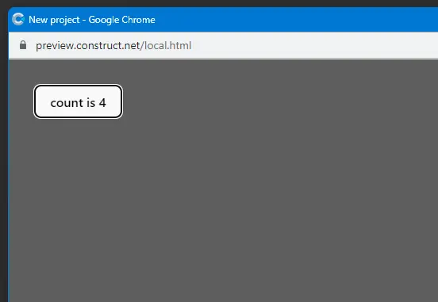

### Inserire un componente Svelte in un Elemento HTML

Fin qui abbiamo inserito un componente Svelte in una pagina HTML usando Construct. Ma è più utile inserire il componente direttamente nella struttura creata da C3. Per farlo creiamo un elemento HTML nel progetto e gli assegniamo un ID (per esempio `counter`).

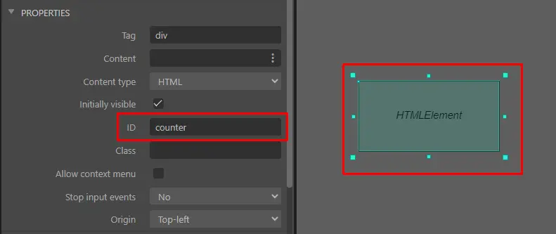

Modifico quindi il file `\svelte\counter\src\main.ts` in modo da poter caricare direttamente il componente nell'elemento HTML di Construct:

```ts
import "./app.css";
import App from "./App.svelte";

const app = new App({
  target: document.getElementById("counter"),
});

export default app;
```

Ma conviene modificare ancora un po' il codice per permettere a Construct di caricare in maniera dinamica il componente. Per farlo uso `globalThis` a cui aggiungo una proprietà `Counter`.

```ts
import "./app.css";
import App from "./App.svelte";

declare global {
  var Counter: unknown;
}

globalThis.Counter = () =>
  new App({
    target: document.getElementById("counter") || document.body,
  });

export default globalThis.Counter;
```

Da un Event Sheet uso il codice JavaScript

```js
globalThis.Counter();
```

In questo modo ottengo finalmente il risultato:


<!-- Posso in alternativa modificare l'interfaccia `Globals` in `\scripts\definitions\defs.ts`:

```ts
export interface Globals {
  app: Function;
}
```

in modo da poter importare direttamente il modulo in `\scripts\globals.ts`

```ts
import type { Globals } from "./definitions/defs";
const Globals: Globals = {
  //@ts-ignore
  app: import("./svelte/index.js"),
};
export default Globals;
``` -->
