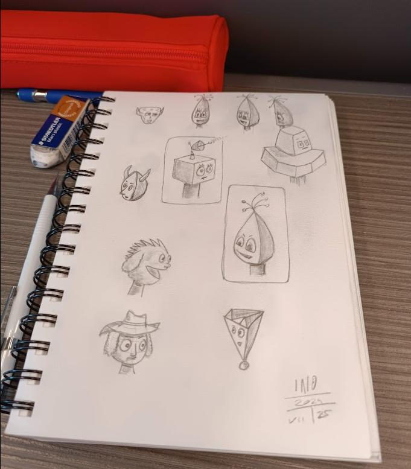

Negli ultimi mesi mi sono concentrato molto sul disegno. In primavera mi sono fatto male a una gamba e sono stato immobilizzato per un certo periodo. Oltre ad aver dedicato un bel po' di tempo a leggere, su suggerimento di mia moglie ho ripreso in mano carta e matita. Ho cominciato a seguire un corso di disegno online (su https://www.21-draw.com/) e... sto disegnando ancora adesso.

La cosa interessante è che più disegno meno sento la necessità di usare delle AI per generare immagini. Disegnare a matita prima, con una tavoletta grafica poi, è diventata un'abitudine in grado di rilassarmi, di farmi star bene e di decomprimermi.

Non ho ancora uno stile ben definito, anzi. Però mi piace esplorare questa mia parte artistica, che non sapevo nemmeno più di avere. E più esploro più scopro delle cose interessanti su di, e su come vedo il mondo.

Ho scoperto, anzi, riscoperto, la bellezza di creare qualcosa che esiste davvero nel mondo materiale. Disegnare su uno sketchbook vuol dire trasferire una parte di me in un oggetto. Dipingere una tela con i colori acrilici, oppure del cartone con gli acquarelli significa dare vita a qualcosa di tangibile. Di reale. Qualcosa da poter toccare.

Avevo dimenticato questa soddisfazione, questa gioia legata alla creazione.

Più tempo passa e più disegni faccio, più imparo e più mi accorgo di quanto il disegnare rifletta qualcosa di me. Sta diventando un modo per esprimermi, per comunicare con chi mi sta vicino e con il mondo.

Negli ultimi 18 mesi ho cambiato vita, cambiando lavoro e molte delle vecchie frequentazioni. Ho affrontato un lutto importante. Ho chiuso un capitolo di me che ritenevo fondamentale ma che con il passare dei decenni era diventato tutt'altro.

In mezzo a tutti questi cambiamenti mi sono accorto di avere l'esigenza di raccontarmi alle persone a cui voglio bene. E di condividere me. Ma, soprattutto, avevo, ho bisogno di farmi capire.

Disegnare sta diventando questo. Un modo per esprimermi. Come credevo fosse la scrittura per me.

Disegnare ha anche cambiato il modo in cui vedo la scrittura, e la fotografia. Non sono in grado di unire i due mondi, ma sto iniziando a sentire l'esigenza di raccontare. Di usare i disegni assieme alle parole. E mescolare il tutto con la fotografia. Sto cominciando a sperimentare.

Che poi sperimentare vuol dire, nel mio caso, ancora scoprire e imparare le basi. Ma ho la testa che pullula di idee creative come non mi capitava da davvero troppo tempo.

E non vedo l'ora di scoprire quante di queste riuscirò a realizzare.
